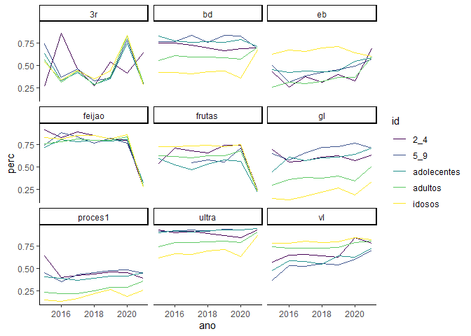
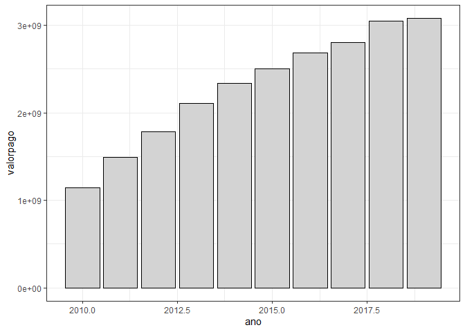

<!-- README.md is generated from README.Rmd. Please edit that file -->

# diagnosticos-pp 2023

<!-- badges: start -->
<!-- badges: end -->

## Carregando o banco de dados

``` r
library(tidyverse)
saude <- readr::read_rds("data/saude.rds") %>% 
  dplyr::mutate(tipo = stringr::str_to_lower(tipo))
dplyr::glimpse(saude)
#> Rows: 315
#> Columns: 7
#> $ cidade  <chr> "Bauru", "Bauru", "Bauru", "Bauru", "Bauru", "Bauru", "Bauru",…
#> $ ano     <dbl> 2015, 2015, 2015, 2015, 2015, 2016, 2016, 2016, 2016, 2016, 20…
#> $ id      <chr> "2_4", "5_9", "adolecentes", "adultos", "idosos", "2_4", "5_9"…
#> $ tipo    <chr> "ultra", "ultra", "ultra", "ultra", "ultra", "ultra", "ultra",…
#> $ total   <dbl> 56, 46, 145, 687, 311, 181, 123, 369, 2390, 1444, 220, 270, 56…
#> $ amostra <dbl> 52, 42, 131, 512, 193, 163, 113, 340, 1889, 965, 201, 251, 517…
#> $ perc    <dbl> 0.9285714, 0.9130435, 0.9034483, 0.7452693, 0.6205788, 0.90055…
```

## Visualizando a série temporal

``` r
saude %>% 
  ggplot2::ggplot(ggplot2::aes(x=ano,y=perc,color=id))+
  #ggplot2::geom_col(position = "dodge")+
  ggplot2::geom_line() +
  ggplot2::facet_wrap(~tipo,ncol=3)+
  ggplot2::scale_color_viridis_d()+
  ggplot2::theme_classic()
```

<!-- -->

## Consumo de ultraprocessados

``` r
dplyr::glimpse(saude)  
#> Rows: 315
#> Columns: 7
#> $ cidade  <chr> "Bauru", "Bauru", "Bauru", "Bauru", "Bauru", "Bauru", "Bauru",…
#> $ ano     <dbl> 2015, 2015, 2015, 2015, 2015, 2016, 2016, 2016, 2016, 2016, 20…
#> $ id      <chr> "2_4", "5_9", "adolecentes", "adultos", "idosos", "2_4", "5_9"…
#> $ tipo    <chr> "ultra", "ultra", "ultra", "ultra", "ultra", "ultra", "ultra",…
#> $ total   <dbl> 56, 46, 145, 687, 311, 181, 123, 369, 2390, 1444, 220, 270, 56…
#> $ amostra <dbl> 52, 42, 131, 512, 193, 163, 113, 340, 1889, 965, 201, 251, 517…
#> $ perc    <dbl> 0.9285714, 0.9130435, 0.9034483, 0.7452693, 0.6205788, 0.90055…
saude %>% 
  dplyr::filter(tipo == "ultra") %>% 
  ggplot2::ggplot(ggplot2::aes(x=ano,y=perc,fill=id))+
  #ggplot2::geom_col(position = "dodge")+
  ggplot2::geom_col(position="dodge",color="black") +
  # ggplot2::facet_wrap(~tipo,ncol=3)+
  ggplot2::scale_fill_viridis_d()+
  ggplot2::theme_classic() + 
  ggplot2::coord_cartesian(ylim=c(.5,1))
```

<!-- -->

``` r
dplyr::glimpse(saude)  
#> Rows: 315
#> Columns: 7
#> $ cidade  <chr> "Bauru", "Bauru", "Bauru", "Bauru", "Bauru", "Bauru", "Bauru",…
#> $ ano     <dbl> 2015, 2015, 2015, 2015, 2015, 2016, 2016, 2016, 2016, 2016, 20…
#> $ id      <chr> "2_4", "5_9", "adolecentes", "adultos", "idosos", "2_4", "5_9"…
#> $ tipo    <chr> "ultra", "ultra", "ultra", "ultra", "ultra", "ultra", "ultra",…
#> $ total   <dbl> 56, 46, 145, 687, 311, 181, 123, 369, 2390, 1444, 220, 270, 56…
#> $ amostra <dbl> 52, 42, 131, 512, 193, 163, 113, 340, 1889, 965, 201, 251, 517…
#> $ perc    <dbl> 0.9285714, 0.9130435, 0.9034483, 0.7452693, 0.6205788, 0.90055…
saude %>% dplyr::filter(ano <= 2019) %>% 
  dplyr::filter(tipo == "ultra") %>% 
  ggplot2::ggplot(ggplot2::aes(x=ano,y=perc,color=id))+
  ggplot2::geom_point(shape=16,size=4) +
  # ggplot2::facet_wrap(~tipo,ncol=3)+
  ggplot2::scale_color_viridis_d()+
  ggplot2::theme_classic() + 
  ggplot2::coord_cartesian(ylim=c(.5,1))+
  ggplot2::geom_smooth(method = "lm",se=FALSE) +
  ggpubr::stat_regline_equation(label.y = seq(.5,.6,.025) )
```

<!-- -->

``` r
dplyr::glimpse(saude)  
#> Rows: 315
#> Columns: 7
#> $ cidade  <chr> "Bauru", "Bauru", "Bauru", "Bauru", "Bauru", "Bauru", "Bauru",…
#> $ ano     <dbl> 2015, 2015, 2015, 2015, 2015, 2016, 2016, 2016, 2016, 2016, 20…
#> $ id      <chr> "2_4", "5_9", "adolecentes", "adultos", "idosos", "2_4", "5_9"…
#> $ tipo    <chr> "ultra", "ultra", "ultra", "ultra", "ultra", "ultra", "ultra",…
#> $ total   <dbl> 56, 46, 145, 687, 311, 181, 123, 369, 2390, 1444, 220, 270, 56…
#> $ amostra <dbl> 52, 42, 131, 512, 193, 163, 113, 340, 1889, 965, 201, 251, 517…
#> $ perc    <dbl> 0.9285714, 0.9130435, 0.9034483, 0.7452693, 0.6205788, 0.90055…
saude %>% dplyr::filter(ano > 2019) %>% 
  dplyr::filter(tipo == "ultra") %>% 
  ggplot2::ggplot(ggplot2::aes(x=as.factor(ano),y=perc,fill=id))+
  #ggplot2::geom_col(position = "dodge")+
  ggplot2::geom_col(position="dodge",color="black") +
  # ggplot2::facet_wrap(~tipo,ncol=3)+
  ggplot2::scale_fill_viridis_d()+
  ggplot2::theme_classic() + 
  ggplot2::coord_cartesian(ylim=c(.5,1)) +
  ggplot2::labs(x="Ano")
```

<!-- -->

``` r
dplyr::glimpse(saude)  
#> Rows: 315
#> Columns: 7
#> $ cidade  <chr> "Bauru", "Bauru", "Bauru", "Bauru", "Bauru", "Bauru", "Bauru",…
#> $ ano     <dbl> 2015, 2015, 2015, 2015, 2015, 2016, 2016, 2016, 2016, 2016, 20…
#> $ id      <chr> "2_4", "5_9", "adolecentes", "adultos", "idosos", "2_4", "5_9"…
#> $ tipo    <chr> "ultra", "ultra", "ultra", "ultra", "ultra", "ultra", "ultra",…
#> $ total   <dbl> 56, 46, 145, 687, 311, 181, 123, 369, 2390, 1444, 220, 270, 56…
#> $ amostra <dbl> 52, 42, 131, 512, 193, 163, 113, 340, 1889, 965, 201, 251, 517…
#> $ perc    <dbl> 0.9285714, 0.9130435, 0.9034483, 0.7452693, 0.6205788, 0.90055…
saude %>% dplyr::filter(ano > 2019) %>% 
  dplyr::filter(tipo == "ultra") %>% 
  tidyr::pivot_wider(names_from = ano, values_from = perc,id_cols = id) %>% 
  dplyr::mutate(dif = (`2021` - `2020`)*100)
#> # A tibble: 5 × 4
#>   id          `2020` `2021`    dif
#>   <chr>        <dbl>  <dbl>  <dbl>
#> 1 2_4          0.843  0.931  8.74 
#> 2 5_9          0.933  0.947  1.42 
#> 3 adolecentes  0.935  0.944  0.912
#> 4 adultos      0.792  0.908 11.6  
#> 5 idosos       0.637  0.866 22.9
```

## Três refeições ao dia

``` r
dplyr::glimpse(saude)  
#> Rows: 315
#> Columns: 7
#> $ cidade  <chr> "Bauru", "Bauru", "Bauru", "Bauru", "Bauru", "Bauru", "Bauru",…
#> $ ano     <dbl> 2015, 2015, 2015, 2015, 2015, 2016, 2016, 2016, 2016, 2016, 20…
#> $ id      <chr> "2_4", "5_9", "adolecentes", "adultos", "idosos", "2_4", "5_9"…
#> $ tipo    <chr> "ultra", "ultra", "ultra", "ultra", "ultra", "ultra", "ultra",…
#> $ total   <dbl> 56, 46, 145, 687, 311, 181, 123, 369, 2390, 1444, 220, 270, 56…
#> $ amostra <dbl> 52, 42, 131, 512, 193, 163, 113, 340, 1889, 965, 201, 251, 517…
#> $ perc    <dbl> 0.9285714, 0.9130435, 0.9034483, 0.7452693, 0.6205788, 0.90055…
saude %>% 
  dplyr::filter(tipo == "3r") %>% 
  ggplot2::ggplot(ggplot2::aes(x=ano,y=perc,fill=id))+
  #ggplot2::geom_col(position = "dodge")+
  ggplot2::geom_col(position="dodge",color="black") +
  # ggplot2::facet_wrap(~tipo,ncol=3)+
  ggplot2::scale_fill_viridis_d()+
  ggplot2::theme_classic() # 
```

<!-- -->

``` r
  #ggplot2::coord_cartesian(ylim=c(.5,1))
```

``` r
dplyr::glimpse(saude)  
#> Rows: 315
#> Columns: 7
#> $ cidade  <chr> "Bauru", "Bauru", "Bauru", "Bauru", "Bauru", "Bauru", "Bauru",…
#> $ ano     <dbl> 2015, 2015, 2015, 2015, 2015, 2016, 2016, 2016, 2016, 2016, 20…
#> $ id      <chr> "2_4", "5_9", "adolecentes", "adultos", "idosos", "2_4", "5_9"…
#> $ tipo    <chr> "ultra", "ultra", "ultra", "ultra", "ultra", "ultra", "ultra",…
#> $ total   <dbl> 56, 46, 145, 687, 311, 181, 123, 369, 2390, 1444, 220, 270, 56…
#> $ amostra <dbl> 52, 42, 131, 512, 193, 163, 113, 340, 1889, 965, 201, 251, 517…
#> $ perc    <dbl> 0.9285714, 0.9130435, 0.9034483, 0.7452693, 0.6205788, 0.90055…
saude %>% dplyr::filter(ano <= 2019) %>% 
  dplyr::filter(tipo == "3r") %>% 
  ggplot2::ggplot(ggplot2::aes(x=ano,y=perc,color=id))+
  ggplot2::geom_point(shape=16,size=4) +
  # ggplot2::facet_wrap(~tipo,ncol=3)+
  ggplot2::scale_color_viridis_d()+
  ggplot2::theme_classic() + 
  # ggplot2::coord_cartesian(ylim=c(.5,1))+
  ggplot2::geom_smooth(method = "lm",se=FALSE) +
  ggpubr::stat_regline_equation(label.y = seq(.6,.7,.025),
                                label.x = rep(2017,5))
```

<!-- -->

``` r
dplyr::glimpse(saude)  
#> Rows: 315
#> Columns: 7
#> $ cidade  <chr> "Bauru", "Bauru", "Bauru", "Bauru", "Bauru", "Bauru", "Bauru",…
#> $ ano     <dbl> 2015, 2015, 2015, 2015, 2015, 2016, 2016, 2016, 2016, 2016, 20…
#> $ id      <chr> "2_4", "5_9", "adolecentes", "adultos", "idosos", "2_4", "5_9"…
#> $ tipo    <chr> "ultra", "ultra", "ultra", "ultra", "ultra", "ultra", "ultra",…
#> $ total   <dbl> 56, 46, 145, 687, 311, 181, 123, 369, 2390, 1444, 220, 270, 56…
#> $ amostra <dbl> 52, 42, 131, 512, 193, 163, 113, 340, 1889, 965, 201, 251, 517…
#> $ perc    <dbl> 0.9285714, 0.9130435, 0.9034483, 0.7452693, 0.6205788, 0.90055…
saude %>% dplyr::filter(ano > 2019) %>% 
  dplyr::filter(tipo == "3r") %>% 
  ggplot2::ggplot(ggplot2::aes(x=as.factor(ano),y=perc,fill=id))+
  #ggplot2::geom_col(position = "dodge")+
  ggplot2::geom_col(position="dodge",color="black") +
  # ggplot2::facet_wrap(~tipo,ncol=3)+
  ggplot2::scale_fill_viridis_d()+
  ggplot2::theme_classic() + 
  #ggplot2::coord_cartesian(ylim=c(.5,1)) +
  ggplot2::labs(x="Ano")
```

<!-- -->

``` r
dplyr::glimpse(saude)  
#> Rows: 315
#> Columns: 7
#> $ cidade  <chr> "Bauru", "Bauru", "Bauru", "Bauru", "Bauru", "Bauru", "Bauru",…
#> $ ano     <dbl> 2015, 2015, 2015, 2015, 2015, 2016, 2016, 2016, 2016, 2016, 20…
#> $ id      <chr> "2_4", "5_9", "adolecentes", "adultos", "idosos", "2_4", "5_9"…
#> $ tipo    <chr> "ultra", "ultra", "ultra", "ultra", "ultra", "ultra", "ultra",…
#> $ total   <dbl> 56, 46, 145, 687, 311, 181, 123, 369, 2390, 1444, 220, 270, 56…
#> $ amostra <dbl> 52, 42, 131, 512, 193, 163, 113, 340, 1889, 965, 201, 251, 517…
#> $ perc    <dbl> 0.9285714, 0.9130435, 0.9034483, 0.7452693, 0.6205788, 0.90055…
saude %>% dplyr::filter(ano < 2017) %>% 
  dplyr::filter(tipo == "3r") %>% 
  ggplot2::ggplot(ggplot2::aes(x=as.factor(ano),y=perc,fill=id))+
  #ggplot2::geom_col(position = "dodge")+
  ggplot2::geom_col(position="dodge",color="black") +
  # ggplot2::facet_wrap(~tipo,ncol=3)+
  ggplot2::scale_fill_viridis_d()+
  ggplot2::theme_classic() + 
  #ggplot2::coord_cartesian(ylim=c(.5,1)) +
  ggplot2::labs(x="Ano")
```

<!-- -->

``` r
dplyr::glimpse(saude)  
#> Rows: 315
#> Columns: 7
#> $ cidade  <chr> "Bauru", "Bauru", "Bauru", "Bauru", "Bauru", "Bauru", "Bauru",…
#> $ ano     <dbl> 2015, 2015, 2015, 2015, 2015, 2016, 2016, 2016, 2016, 2016, 20…
#> $ id      <chr> "2_4", "5_9", "adolecentes", "adultos", "idosos", "2_4", "5_9"…
#> $ tipo    <chr> "ultra", "ultra", "ultra", "ultra", "ultra", "ultra", "ultra",…
#> $ total   <dbl> 56, 46, 145, 687, 311, 181, 123, 369, 2390, 1444, 220, 270, 56…
#> $ amostra <dbl> 52, 42, 131, 512, 193, 163, 113, 340, 1889, 965, 201, 251, 517…
#> $ perc    <dbl> 0.9285714, 0.9130435, 0.9034483, 0.7452693, 0.6205788, 0.90055…
saude %>% dplyr::filter(ano > 2019) %>% 
  dplyr::filter(tipo == "3r") %>% 
  tidyr::pivot_wider(names_from = ano, values_from = perc,id_cols = id) %>% 
  dplyr::mutate(dif = (`2021` - `2020`)*100)
#> # A tibble: 5 × 4
#>   id          `2020` `2021`   dif
#>   <chr>        <dbl>  <dbl> <dbl>
#> 1 2_4          0.414  0.643  22.8
#> 2 5_9          0.787  0.295 -49.1
#> 3 adolecentes  0.747  0.286 -46.1
#> 4 adultos      0.824  0.301 -52.3
#> 5 idosos       0.838  0.284 -55.4
```

``` r
dplyr::glimpse(saude)  
#> Rows: 315
#> Columns: 7
#> $ cidade  <chr> "Bauru", "Bauru", "Bauru", "Bauru", "Bauru", "Bauru", "Bauru",…
#> $ ano     <dbl> 2015, 2015, 2015, 2015, 2015, 2016, 2016, 2016, 2016, 2016, 20…
#> $ id      <chr> "2_4", "5_9", "adolecentes", "adultos", "idosos", "2_4", "5_9"…
#> $ tipo    <chr> "ultra", "ultra", "ultra", "ultra", "ultra", "ultra", "ultra",…
#> $ total   <dbl> 56, 46, 145, 687, 311, 181, 123, 369, 2390, 1444, 220, 270, 56…
#> $ amostra <dbl> 52, 42, 131, 512, 193, 163, 113, 340, 1889, 965, 201, 251, 517…
#> $ perc    <dbl> 0.9285714, 0.9130435, 0.9034483, 0.7452693, 0.6205788, 0.90055…
saude %>% dplyr::filter(ano < 2017) %>% 
  dplyr::filter(tipo == "3r") %>% 
  tidyr::pivot_wider(names_from = ano, values_from = perc,id_cols = id) %>% 
  dplyr::mutate(dif = (`2016` - `2015`)*100)
#> # A tibble: 5 × 4
#>   id          `2015` `2016`   dif
#>   <chr>        <dbl>  <dbl> <dbl>
#> 1 2_4          0.269  0.861  59.2
#> 2 5_9          0.739  0.366 -37.3
#> 3 adolecentes  0.634  0.325 -30.9
#> 4 adultos      0.559  0.313 -24.6
#> 5 idosos       0.540  0.337 -20.4
```

## Consumo de embutidos

``` r
dplyr::glimpse(saude)  
#> Rows: 315
#> Columns: 7
#> $ cidade  <chr> "Bauru", "Bauru", "Bauru", "Bauru", "Bauru", "Bauru", "Bauru",…
#> $ ano     <dbl> 2015, 2015, 2015, 2015, 2015, 2016, 2016, 2016, 2016, 2016, 20…
#> $ id      <chr> "2_4", "5_9", "adolecentes", "adultos", "idosos", "2_4", "5_9"…
#> $ tipo    <chr> "ultra", "ultra", "ultra", "ultra", "ultra", "ultra", "ultra",…
#> $ total   <dbl> 56, 46, 145, 687, 311, 181, 123, 369, 2390, 1444, 220, 270, 56…
#> $ amostra <dbl> 52, 42, 131, 512, 193, 163, 113, 340, 1889, 965, 201, 251, 517…
#> $ perc    <dbl> 0.9285714, 0.9130435, 0.9034483, 0.7452693, 0.6205788, 0.90055…
saude %>% 
  dplyr::filter(tipo == "eb") %>% 
  ggplot2::ggplot(ggplot2::aes(x=ano,y=perc,fill=id))+
  #ggplot2::geom_col(position = "dodge")+
  ggplot2::geom_col(position="dodge",color="black") +
  # ggplot2::facet_wrap(~tipo,ncol=3)+
  ggplot2::scale_fill_viridis_d()+
  ggplot2::theme_classic() #+ 
```

<!-- -->

``` r
 # ggplot2::coord_cartesian(ylim=c(.5,1))
```

``` r
dplyr::glimpse(saude)  
#> Rows: 315
#> Columns: 7
#> $ cidade  <chr> "Bauru", "Bauru", "Bauru", "Bauru", "Bauru", "Bauru", "Bauru",…
#> $ ano     <dbl> 2015, 2015, 2015, 2015, 2015, 2016, 2016, 2016, 2016, 2016, 20…
#> $ id      <chr> "2_4", "5_9", "adolecentes", "adultos", "idosos", "2_4", "5_9"…
#> $ tipo    <chr> "ultra", "ultra", "ultra", "ultra", "ultra", "ultra", "ultra",…
#> $ total   <dbl> 56, 46, 145, 687, 311, 181, 123, 369, 2390, 1444, 220, 270, 56…
#> $ amostra <dbl> 52, 42, 131, 512, 193, 163, 113, 340, 1889, 965, 201, 251, 517…
#> $ perc    <dbl> 0.9285714, 0.9130435, 0.9034483, 0.7452693, 0.6205788, 0.90055…
saude %>% dplyr::filter(ano <= 2019) %>% 
  dplyr::filter(tipo == "eb") %>% 
  ggplot2::ggplot(ggplot2::aes(x=ano,y=perc,color=id))+
  ggplot2::geom_point(shape=16,size=4) +
  # ggplot2::facet_wrap(~tipo,ncol=3)+
  ggplot2::scale_color_viridis_d()+
  ggplot2::theme_classic() + 
  # ggplot2::coord_cartesian(ylim=c(.5,1))+
  ggplot2::geom_smooth(method = "lm",se=FALSE) +
  ggpubr::stat_regline_equation(label.y = seq(.5,.6,.025),
                                label.x= rep(2016,5))
```

<!-- -->

``` r
dplyr::glimpse(saude)  
#> Rows: 315
#> Columns: 7
#> $ cidade  <chr> "Bauru", "Bauru", "Bauru", "Bauru", "Bauru", "Bauru", "Bauru",…
#> $ ano     <dbl> 2015, 2015, 2015, 2015, 2015, 2016, 2016, 2016, 2016, 2016, 20…
#> $ id      <chr> "2_4", "5_9", "adolecentes", "adultos", "idosos", "2_4", "5_9"…
#> $ tipo    <chr> "ultra", "ultra", "ultra", "ultra", "ultra", "ultra", "ultra",…
#> $ total   <dbl> 56, 46, 145, 687, 311, 181, 123, 369, 2390, 1444, 220, 270, 56…
#> $ amostra <dbl> 52, 42, 131, 512, 193, 163, 113, 340, 1889, 965, 201, 251, 517…
#> $ perc    <dbl> 0.9285714, 0.9130435, 0.9034483, 0.7452693, 0.6205788, 0.90055…
saude %>% dplyr::filter(ano > 2019) %>% 
  dplyr::filter(tipo == "eb") %>% 
  ggplot2::ggplot(ggplot2::aes(x=as.factor(ano),y=perc,fill=id))+
  #ggplot2::geom_col(position = "dodge")+
  ggplot2::geom_col(position="dodge",color="black") +
  # ggplot2::facet_wrap(~tipo,ncol=3)+
  ggplot2::scale_fill_viridis_d()+
  ggplot2::theme_classic() + 
  # ggplot2::coord_cartesian(ylim=c(.5,1)) +
  ggplot2::labs(x="Ano")
```

<!-- -->

``` r
dplyr::glimpse(saude)  
#> Rows: 315
#> Columns: 7
#> $ cidade  <chr> "Bauru", "Bauru", "Bauru", "Bauru", "Bauru", "Bauru", "Bauru",…
#> $ ano     <dbl> 2015, 2015, 2015, 2015, 2015, 2016, 2016, 2016, 2016, 2016, 20…
#> $ id      <chr> "2_4", "5_9", "adolecentes", "adultos", "idosos", "2_4", "5_9"…
#> $ tipo    <chr> "ultra", "ultra", "ultra", "ultra", "ultra", "ultra", "ultra",…
#> $ total   <dbl> 56, 46, 145, 687, 311, 181, 123, 369, 2390, 1444, 220, 270, 56…
#> $ amostra <dbl> 52, 42, 131, 512, 193, 163, 113, 340, 1889, 965, 201, 251, 517…
#> $ perc    <dbl> 0.9285714, 0.9130435, 0.9034483, 0.7452693, 0.6205788, 0.90055…
saude %>% dplyr::filter(ano > 2019) %>% 
  dplyr::filter(tipo == "eb") %>% 
  tidyr::pivot_wider(names_from = ano, values_from = perc,id_cols = id) %>% 
  dplyr::mutate(dif = (`2021` - `2020`)*100)
#> # A tibble: 5 × 4
#>   id          `2020` `2021`   dif
#>   <chr>        <dbl>  <dbl> <dbl>
#> 1 2_4          0.330  0.686 35.6 
#> 2 5_9          0.489  0.566  7.74
#> 3 adolecentes  0.545  0.587  4.15
#> 4 adultos      0.368  0.591 22.3 
#> 5 idosos       0.637  0.602 -3.44
```

## Feijão

``` r
dplyr::glimpse(saude)  
#> Rows: 315
#> Columns: 7
#> $ cidade  <chr> "Bauru", "Bauru", "Bauru", "Bauru", "Bauru", "Bauru", "Bauru",…
#> $ ano     <dbl> 2015, 2015, 2015, 2015, 2015, 2016, 2016, 2016, 2016, 2016, 20…
#> $ id      <chr> "2_4", "5_9", "adolecentes", "adultos", "idosos", "2_4", "5_9"…
#> $ tipo    <chr> "ultra", "ultra", "ultra", "ultra", "ultra", "ultra", "ultra",…
#> $ total   <dbl> 56, 46, 145, 687, 311, 181, 123, 369, 2390, 1444, 220, 270, 56…
#> $ amostra <dbl> 52, 42, 131, 512, 193, 163, 113, 340, 1889, 965, 201, 251, 517…
#> $ perc    <dbl> 0.9285714, 0.9130435, 0.9034483, 0.7452693, 0.6205788, 0.90055…
saude %>% 
  dplyr::filter(tipo == "feijao") %>% 
  ggplot2::ggplot(ggplot2::aes(x=ano,y=perc,fill=id))+
  #ggplot2::geom_col(position = "dodge")+
  ggplot2::geom_col(position="dodge",color="black") +
  # ggplot2::facet_wrap(~tipo,ncol=3)+
  ggplot2::scale_fill_viridis_d()+
  ggplot2::theme_classic() #+ 
```

<!-- -->

``` r
  #ggplot2::coord_cartesian(ylim=c(.5,1))
```

``` r
dplyr::glimpse(saude)  
#> Rows: 315
#> Columns: 7
#> $ cidade  <chr> "Bauru", "Bauru", "Bauru", "Bauru", "Bauru", "Bauru", "Bauru",…
#> $ ano     <dbl> 2015, 2015, 2015, 2015, 2015, 2016, 2016, 2016, 2016, 2016, 20…
#> $ id      <chr> "2_4", "5_9", "adolecentes", "adultos", "idosos", "2_4", "5_9"…
#> $ tipo    <chr> "ultra", "ultra", "ultra", "ultra", "ultra", "ultra", "ultra",…
#> $ total   <dbl> 56, 46, 145, 687, 311, 181, 123, 369, 2390, 1444, 220, 270, 56…
#> $ amostra <dbl> 52, 42, 131, 512, 193, 163, 113, 340, 1889, 965, 201, 251, 517…
#> $ perc    <dbl> 0.9285714, 0.9130435, 0.9034483, 0.7452693, 0.6205788, 0.90055…
saude %>% dplyr::filter(ano <= 2019) %>% 
  dplyr::filter(tipo == "feijao") %>% 
  ggplot2::ggplot(ggplot2::aes(x=ano,y=perc,color=id))+
  ggplot2::geom_point(shape=16,size=4) +
  # ggplot2::facet_wrap(~tipo,ncol=3)+
  ggplot2::scale_color_viridis_d()+
  ggplot2::theme_classic() + 
  ggplot2::coord_cartesian(ylim=c(.6,1))+
  ggplot2::geom_smooth(method = "lm",se=FALSE) +
  ggpubr::stat_regline_equation(label.y = seq(.6,.7,.025),
                                label.x = rep(2017,5))
```

<!-- -->

``` r
dplyr::glimpse(saude)  
#> Rows: 315
#> Columns: 7
#> $ cidade  <chr> "Bauru", "Bauru", "Bauru", "Bauru", "Bauru", "Bauru", "Bauru",…
#> $ ano     <dbl> 2015, 2015, 2015, 2015, 2015, 2016, 2016, 2016, 2016, 2016, 20…
#> $ id      <chr> "2_4", "5_9", "adolecentes", "adultos", "idosos", "2_4", "5_9"…
#> $ tipo    <chr> "ultra", "ultra", "ultra", "ultra", "ultra", "ultra", "ultra",…
#> $ total   <dbl> 56, 46, 145, 687, 311, 181, 123, 369, 2390, 1444, 220, 270, 56…
#> $ amostra <dbl> 52, 42, 131, 512, 193, 163, 113, 340, 1889, 965, 201, 251, 517…
#> $ perc    <dbl> 0.9285714, 0.9130435, 0.9034483, 0.7452693, 0.6205788, 0.90055…
saude %>% dplyr::filter(ano > 2019) %>% 
  dplyr::filter(tipo == "feijao") %>% 
  ggplot2::ggplot(ggplot2::aes(x=as.factor(ano),y=perc,fill=id))+
  #ggplot2::geom_col(position = "dodge")+
  ggplot2::geom_col(position="dodge",color="black") +
  # ggplot2::facet_wrap(~tipo,ncol=3)+
  ggplot2::scale_fill_viridis_d()+
  ggplot2::theme_classic() + 
  # ggplot2::coord_cartesian(ylim=c(.5,1)) +
  ggplot2::labs(x="Ano")
```

<!-- -->

``` r
dplyr::glimpse(saude)  
#> Rows: 315
#> Columns: 7
#> $ cidade  <chr> "Bauru", "Bauru", "Bauru", "Bauru", "Bauru", "Bauru", "Bauru",…
#> $ ano     <dbl> 2015, 2015, 2015, 2015, 2015, 2016, 2016, 2016, 2016, 2016, 20…
#> $ id      <chr> "2_4", "5_9", "adolecentes", "adultos", "idosos", "2_4", "5_9"…
#> $ tipo    <chr> "ultra", "ultra", "ultra", "ultra", "ultra", "ultra", "ultra",…
#> $ total   <dbl> 56, 46, 145, 687, 311, 181, 123, 369, 2390, 1444, 220, 270, 56…
#> $ amostra <dbl> 52, 42, 131, 512, 193, 163, 113, 340, 1889, 965, 201, 251, 517…
#> $ perc    <dbl> 0.9285714, 0.9130435, 0.9034483, 0.7452693, 0.6205788, 0.90055…
saude %>% dplyr::filter(ano > 2019) %>% 
  dplyr::filter(tipo == "feijao") %>% 
  tidyr::pivot_wider(names_from = ano, values_from = perc,id_cols = id) %>% 
  dplyr::mutate(dif = (`2021` - `2020`)*100)
#> # A tibble: 5 × 4
#>   id          `2020` `2021`   dif
#>   <chr>        <dbl>  <dbl> <dbl>
#> 1 2_4          0.8    0.274 -52.6
#> 2 5_9          0.770  0.323 -44.7
#> 3 adolecentes  0.801  0.318 -48.3
#> 4 adultos      0.837  0.290 -54.8
#> 5 idosos       0.860  0.271 -59.0
```

## Frutas

``` r
dplyr::glimpse(saude)  
#> Rows: 315
#> Columns: 7
#> $ cidade  <chr> "Bauru", "Bauru", "Bauru", "Bauru", "Bauru", "Bauru", "Bauru",…
#> $ ano     <dbl> 2015, 2015, 2015, 2015, 2015, 2016, 2016, 2016, 2016, 2016, 20…
#> $ id      <chr> "2_4", "5_9", "adolecentes", "adultos", "idosos", "2_4", "5_9"…
#> $ tipo    <chr> "ultra", "ultra", "ultra", "ultra", "ultra", "ultra", "ultra",…
#> $ total   <dbl> 56, 46, 145, 687, 311, 181, 123, 369, 2390, 1444, 220, 270, 56…
#> $ amostra <dbl> 52, 42, 131, 512, 193, 163, 113, 340, 1889, 965, 201, 251, 517…
#> $ perc    <dbl> 0.9285714, 0.9130435, 0.9034483, 0.7452693, 0.6205788, 0.90055…
saude %>% 
  dplyr::filter(tipo == "frutas") %>% 
  ggplot2::ggplot(ggplot2::aes(x=ano,y=perc,fill=id))+
  #ggplot2::geom_col(position = "dodge")+
  ggplot2::geom_col(position="dodge",color="black") +
  # ggplot2::facet_wrap(~tipo,ncol=3)+
  ggplot2::scale_fill_viridis_d()+
  ggplot2::theme_classic() #+ 
```

<!-- -->

``` r
  #ggplot2::coord_cartesian(ylim=c(.5,1))
```

``` r
dplyr::glimpse(saude)  
#> Rows: 315
#> Columns: 7
#> $ cidade  <chr> "Bauru", "Bauru", "Bauru", "Bauru", "Bauru", "Bauru", "Bauru",…
#> $ ano     <dbl> 2015, 2015, 2015, 2015, 2015, 2016, 2016, 2016, 2016, 2016, 20…
#> $ id      <chr> "2_4", "5_9", "adolecentes", "adultos", "idosos", "2_4", "5_9"…
#> $ tipo    <chr> "ultra", "ultra", "ultra", "ultra", "ultra", "ultra", "ultra",…
#> $ total   <dbl> 56, 46, 145, 687, 311, 181, 123, 369, 2390, 1444, 220, 270, 56…
#> $ amostra <dbl> 52, 42, 131, 512, 193, 163, 113, 340, 1889, 965, 201, 251, 517…
#> $ perc    <dbl> 0.9285714, 0.9130435, 0.9034483, 0.7452693, 0.6205788, 0.90055…
saude %>% dplyr::filter(ano <= 2019) %>% 
  dplyr::filter(tipo == "frutas") %>% 
  ggplot2::ggplot(ggplot2::aes(x=ano,y=perc,color=id))+
  ggplot2::geom_point(shape=16,size=4) +
  # ggplot2::facet_wrap(~tipo,ncol=3)+
  ggplot2::scale_color_viridis_d()+
  ggplot2::theme_classic() + 
  ggplot2::coord_cartesian(ylim=c(.4,1))+
  ggplot2::geom_smooth(method = "lm",se=FALSE) +
  ggpubr::stat_regline_equation(label.y = seq(.8,.9,.025),
                                label.x = rep(2017,5))
```

<!-- -->

``` r
dplyr::glimpse(saude)  
#> Rows: 315
#> Columns: 7
#> $ cidade  <chr> "Bauru", "Bauru", "Bauru", "Bauru", "Bauru", "Bauru", "Bauru",…
#> $ ano     <dbl> 2015, 2015, 2015, 2015, 2015, 2016, 2016, 2016, 2016, 2016, 20…
#> $ id      <chr> "2_4", "5_9", "adolecentes", "adultos", "idosos", "2_4", "5_9"…
#> $ tipo    <chr> "ultra", "ultra", "ultra", "ultra", "ultra", "ultra", "ultra",…
#> $ total   <dbl> 56, 46, 145, 687, 311, 181, 123, 369, 2390, 1444, 220, 270, 56…
#> $ amostra <dbl> 52, 42, 131, 512, 193, 163, 113, 340, 1889, 965, 201, 251, 517…
#> $ perc    <dbl> 0.9285714, 0.9130435, 0.9034483, 0.7452693, 0.6205788, 0.90055…
saude %>% dplyr::filter(ano > 2019) %>% 
  dplyr::filter(tipo == "frutas") %>% 
  ggplot2::ggplot(ggplot2::aes(x=as.factor(ano),y=perc,fill=id))+
  #ggplot2::geom_col(position = "dodge")+
  ggplot2::geom_col(position="dodge",color="black") +
  # ggplot2::facet_wrap(~tipo,ncol=3)+
  ggplot2::scale_fill_viridis_d()+
  ggplot2::theme_classic() + 
  # ggplot2::coord_cartesian(ylim=c(.5,1)) +
  ggplot2::labs(x="Ano")
```

<!-- -->

``` r
dplyr::glimpse(saude)  
#> Rows: 315
#> Columns: 7
#> $ cidade  <chr> "Bauru", "Bauru", "Bauru", "Bauru", "Bauru", "Bauru", "Bauru",…
#> $ ano     <dbl> 2015, 2015, 2015, 2015, 2015, 2016, 2016, 2016, 2016, 2016, 20…
#> $ id      <chr> "2_4", "5_9", "adolecentes", "adultos", "idosos", "2_4", "5_9"…
#> $ tipo    <chr> "ultra", "ultra", "ultra", "ultra", "ultra", "ultra", "ultra",…
#> $ total   <dbl> 56, 46, 145, 687, 311, 181, 123, 369, 2390, 1444, 220, 270, 56…
#> $ amostra <dbl> 52, 42, 131, 512, 193, 163, 113, 340, 1889, 965, 201, 251, 517…
#> $ perc    <dbl> 0.9285714, 0.9130435, 0.9034483, 0.7452693, 0.6205788, 0.90055…
saude %>% dplyr::filter(ano > 2019) %>% 
  dplyr::filter(tipo == "frutas") %>% 
  tidyr::pivot_wider(names_from = ano, values_from = perc,id_cols = id) %>% 
  dplyr::mutate(dif = (`2021` - `2020`)*100)
#> # A tibble: 5 × 4
#>   id          `2020` `2021`   dif
#>   <chr>        <dbl>  <dbl> <dbl>
#> 1 2_4          0.739  0.239 -50.0
#> 2 5_9          0.708  0.242 -46.6
#> 3 adolecentes  0.567  0.219 -34.8
#> 4 adultos      0.683  0.224 -45.8
#> 5 idosos       0.752  0.224 -52.8
```

## Guloseimas

``` r
dplyr::glimpse(saude)  
#> Rows: 315
#> Columns: 7
#> $ cidade  <chr> "Bauru", "Bauru", "Bauru", "Bauru", "Bauru", "Bauru", "Bauru",…
#> $ ano     <dbl> 2015, 2015, 2015, 2015, 2015, 2016, 2016, 2016, 2016, 2016, 20…
#> $ id      <chr> "2_4", "5_9", "adolecentes", "adultos", "idosos", "2_4", "5_9"…
#> $ tipo    <chr> "ultra", "ultra", "ultra", "ultra", "ultra", "ultra", "ultra",…
#> $ total   <dbl> 56, 46, 145, 687, 311, 181, 123, 369, 2390, 1444, 220, 270, 56…
#> $ amostra <dbl> 52, 42, 131, 512, 193, 163, 113, 340, 1889, 965, 201, 251, 517…
#> $ perc    <dbl> 0.9285714, 0.9130435, 0.9034483, 0.7452693, 0.6205788, 0.90055…
saude %>% 
  dplyr::filter(tipo == "gl") %>% 
  ggplot2::ggplot(ggplot2::aes(x=ano,y=perc,fill=id))+
  #ggplot2::geom_col(position = "dodge")+
  ggplot2::geom_col(position="dodge",color="black") +
  # ggplot2::facet_wrap(~tipo,ncol=3)+
  ggplot2::scale_fill_viridis_d()+
  ggplot2::theme_classic() #+ 
```

<!-- -->

``` r
  #ggplot2::coord_cartesian(ylim=c(.5,1))
```

``` r
dplyr::glimpse(saude)  
#> Rows: 315
#> Columns: 7
#> $ cidade  <chr> "Bauru", "Bauru", "Bauru", "Bauru", "Bauru", "Bauru", "Bauru",…
#> $ ano     <dbl> 2015, 2015, 2015, 2015, 2015, 2016, 2016, 2016, 2016, 2016, 20…
#> $ id      <chr> "2_4", "5_9", "adolecentes", "adultos", "idosos", "2_4", "5_9"…
#> $ tipo    <chr> "ultra", "ultra", "ultra", "ultra", "ultra", "ultra", "ultra",…
#> $ total   <dbl> 56, 46, 145, 687, 311, 181, 123, 369, 2390, 1444, 220, 270, 56…
#> $ amostra <dbl> 52, 42, 131, 512, 193, 163, 113, 340, 1889, 965, 201, 251, 517…
#> $ perc    <dbl> 0.9285714, 0.9130435, 0.9034483, 0.7452693, 0.6205788, 0.90055…
saude %>% dplyr::filter(ano <= 2019) %>% 
  dplyr::filter(tipo == "gl") %>% 
  ggplot2::ggplot(ggplot2::aes(x=ano,y=perc,color=id))+
  ggplot2::geom_point(shape=16,size=4) +
  # ggplot2::facet_wrap(~tipo,ncol=3)+
  ggplot2::scale_color_viridis_d()+
  ggplot2::theme_classic() + 
  #ggplot2::coord_cartesian(ylim=c(.6,1))+
  ggplot2::geom_smooth(method = "lm",se=FALSE) +
  ggpubr::stat_regline_equation(label.y = seq(.42,.52,.025),
                                label.x = rep(2017,5))
```

<!-- -->

``` r
dplyr::glimpse(saude)  
#> Rows: 315
#> Columns: 7
#> $ cidade  <chr> "Bauru", "Bauru", "Bauru", "Bauru", "Bauru", "Bauru", "Bauru",…
#> $ ano     <dbl> 2015, 2015, 2015, 2015, 2015, 2016, 2016, 2016, 2016, 2016, 20…
#> $ id      <chr> "2_4", "5_9", "adolecentes", "adultos", "idosos", "2_4", "5_9"…
#> $ tipo    <chr> "ultra", "ultra", "ultra", "ultra", "ultra", "ultra", "ultra",…
#> $ total   <dbl> 56, 46, 145, 687, 311, 181, 123, 369, 2390, 1444, 220, 270, 56…
#> $ amostra <dbl> 52, 42, 131, 512, 193, 163, 113, 340, 1889, 965, 201, 251, 517…
#> $ perc    <dbl> 0.9285714, 0.9130435, 0.9034483, 0.7452693, 0.6205788, 0.90055…
saude %>% dplyr::filter(ano > 2019) %>% 
  dplyr::filter(tipo == "gl") %>% 
  ggplot2::ggplot(ggplot2::aes(x=as.factor(ano),y=perc,fill=id))+
  #ggplot2::geom_col(position = "dodge")+
  ggplot2::geom_col(position="dodge",color="black") +
  # ggplot2::facet_wrap(~tipo,ncol=3)+
  ggplot2::scale_fill_viridis_d()+
  ggplot2::theme_classic() + 
  # ggplot2::coord_cartesian(ylim=c(.5,1)) +
  ggplot2::labs(x="Ano")
```

<!-- -->

``` r
dplyr::glimpse(saude)  
#> Rows: 315
#> Columns: 7
#> $ cidade  <chr> "Bauru", "Bauru", "Bauru", "Bauru", "Bauru", "Bauru", "Bauru",…
#> $ ano     <dbl> 2015, 2015, 2015, 2015, 2015, 2016, 2016, 2016, 2016, 2016, 20…
#> $ id      <chr> "2_4", "5_9", "adolecentes", "adultos", "idosos", "2_4", "5_9"…
#> $ tipo    <chr> "ultra", "ultra", "ultra", "ultra", "ultra", "ultra", "ultra",…
#> $ total   <dbl> 56, 46, 145, 687, 311, 181, 123, 369, 2390, 1444, 220, 270, 56…
#> $ amostra <dbl> 52, 42, 131, 512, 193, 163, 113, 340, 1889, 965, 201, 251, 517…
#> $ perc    <dbl> 0.9285714, 0.9130435, 0.9034483, 0.7452693, 0.6205788, 0.90055…
saude %>% dplyr::filter(ano > 2019) %>% 
  dplyr::filter(tipo == "gl") %>% 
  tidyr::pivot_wider(names_from = ano, values_from = perc,id_cols = id) %>% 
  dplyr::mutate(dif = (`2021` - `2020`)*100)
#> # A tibble: 5 × 4
#>   id          `2020` `2021`   dif
#>   <chr>        <dbl>  <dbl> <dbl>
#> 1 2_4          0.574  0.636  6.17
#> 2 5_9          0.764  0.711 -5.28
#> 3 adolecentes  0.643  0.709  6.69
#> 4 adultos      0.346  0.507 16.1 
#> 5 idosos       0.192  0.339 14.7
```
