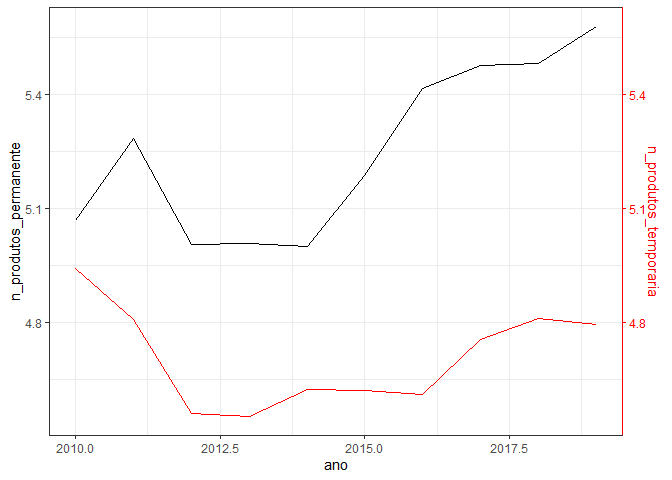
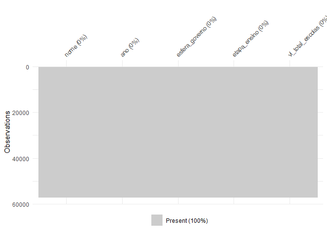
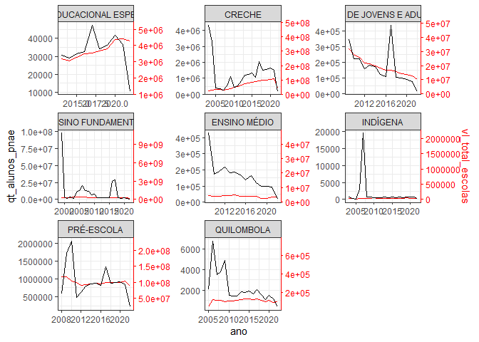

<!-- README.md is generated from README.Rmd. Please edit that file -->

## Carregando Pacotes

``` r
library(readxl)
library(tidyverse)
library(vegan)
library(corrplot)
library(bit64)
library(ggpubr)
library(stringr)
library(sf)
source("R/my-functions.R")
theme_set(theme_bw())
```

------------------------------------------------------------------------

**DESAFIO 1**. Promover o acesso universal à alimentação adequada e
saudável, com prioridade para as famílias e pessoas em situação de
insegurança alimentar e nutricional

Temas: Transferência de Renda; Alimentação escolar; Distribuição de
alimentos.

1.1 Programa Bolsa Família  
1.1.1 Pessoas Beneficiárias **(OK)**  
1.1.2 Famílias Beneficiárias **(OK)**  
1.1.3 Valor Pago **(OK)**

### Base de dados - “im”

``` r
im <- read_rds("data/im.rds") %>% 
  select(nome,id_municipio:valor_pago_pbf)
data_set <- im %>% filter(ano >= 2010) %>% 
  group_by(nome, ano) %>% 
  summarise(
    familias_beneficiarias_pbf=
      sum(familias_beneficiarias_pbf,na.rm=TRUE)/12,
    pessoas_beneficiarias_pbf=
      sum(pessoas_beneficiarias_pbf,na.rm=TRUE)/12,
    valor_pago_pbf=sum(valor_pago_pbf,na.rm=TRUE))
```

### Visualização de dados

``` r
tab_im <- im %>% 
  group_by(ano) %>% filter(ano >=2010, ano < 2020) %>% 
  summarise(
    nfamilias = sum(familias_beneficiarias_pbf, na.rm=TRUE),
    npessoa = sum(pessoas_beneficiarias_pbf, na.rm=TRUE),
    valorpago = sum(valor_pago_pbf, na.rm=TRUE),
  )

tab_im %>% 
  ggplot(aes(x=ano, y=nfamilias)) +
  geom_col(col="black",fill="lightgray")
```

<!-- -->

``` r
tab_im %>% 
  ggplot(aes(x=ano, y=npessoa)) +
  geom_col(col="black",fill="lightgray")
```

<!-- -->

``` r
tab_im %>% 
  ggplot(aes(x=ano, y=valorpago)) +
  geom_col(col="black",fill="lightgray")
```

<!-- -->

#### Tabela de Dados

``` r
tab_im
#> # A tibble: 10 x 4
#>      ano nfamilias  npessoa  valorpago
#>    <int>     <int>    <int>      <dbl>
#>  1  2010  13346131        0 1145282091
#>  2  2011  14383203        0 1493753207
#>  3  2012  14645039        0 1785146440
#>  4  2013  15529029        0 2103544648
#>  5  2014  15951587        0 2334973894
#>  6  2015  16685980        0 2500827660
#>  7  2016  17470926        0 2682409405
#>  8  2017  17560121        0 2806387560
#>  9  2018  18627450 55840305 3047820940
#> 10  2019  18027294 52696807 3078050973
```

#### Criando a base resumo

``` r
data_set_muni <- data_set %>% filter(ano>= 2015, ano < 2020) %>% 
  group_by(nome) %>% 
  summarise(
    pbf_familias = mean(familias_beneficiarias_pbf, na.rm=TRUE),
    pbf_pessoas = mean(pessoas_beneficiarias_pbf, na.rm=TRUE),
    pbf_valor = mean(valor_pago_pbf, na.rm=TRUE)
  )
```

#### Agrupamento e Correlação

``` r
nome <- data_set_muni$nome
da <- data_set_muni
da_pad <- decostand(da[-1] , 
                      method = "standardize",
                      na.rm=TRUE)
df <- da_pad

visdat::vis_miss(da_pad)
```

<!-- -->

``` r
da_pad_euc<-vegdist(df,"euclidean",na.rm=TRUE) 
da_pad_euc_ward<-hclust(da_pad_euc, method="ward.D")
plot(da_pad_euc_ward, 
     ylab="Distância Euclidiana",
     xlab="Acessos", hang=-1,
     col="blue", las=1,
     cex=.6,lwd=1.5);box()
```

<!-- -->

``` r
grupo<-cutree(da_pad_euc_ward,3)
```

``` r
cor_matrix <- cor(df,use = "na.or.complete")
corrplot(cor_matrix, method="ellipse")
```

<!-- -->

- Variáveis altamente correlacionadas, apenas uma delas representa bem
  esse banco de dados

``` r
pca <-  prcomp(df,
               scale=T)
# Autovalores
eig<-pca$sdev^2
print(round(eig,3))
#> [1] 2.999 0.001 0.000
ve<-eig/sum(eig)
print(round(ve,4))
#> [1] 0.9997 0.0002 0.0001
print(round(cumsum(ve),4)*100)
#> [1]  99.97  99.99 100.00
mcor<-cor(df,pca$x)
corrplot(mcor)
```

<!-- -->

``` r
screeplot(pca)
abline(h=1)
```

<!-- -->

``` r
pc1V<-cor(df,pca$x)[,1]/sd(cor(df,pca$x)[,1])
pc2V<-cor(df,pca$x)[,2]/sd(cor(df,pca$x)[,2])
pc3V<-cor(df,pca$x)[,3]/sd(cor(df,pca$x)[,3])
pc1c<-pca$x[,1]/sd(pca$x[,1])
pc2c<-pca$x[,2]/sd(pca$x[,2])
pc3c<-pca$x[,3]/sd(pca$x[,3])
nv<-ncol(df)
```

``` r
bip<-data.frame(pc1c,pc2c,pc3c,nome,grupo=as.factor(grupo))
texto <- data.frame(x = pc1V, y = pc2V,z = pc3V,label = names(df)
)

bip %>% 
  ggplot(aes(x=pc1c, y=pc2c))+
  geom_point() +
  geom_point(aes(shape = grupo, color = grupo), size = 3) + theme_minimal()+
  scale_shape_manual(values=16:18)+
  scale_color_manual(values=c("#009E73","#D55E00", "#A6761D"))+
  geom_vline(aes(xintercept=0),
             color="black", size=1) +
  geom_hline(aes(yintercept=0),
             color="black", size=1) +
  annotate(geom="segment",
           x=rep(0,length(df)),
           xend=texto$x,
           y=rep(0,length(df)),
           yend=texto$y,color="black",lwd=.5) +
  geom_label(data=texto,aes(x=x,y=y,label=label),
             color="black",angle=0,fontface="bold",size=4,fill="white") +
  labs(x=paste("CP1 (",round(100*ve[1],2),"%)",sep=""),
       y=paste("CP2 (",round(100*ve[2],2),"%)",sep=""),
       color="",shape="") +
  theme(legend.position = "top")
```

<!-- -->

``` r
ck<-sum(pca$sdev^2>=0.98)
tabelapca<-vector()
for( l in 1:ck) tabelapca<-cbind(tabelapca,mcor[,l])
colnames(tabelapca)<-paste(rep(c("PC"),ck),1:ck,sep="")
pcat<-round(tabelapca,3)
tabelapca<-tabelapca[order(abs(tabelapca[,1])),]
print(tabelapca)
#>    pbf_valor pbf_familias  pbf_pessoas 
#>    0.9998245    0.9998260    0.9998837
```

``` r
df_grupo <- data.frame(nome, grupo)
df_nomes <- read_rds("data/df_nome.rds")
df_grupo <- left_join(df_grupo,df_nomes %>% select(id_municipio, nome) ,by ="nome")
d_sf_municipio <- st_read("shp/35MUE250GC_SIR.shp", quiet = TRUE)
d_sf_municipio <- d_sf_municipio %>%
  rename(id_municipio = CD_GEOCMU) %>%
  inner_join(df_grupo %>%
               relocate(id_municipio), "id_municipio") %>% 
  mutate(grupo = as.factor(grupo))
ggplot(d_sf_municipio) +
  geom_sf(aes(fill = grupo))+
  theme_minimal() +
  scale_fill_viridis_d()
```

<!-- --> \#### Grupo
1:

``` r
nome[grupo == 1]
#>   [1] "Adamantina"                 "Adolfo"                    
#>   [3] "Aguaí"                      "Agudos"                    
#>   [5] "Alambari"                   "Alfredo Marcondes"         
#>   [7] "Altair"                     "Altinópolis"               
#>   [9] "Alto Alegre"                "Alumínio"                  
#>  [11] "Alvinlândia"                "Americana"                 
#>  [13] "Amparo"                     "Américo Brasiliense"       
#>  [15] "Américo de Campos"          "Analândia"                 
#>  [17] "Andradina"                  "Angatuba"                  
#>  [19] "Anhembi"                    "Anhumas"                   
#>  [21] "Aparecida"                  "Aparecida d'Oeste"         
#>  [23] "Apiaí"                      "Aramina"                   
#>  [25] "Arandu"                     "Arapeí"                    
#>  [27] "Araraquara"                 "Araras"                    
#>  [29] "Araçariguama"               "Araçatuba"                 
#>  [31] "Araçoiaba da Serra"         "Arco-Íris"                 
#>  [33] "Arealva"                    "Areias"                    
#>  [35] "Areiópolis"                 "Ariranha"                  
#>  [37] "Artur Nogueira"             "Arujá"                     
#>  [39] "Aspásia"                    "Assis"                     
#>  [41] "Atibaia"                    "Auriflama"                 
#>  [43] "Avanhandava"                "Avaré"                     
#>  [45] "Avaí"                       "Bady Bassitt"              
#>  [47] "Balbinos"                   "Bananal"                   
#>  [49] "Barbosa"                    "Bariri"                    
#>  [51] "Barra Bonita"               "Barra do Chapéu"           
#>  [53] "Barra do Turvo"             "Barretos"                  
#>  [55] "Barrinha"                   "Barão de Antonina"         
#>  [57] "Bastos"                     "Batatais"                  
#>  [59] "Bebedouro"                  "Bento de Abreu"            
#>  [61] "Bernardino de Campos"       "Bertioga"                  
#>  [63] "Bilac"                      "Birigui"                   
#>  [65] "Biritiba-Mirim"             "Boa Esperança do Sul"      
#>  [67] "Bocaina"                    "Bofete"                    
#>  [69] "Boituva"                    "Bom Jesus dos Perdões"     
#>  [71] "Bom Sucesso de Itararé"     "Boracéia"                  
#>  [73] "Borborema"                  "Borebi"                    
#>  [75] "Borá"                       "Botucatu"                  
#>  [77] "Bragança Paulista"          "Braúna"                    
#>  [79] "Brejo Alegre"               "Brodowski"                 
#>  [81] "Brotas"                     "Buri"                      
#>  [83] "Buritama"                   "Buritizal"                 
#>  [85] "Bálsamo"                    "Cabreúva"                  
#>  [87] "Cabrália Paulista"          "Cachoeira Paulista"        
#>  [89] "Caconde"                    "Cafelândia"                
#>  [91] "Caiabu"                     "Caieiras"                  
#>  [93] "Caiuá"                      "Cajati"                    
#>  [95] "Cajobi"                     "Cajuru"                    
#>  [97] "Campina do Monte Alegre"    "Campo Limpo Paulista"      
#>  [99] "Campos Novos Paulista"      "Campos do Jordão"          
#> [101] "Cananéia"                   "Canas"                     
#> [103] "Canitar"                    "Capela do Alto"            
#> [105] "Capivari"                   "Capão Bonito"              
#> [107] "Caraguatatuba"              "Cardoso"                   
#> [109] "Casa Branca"                "Castilho"                  
#> [111] "Catanduva"                  "Catiguá"                   
#> [113] "Caçapava"                   "Cedral"                    
#> [115] "Cerqueira César"            "Cerquilho"                 
#> [117] "Cesário Lange"              "Charqueada"                
#> [119] "Chavantes"                  "Clementina"                
#> [121] "Colina"                     "Colômbia"                  
#> [123] "Conchal"                    "Conchas"                   
#> [125] "Cordeirópolis"              "Coroados"                  
#> [127] "Coronel Macedo"             "Corumbataí"                
#> [129] "Cosmorama"                  "Cosmópolis"                
#> [131] "Cotia"                      "Cravinhos"                 
#> [133] "Cristais Paulista"          "Cruzeiro"                  
#> [135] "Cruzália"                   "Cubatão"                   
#> [137] "Cunha"                      "Cássia dos Coqueiros"      
#> [139] "Cândido Mota"               "Cândido Rodrigues"         
#> [141] "Descalvado"                 "Dirce Reis"                
#> [143] "Divinolândia"               "Dobrada"                   
#> [145] "Dois Córregos"              "Dolcinópolis"              
#> [147] "Dourado"                    "Dracena"                   
#> [149] "Duartina"                   "Dumont"                    
#> [151] "Echaporã"                   "Eldorado"                  
#> [153] "Elias Fausto"               "Elisiário"                 
#> [155] "Embaúba"                    "Embu-Guaçu"                
#> [157] "Emilianópolis"              "Engenheiro Coelho"         
#> [159] "Espírito Santo do Pinhal"   "Espírito Santo do Turvo"   
#> [161] "Estiva Gerbi"               "Estrela d'Oeste"           
#> [163] "Estrela do Norte"           "Euclides da Cunha Paulista"
#> [165] "Fartura"                    "Fernando Prestes"          
#> [167] "Fernandópolis"              "Fernão"                    
#> [169] "Flora Rica"                 "Floreal"                   
#> [171] "Florínia"                   "Flórida Paulista"          
#> [173] "Gabriel Monteiro"           "Garça"                     
#> [175] "Gastão Vidigal"             "Gavião Peixoto"            
#> [177] "General Salgado"            "Getulina"                  
#> [179] "Glicério"                   "Guaimbê"                   
#> [181] "Guaiçara"                   "Guapiara"                  
#> [183] "Guapiaçu"                   "Guaraci"                   
#> [185] "Guarani d'Oeste"            "Guarantã"                  
#> [187] "Guararapes"                 "Guararema"                 
#> [189] "Guaratinguetá"              "Guaraçaí"                  
#> [191] "Guareí"                     "Guariba"                   
#> [193] "Guará"                      "Guatapará"                 
#> [195] "Guaíra"                     "Guzolândia"                
#> [197] "Gália"                      "Herculândia"               
#> [199] "Holambra"                   "Iacanga"                   
#> [201] "Iacri"                      "Iaras"                     
#> [203] "Ibaté"                      "Ibirarema"                 
#> [205] "Ibirá"                      "Ibitinga"                  
#> [207] "Ibiúna"                     "Icém"                      
#> [209] "Iepê"                       "Igarapava"                 
#> [211] "Igaratá"                    "Igaraçu do Tietê"          
#> [213] "Iguape"                     "Ilha Comprida"             
#> [215] "Ilha Solteira"              "Ilhabela"                  
#> [217] "Indaiatuba"                 "Indiana"                   
#> [219] "Indiaporã"                  "Inúbia Paulista"           
#> [221] "Ipaussu"                    "Iperó"                     
#> [223] "Ipeúna"                     "Ipiguá"                    
#> [225] "Iporanga"                   "Ipuã"                      
#> [227] "Iracemápolis"               "Irapuru"                   
#> [229] "Irapuã"                     "Itaberá"                   
#> [231] "Itajobi"                    "Itaju"                     
#> [233] "Itapecerica da Serra"       "Itapetininga"              
#> [235] "Itapeva"                    "Itapira"                   
#> [237] "Itapirapuã Paulista"        "Itaporanga"                
#> [239] "Itapura"                    "Itapuí"                    
#> [241] "Itararé"                    "Itariri"                   
#> [243] "Itatiba"                    "Itatinga"                  
#> [245] "Itaí"                       "Itaóca"                    
#> [247] "Itirapina"                  "Itirapuã"                  
#> [249] "Itobi"                      "Itupeva"                   
#> [251] "Ituverava"                  "Itápolis"                  
#> [253] "Jaborandi"                  "Jaboticabal"               
#> [255] "Jaci"                       "Jacupiranga"               
#> [257] "Jaguariúna"                 "Jales"                     
#> [259] "Jambeiro"                   "Jandira"                   
#> [261] "Jardinópolis"               "Jarinu"                    
#> [263] "Jaú"                        "Jeriquara"                 
#> [265] "Joanópolis"                 "José Bonifácio"            
#> [267] "João Ramalho"               "Jumirim"                   
#> [269] "Jundiaí"                    "Junqueirópolis"            
#> [271] "Juquitiba"                  "Juquiá"                    
#> [273] "Júlio Mesquita"             "Lagoinha"                  
#> [275] "Laranjal Paulista"          "Lavrinhas"                 
#> [277] "Lavínia"                    "Leme"                      
#> [279] "Lençóis Paulista"           "Lindóia"                   
#> [281] "Lins"                       "Lorena"                    
#> [283] "Lourdes"                    "Louveira"                  
#> [285] "Lucianópolis"               "Lucélia"                   
#> [287] "Luiziânia"                  "Lupércio"                  
#> [289] "Lutécia"                    "Luís Antônio"              
#> [291] "Macatuba"                   "Macaubal"                  
#> [293] "Macedônia"                  "Magda"                     
#> [295] "Mairinque"                  "Mairiporã"                 
#> [297] "Manduri"                    "Marabá Paulista"           
#> [299] "Maracaí"                    "Marapoama"                 
#> [301] "Marinópolis"                "Mariápolis"                
#> [303] "Martinópolis"               "Matão"                     
#> [305] "Mendonça"                   "Meridiano"                 
#> [307] "Mesópolis"                  "Miguelópolis"              
#> [309] "Mineiros do Tietê"          "Mira Estrela"              
#> [311] "Miracatu"                   "Mirandópolis"              
#> [313] "Mirante do Paranapanema"    "Mirassol"                  
#> [315] "Mirassolândia"              "Mococa"                    
#> [317] "Mogi Guaçu"                 "Mogi Mirim"                
#> [319] "Mombuca"                    "Mongaguá"                  
#> [321] "Monte Alegre do Sul"        "Monte Alto"                
#> [323] "Monte Aprazível"            "Monte Azul Paulista"       
#> [325] "Monte Castelo"              "Monte Mor"                 
#> [327] "Monteiro Lobato"            "Monções"                   
#> [329] "Morro Agudo"                "Morungaba"                 
#> [331] "Motuca"                     "Murutinga do Sul"          
#> [333] "Nantes"                     "Narandiba"                 
#> [335] "Natividade da Serra"        "Nazaré Paulista"           
#> [337] "Neves Paulista"             "Nhandeara"                 
#> [339] "Nipoã"                      "Nova Aliança"              
#> [341] "Nova Campina"               "Nova Canaã Paulista"       
#> [343] "Nova Castilho"              "Nova Europa"               
#> [345] "Nova Granada"               "Nova Guataporanga"         
#> [347] "Nova Independência"         "Nova Luzitânia"            
#> [349] "Nova Odessa"                "Novais"                    
#> [351] "Novo Horizonte"             "Nuporanga"                 
#> [353] "Ocauçu"                     "Olímpia"                   
#> [355] "Onda Verde"                 "Oriente"                   
#> [357] "Orindiúva"                  "Orlândia"                  
#> [359] "Oscar Bressane"             "Osvaldo Cruz"              
#> [361] "Ourinhos"                   "Ouro Verde"                
#> [363] "Ouroeste"                   "Pacaembu"                  
#> [365] "Palestina"                  "Palmares Paulista"         
#> [367] "Palmeira d'Oeste"           "Palmital"                  
#> [369] "Panorama"                   "Paraguaçu Paulista"        
#> [371] "Paraibuna"                  "Paranapanema"              
#> [373] "Paranapuã"                  "Parapuã"                   
#> [375] "Paraíso"                    "Pardinho"                  
#> [377] "Pariquera-Açu"              "Parisi"                    
#> [379] "Patrocínio Paulista"        "Paulicéia"                 
#> [381] "Paulistânia"                "Paulo de Faria"            
#> [383] "Paulínia"                   "Pederneiras"               
#> [385] "Pedra Bela"                 "Pedranópolis"              
#> [387] "Pedregulho"                 "Pedreira"                  
#> [389] "Pedrinhas Paulista"         "Pedro de Toledo"           
#> [391] "Penápolis"                  "Pereira Barreto"           
#> [393] "Pereiras"                   "Peruíbe"                   
#> [395] "Piacatu"                    "Piedade"                   
#> [397] "Pilar do Sul"               "Pindorama"                 
#> [399] "Pinhalzinho"                "Piquerobi"                 
#> [401] "Piquete"                    "Piracaia"                  
#> [403] "Piraju"                     "Pirajuí"                   
#> [405] "Pirangi"                    "Pirapora do Bom Jesus"     
#> [407] "Pirapozinho"                "Pirassununga"              
#> [409] "Piratininga"                "Pitangueiras"              
#> [411] "Planalto"                   "Platina"                   
#> [413] "Poloni"                     "Pompéia"                   
#> [415] "Pongaí"                     "Pontal"                    
#> [417] "Pontalinda"                 "Pontes Gestal"             
#> [419] "Populina"                   "Porangaba"                 
#> [421] "Porto Feliz"                "Porto Ferreira"            
#> [423] "Potim"                      "Potirendaba"               
#> [425] "Pracinha"                   "Pradópolis"                
#> [427] "Pratânia"                   "Presidente Alves"          
#> [429] "Presidente Bernardes"       "Presidente Epitácio"       
#> [431] "Presidente Prudente"        "Presidente Venceslau"      
#> [433] "Promissão"                  "Quadra"                    
#> [435] "Quatá"                      "Queiroz"                   
#> [437] "Queluz"                     "Quintana"                  
#> [439] "Rafard"                     "Rancharia"                 
#> [441] "Redenção da Serra"          "Regente Feijó"             
#> [443] "Reginópolis"                "Registro"                  
#> [445] "Restinga"                   "Ribeira"                   
#> [447] "Ribeirão Bonito"            "Ribeirão Branco"           
#> [449] "Ribeirão Corrente"          "Ribeirão Grande"           
#> [451] "Ribeirão Pires"             "Ribeirão do Sul"           
#> [453] "Ribeirão dos Índios"        "Rifaina"                   
#> [455] "Rincão"                     "Rinópolis"                 
#> [457] "Rio Claro"                  "Rio Grande da Serra"       
#> [459] "Rio das Pedras"             "Riolândia"                 
#> [461] "Riversul"                   "Rosana"                    
#> [463] "Roseira"                    "Rubinéia"                  
#> [465] "Rubiácea"                   "Sabino"                    
#> [467] "Sagres"                     "Sales"                     
#> [469] "Sales Oliveira"             "Salesópolis"               
#> [471] "Salmourão"                  "Saltinho"                  
#> [473] "Salto"                      "Salto Grande"              
#> [475] "Salto de Pirapora"          "Sandovalina"               
#> [477] "Santa Adélia"               "Santa Albertina"           
#> [479] "Santa Branca"               "Santa Bárbara d'Oeste"     
#> [481] "Santa Clara d'Oeste"        "Santa Cruz da Conceição"   
#> [483] "Santa Cruz da Esperança"    "Santa Cruz das Palmeiras"  
#> [485] "Santa Cruz do Rio Pardo"    "Santa Ernestina"           
#> [487] "Santa Fé do Sul"            "Santa Gertrudes"           
#> [489] "Santa Isabel"               "Santa Lúcia"               
#> [491] "Santa Maria da Serra"       "Santa Mercedes"            
#> [493] "Santa Rita d'Oeste"         "Santa Rita do Passa Quatro"
#> [495] "Santa Rosa de Viterbo"      "Santa Salete"              
#> [497] "Santana da Ponte Pensa"     "Santana de Parnaíba"       
#> [499] "Santo Anastácio"            "Santo Antônio da Alegria"  
#> [501] "Santo Antônio de Posse"     "Santo Antônio do Aracanguá"
#> [503] "Santo Antônio do Jardim"    "Santo Antônio do Pinhal"   
#> [505] "Santo Expedito"             "Santópolis do Aguapeí"     
#> [507] "Sarapuí"                    "Sarutaiá"                  
#> [509] "Sebastianópolis do Sul"     "Serra Azul"                
#> [511] "Serra Negra"                "Serrana"                   
#> [513] "Sertãozinho"                "Sete Barras"               
#> [515] "Severínia"                  "Silveiras"                 
#> [517] "Socorro"                    "Sud Mennucci"              
#> [519] "Suzanápolis"                "São Bento do Sapucaí"      
#> [521] "São Caetano do Sul"         "São Francisco"             
#> [523] "São Joaquim da Barra"       "São José da Bela Vista"    
#> [525] "São José do Barreiro"       "São José do Rio Pardo"     
#> [527] "São João da Boa Vista"      "São João das Duas Pontes"  
#> [529] "São João de Iracema"        "São João do Pau d'Alho"    
#> [531] "São Lourenço da Serra"      "São Luís do Paraitinga"    
#> [533] "São Manuel"                 "São Miguel Arcanjo"        
#> [535] "São Pedro"                  "São Pedro do Turvo"        
#> [537] "São Roque"                  "São Sebastião"             
#> [539] "São Sebastião da Grama"     "São Simão"                 
#> [541] "Tabapuã"                    "Tabatinga"                 
#> [543] "Taciba"                     "Taguaí"                    
#> [545] "Taiaçu"                     "Taiúva"                    
#> [547] "Tambaú"                     "Tanabi"                    
#> [549] "Tapiratiba"                 "Tapiraí"                   
#> [551] "Taquaral"                   "Taquaritinga"              
#> [553] "Taquarituba"                "Taquarivaí"                
#> [555] "Tarabai"                    "Tarumã"                    
#> [557] "Tatuí"                      "Taubaté"                   
#> [559] "Tejupá"                     "Teodoro Sampaio"           
#> [561] "Terra Roxa"                 "Tietê"                     
#> [563] "Timburi"                    "Torre de Pedra"            
#> [565] "Torrinha"                   "Trabiju"                   
#> [567] "Tremembé"                   "Três Fronteiras"           
#> [569] "Tuiuti"                     "Tupi Paulista"             
#> [571] "Tupã"                       "Turiúba"                   
#> [573] "Turmalina"                  "Ubarana"                   
#> [575] "Ubatuba"                    "Ubirajara"                 
#> [577] "Uchoa"                      "União Paulista"            
#> [579] "Uru"                        "Urupês"                    
#> [581] "Urânia"                     "Valentim Gentil"           
#> [583] "Valinhos"                   "Valparaíso"                
#> [585] "Vargem"                     "Vargem Grande Paulista"    
#> [587] "Vargem Grande do Sul"       "Vera Cruz"                 
#> [589] "Vinhedo"                    "Viradouro"                 
#> [591] "Vista Alegre do Alto"       "Vitória Brasil"            
#> [593] "Votorantim"                 "Votuporanga"               
#> [595] "Várzea Paulista"            "Zacarias"                  
#> [597] "Águas da Prata"             "Águas de Lindóia"          
#> [599] "Águas de Santa Bárbara"     "Águas de São Pedro"        
#> [601] "Álvares Florence"           "Álvares Machado"           
#> [603] "Álvaro de Carvalho"         "Óleo"
```

#### Grupo 2:

``` r
nome[grupo == 2]
#>  [1] "Barueri"               "Bauru"                 "Cajamar"              
#>  [4] "Campinas"              "Carapicuíba"           "Diadema"              
#>  [7] "Embu das Artes"        "Ferraz de Vasconcelos" "Franca"               
#> [10] "Francisco Morato"      "Franco da Rocha"       "Guarujá"              
#> [13] "Guarulhos"             "Hortolândia"           "Itanhaém"             
#> [16] "Itapevi"               "Itaquaquecetuba"       "Itu"                  
#> [19] "Jacareí"               "Limeira"               "Marília"              
#> [22] "Mauá"                  "Mogi das Cruzes"       "Osasco"               
#> [25] "Pindamonhangaba"       "Piracicaba"            "Poá"                  
#> [28] "Praia Grande"          "Ribeirão Preto"        "Santo André"          
#> [31] "Santos"                "Sorocaba"              "Sumaré"               
#> [34] "Suzano"                "São Bernardo do Campo" "São Carlos"           
#> [37] "São José do Rio Preto" "São José dos Campos"   "São Vicente"          
#> [40] "Taboão da Serra"
```

#### Grupo 3:

``` r
nome[grupo == 3]
#> [1] "São Paulo"
```

------------------------------------------------------------------------

**DESAFIO 2**. Combater a insegurança alimentar e nutricional e promover
a inclusão produtiva rural em grupos populacionais específicos, com
ênfase em povos e comunidades tradicionais e outros grupos sociais
vulneráveis no meio rural.

Temas: Insegurança alimentar e nutricional; Inclusão produtiva rural;
Acesso à terra e gestão territorial; Biodiversidade; Saúde indígena;
extrativistas e ribeirinhos; Acesso a políticas públicas.

*MACRO DESAFIO*: Promoção de Sistemas Alimentares Saudáveis e
Sustentáveis Desafios: o conjunto dos desafios 3, 4 e 5 contemplam este
macro desafio.

------------------------------------------------------------------------

**DESAFIO 3**. Promover a produção de alimentos saudáveis e
sustentáveis, a estruturação da agricultura familiar e o fortalecimento
de sistemas de produção de base agroecológica

Temas: Fortalecimento da agricultura familiar; Reforma agrária;
Transição agroecológica; Mulheres; Juventude; Sementes; Mudanças
climáticas.

3.1 Produção de alimentos  
3.2 Área Plantada **(OK)**  
3.2.1 Área Plantada Agricultura Familiar  
3.2.2 Área Plantada Agricultura não familiar  
3.3. Rendimento Médio **(OK)**  
3.4 Proporção Área Colhida **(OK)**  
3.5 Proporção Valor da Produção **(OK)**

### Base de dados “lavouras”

``` r
lavoura_permanente <- read_rds("data/permanente.rds") 
lavoura_temporaria <- read_rds("data/temporaria.rds")
lavouras <- rbind(lavoura_permanente %>% 
        mutate(tipo = "permanente"),
      lavoura_temporaria %>% 
        mutate(tipo = "temporaria")
      )
my_na_count <- function(x) sum(is.na(x))
lavouras$na <- apply(lavouras[5:12],1,my_na_count)
```

### Visualização de dados

``` r
lavouras %>% 
  filter(na !=8, ano >= 2010) %>% 
  arrange(ano) %>% 
  relocate(tipo) %>% 
  group_by(tipo,produto) %>% 
  summarise(pvp = sum(prop_valor_producao,na.rm = TRUE)) %>% 
  mutate(produto = produto %>% fct_lump(n=10, w=pvp) %>% fct_reorder(pvp)) %>% 
  ggplot(aes(x=pvp,y=produto,fill=tipo)) +
  geom_col(color="black")+
  facet_wrap(~tipo,scales = "free") + 
  theme_bw() +
  theme(axis.text.x = element_text(angle = 90, hjust=1))
```

<!-- -->

``` r
lavouras <- lavouras %>% 
            filter(na != 8, ano >= 2010,
                   produto != "Café (em grão) Arábica",
                   produto != "Café (em grão) Canephora") %>% 
  select(-na)
lavouras <- lavouras %>% 
  group_by(tipo, ano, nome) %>% 
  summarise(
    n_produtos = n(),
    area_plantada = sum(area_plantada,na.rm=TRUE),
    rendimento_medio = mean(rendimento_medio,na.rm=TRUE),
    prop_area_colhida = mean(prop_area_colhida,na.rm=TRUE) ,
    prop_valor_producao = mean(prop_valor_producao,na.rm=TRUE)
    
  ) %>% 
  pivot_wider(names_from = tipo,
              values_from = n_produtos:prop_valor_producao)

data_set <- left_join(
  data_set,
  lavouras,
  by = c("ano","nome")
)
```

``` r
coeff <-1
tabe_lavouras <- lavouras %>% 
  group_by(ano) %>%
  summarise(
    n_produtos_permanente = mean(n_produtos_permanente,na.rm=TRUE),
    n_produtos_temporaria = mean(n_produtos_temporaria,na.rm=TRUE),
    area_plantada_permanente = mean(area_plantada_permanente,na.rm=TRUE),
    area_plantada_temporaria = mean(area_plantada_temporaria,na.rm=TRUE),
    rendimento_medio_permanente = mean(rendimento_medio_permanente,na.rm=TRUE),
    rendimento_medio_temporaria = mean(rendimento_medio_temporaria,na.rm=TRUE),
    prop_area_colhida_permanente = mean(prop_area_colhida_permanente,na.rm=TRUE),
    prop_area_colhida_temporaria = mean(prop_area_colhida_temporaria,na.rm=TRUE),
    prop_valor_producao_permanente = mean(prop_valor_producao_permanente,na.rm=TRUE),
    prop_valor_producao_temporaria = mean(prop_valor_producao_temporaria,na.rm=TRUE)
  )
```

``` r
tabe_lavouras %>% 
  ggplot(aes(x = ano)) +
  geom_line(aes(y = prop_valor_producao_permanente), color="red") +
  geom_line(aes(y = prop_valor_producao_temporaria/coeff)) +
  scale_y_continuous(
    name = "prop_valor_producao_permanente",
    sec.axis = sec_axis(~.*coeff, name="prop_valor_producao_temporaria")
  ) +
  theme(axis.line.y.right = element_line(color = "red"), 
        axis.ticks.y.right = element_line(color = "red"),
        axis.text.y.right = element_text(color = "red"),
        axis.title.y.right = element_text(color = "red"))
```

<!-- -->

``` r
tabe_lavouras %>% 
  ggplot(aes(x = ano)) +
  geom_line(aes(y = prop_area_colhida_permanente), color="red") +
  geom_line(aes(y = prop_area_colhida_temporaria/coeff)) +
  scale_y_continuous(
    name = "prop_area_colhida_permanente",
    sec.axis = sec_axis(~.*coeff, name="prop_area_colhida_temporaria")
  ) +
  theme(axis.line.y.right = element_line(color = "red"), 
        axis.ticks.y.right = element_line(color = "red"),
        axis.text.y.right = element_text(color = "red"),
        axis.title.y.right = element_text(color = "red"))
```

<!-- -->

``` r
tabe_lavouras %>% 
  ggplot(aes(x = ano)) +
  geom_line(aes(y = rendimento_medio_permanente), color="red") +
  geom_line(aes(y = rendimento_medio_temporaria/coeff)) +
  scale_y_continuous(
    name = "rendimento_medio_permanente",
    sec.axis = sec_axis(~.*coeff, name="rendimento_medio_temporaria")
  ) +
  theme(axis.line.y.right = element_line(color = "red"), 
        axis.ticks.y.right = element_line(color = "red"),
        axis.text.y.right = element_text(color = "red"),
        axis.title.y.right = element_text(color = "red"))
```

<!-- -->

``` r
tabe_lavouras %>% 
  ggplot(aes(x = ano)) +
  geom_line(aes(y = area_plantada_permanente), color="red") +
  geom_line(aes(y = area_plantada_temporaria/coeff)) +
  scale_y_continuous(
    name = "area_plantada_permanente",
    sec.axis = sec_axis(~.*coeff, name="area_plantada_temporaria")
  ) +
  theme(axis.line.y.right = element_line(color = "red"), 
        axis.ticks.y.right = element_line(color = "red"),
        axis.text.y.right = element_text(color = "red"),
        axis.title.y.right = element_text(color = "red"))
```

<!-- -->

``` r
tabe_lavouras %>% 
  ggplot(aes(x = ano)) +
  geom_line(aes(y = n_produtos_permanente), color="red") +
  geom_line(aes(y = n_produtos_temporaria/coeff)) +
  scale_y_continuous(
    name = "n_produtos_permanente",
    sec.axis = sec_axis(~.*coeff, name="n_produtos_temporaria")
  ) +
  theme(axis.line.y.right = element_line(color = "red"), 
        axis.ticks.y.right = element_line(color = "red"),
        axis.text.y.right = element_text(color = "red"),
        axis.title.y.right = element_text(color = "red"))
```

<!-- -->

#### Tabela de Dados

``` r
tabe_lavouras
#> # A tibble: 10 x 11
#>      ano n_produtos_permanente n_produtos_temporaria area_plantada_permanente
#>    <int>                 <dbl>                 <dbl>                    <dbl>
#>  1  2010                  4.94                  5.07                    1784.
#>  2  2011                  4.81                  5.28                    1708.
#>  3  2012                  4.56                  5.01                    1623.
#>  4  2013                  4.55                  5.01                    1499.
#>  5  2014                  4.62                  5                       1485.
#>  6  2015                  4.62                  5.19                    1426.
#>  7  2016                  4.61                  5.42                    1413.
#>  8  2017                  4.75                  5.48                    1438.
#>  9  2018                  4.81                  5.48                    1406.
#> 10  2019                  4.80                  5.58                    1412.
#> # i 7 more variables: area_plantada_temporaria <dbl>,
#> #   rendimento_medio_permanente <dbl>, rendimento_medio_temporaria <dbl>,
#> #   prop_area_colhida_permanente <dbl>, prop_area_colhida_temporaria <dbl>,
#> #   prop_valor_producao_permanente <dbl>, prop_valor_producao_temporaria <dbl>
```

#### Criando a base resumo

``` r
lavouras_resu <- lavouras %>% 
  group_by(nome) %>% 
  summarize(
    npper = mean(n_produtos_permanente,na.rm=TRUE),           
    nptem = mean(n_produtos_temporaria,na.rm=TRUE),         
    areapper   = mean(area_plantada_permanente,na.rm=TRUE),       
    areapltem  = mean(area_plantada_temporaria,na.rm=TRUE),      
    rendper = mean(rendimento_medio_permanente,na.rm=TRUE),     
    rendtem = mean(rendimento_medio_temporaria,na.rm=TRUE),    
    pacolhidaper = mean(prop_area_colhida_permanente,na.rm=TRUE),     
    pacolhidatem = mean(prop_area_colhida_temporaria,na.rm=TRUE),   
    pvalorpper  = mean(prop_valor_producao_permanente,na.rm=TRUE),  
    pvalortem = mean(prop_valor_producao_temporaria,na.rm=TRUE) 
  )

data_set_muni <- left_join(data_set_muni,
                           lavouras_resu,
                           by="nome")
```

#### Agrupamento e Correlação

``` r
da <- lavouras_resu
da_pad <- decostand(da[-1] , 
                      method = "standardize",
                      na.rm=TRUE)
df <- da_pad %>% 
  drop_na()
nome <- da %>% drop_na() %>%  pull(nome)
visdat::vis_miss(da_pad)
```

<!-- -->

``` r
da_pad_euc<-vegdist(df,"euclidean",na.rm=TRUE) 
da_pad_euc_ward<-hclust(da_pad_euc, method="ward.D")
plot(da_pad_euc_ward, 
     ylab="Distância Euclidiana",
     xlab="Acessos", hang=-1,
     col="blue", las=1,
     cex=.6,lwd=1.5);box()
```

<!-- -->

``` r
grupo<-cutree(da_pad_euc_ward,3)
```

``` r
cor_matrix <- cor(df, use = "na.or.complete")
corrplot(cor_matrix, method="ellipse")
```

<!-- -->

``` r
pca <-  prcomp(df,
               scale=T)
# Autovalores
eig<-pca$sdev^2
print(round(eig,3))
#>  [1] 4.092 2.062 1.059 0.983 0.746 0.632 0.247 0.178 0.000 0.000
ve<-eig/sum(eig)
print(round(ve,4))
#>  [1] 0.4092 0.2062 0.1059 0.0983 0.0746 0.0632 0.0247 0.0178 0.0000 0.0000
print(round(cumsum(ve),4)*100)
#>  [1]  40.92  61.54  72.14  81.96  89.42  95.74  98.22  99.99 100.00 100.00
mcor<-cor(df,pca$x)
corrplot(mcor)
```

<!-- -->

``` r
screeplot(pca)
abline(h=1)
```

<!-- -->

``` r
pc1V<-cor(df,pca$x)[,1]/sd(cor(df,pca$x)[,1])
pc2V<-cor(df,pca$x)[,2]/sd(cor(df,pca$x)[,2])
pc3V<-cor(df,pca$x)[,3]/sd(cor(df,pca$x)[,3])
pc1c<-pca$x[,1]/sd(pca$x[,1])
pc2c<-pca$x[,2]/sd(pca$x[,2])
pc3c<-pca$x[,3]/sd(pca$x[,3])
nv<-ncol(df)
```

``` r
bip<-data.frame(pc1c,pc2c,pc3c,nome,grupo=as.factor(grupo))
texto <- data.frame(x = pc1V, y = pc2V,z = pc3V,label = names(df)
)

bip %>% 
  ggplot(aes(x=pc1c, y=pc2c))+
  geom_point() +
  geom_point(aes(shape = grupo, color = grupo), size = 3) + theme_minimal()+
  scale_shape_manual(values=16:18)+
  scale_color_manual(values=c("#009E73","#D55E00", "#A6761D"))+
  geom_vline(aes(xintercept=0),
             color="black", size=1) +
  geom_hline(aes(yintercept=0),
             color="black", size=1) +
  annotate(geom="segment",
           x=rep(0,length(df)),
           xend=texto$x,
           y=rep(0,length(df)),
           yend=texto$y,color="black",lwd=.5) +
  geom_label(data=texto,aes(x=x,y=y,label=label),
             color="black",angle=0,fontface="bold",size=4,fill="white") +
  labs(x=paste("CP1 (",round(100*ve[1],2),"%)",sep=""),
       y=paste("CP2 (",round(100*ve[2],2),"%)",sep=""),
       color="",shape="") +
  theme(legend.position = "top")
```

<!-- -->

``` r
ck<-sum(pca$sdev^2>=0.98)
tabelapca<-vector()
for( l in 1:ck) tabelapca<-cbind(tabelapca,mcor[,l])
colnames(tabelapca)<-paste(rep(c("PC"),ck),1:ck,sep="")
pcat<-round(tabelapca,3)
tabelapca<-tabelapca[order(abs(tabelapca[,1])),]
print(tabelapca)
#>                      PC1         PC2          PC3         PC4
#> rendtem      -0.04708496  0.21807874 -0.713949932 -0.64883914
#> areapltem    -0.30014502 -0.52921096  0.253446179 -0.52208918
#> areapper     -0.39698776  0.07517774  0.591205813 -0.48642547
#> rendper      -0.42761927  0.43689673 -0.074738527  0.07196900
#> nptem        -0.74590283 -0.51897888  0.061782650  0.12084689
#> pvalortem     0.76169795  0.54323547  0.243636761 -0.11029465
#> pacolhidatem  0.76242146  0.54262736  0.244650423 -0.10840504
#> npper        -0.78002635  0.42353001  0.083150131  0.09287658
#> pacolhidaper  0.81619937 -0.50057565 -0.009783809 -0.01309159
#> pvalorpper    0.81677853 -0.49899389 -0.009769515 -0.01181416
```

``` r
df_grupo <- data.frame(nome, grupo)
df_nomes <- read_rds("data/df_nome.rds")
df_grupo <- left_join(df_grupo,df_nomes %>% select(id_municipio, nome) ,by ="nome")
d_sf_municipio <- st_read("shp/35MUE250GC_SIR.shp", quiet = TRUE)
d_sf_municipio <- d_sf_municipio %>%
  rename(id_municipio = CD_GEOCMU) %>%
  inner_join(df_grupo %>%
               relocate(id_municipio), "id_municipio") %>% 
  mutate(grupo = as.factor(grupo))
ggplot(d_sf_municipio) +
  geom_sf(aes(fill = grupo))+
  theme_minimal() +
  scale_fill_viridis_d()
```

<!-- --> \#### Grupo
1:

``` r
nome[grupo == 1]
#>   [1] "Adamantina"               "Adolfo"                  
#>   [3] "Aguaí"                    "Alfredo Marcondes"       
#>   [5] "Altinópolis"              "Alto Alegre"             
#>   [7] "Alvinlândia"              "Amparo"                  
#>   [9] "Angatuba"                 "Apiaí"                   
#>  [11] "Arealva"                  "Atibaia"                 
#>  [13] "Avaré"                    "Bady Bassitt"            
#>  [15] "Bariri"                   "Barra do Turvo"          
#>  [17] "Barretos"                 "Batatais"                
#>  [19] "Bauru"                    "Bebedouro"               
#>  [21] "Boa Esperança do Sul"     "Borborema"               
#>  [23] "Botucatu"                 "Bragança Paulista"       
#>  [25] "Brotas"                   "Buri"                    
#>  [27] "Bálsamo"                  "Caconde"                 
#>  [29] "Cafelândia"               "Caiuá"                   
#>  [31] "Cajati"                   "Campinas"                
#>  [33] "Cananéia"                 "Capão Bonito"            
#>  [35] "Casa Branca"              "Cedral"                  
#>  [37] "Clementina"               "Colômbia"                
#>  [39] "Conchal"                  "Coroados"                
#>  [41] "Corumbataí"               "Cristais Paulista"       
#>  [43] "Cândido Mota"             "Cândido Rodrigues"       
#>  [45] "Dracena"                  "Duartina"                
#>  [47] "Echaporã"                 "Eldorado"                
#>  [49] "Embaúba"                  "Espírito Santo do Pinhal"
#>  [51] "Fernando Prestes"         "Fernão"                  
#>  [53] "Flora Rica"               "Flórida Paulista"        
#>  [55] "Franca"                   "Gabriel Monteiro"        
#>  [57] "Garça"                    "Guaimbê"                 
#>  [59] "Guapiara"                 "Guapiaçu"                
#>  [61] "Guaíra"                   "Gália"                   
#>  [63] "Iacri"                    "Iaras"                   
#>  [65] "Ibitinga"                 "Ibiúna"                  
#>  [67] "Iguape"                   "Ilha Solteira"           
#>  [69] "Indiana"                  "Irapuru"                 
#>  [71] "Irapuã"                   "Itaberá"                 
#>  [73] "Itajobi"                  "Itaju"                   
#>  [75] "Itapetininga"             "Itapeva"                 
#>  [77] "Itapira"                  "Itararé"                 
#>  [79] "Itatiba"                  "Itaí"                    
#>  [81] "Itápolis"                 "Jaboticabal"             
#>  [83] "Jaci"                     "Jacupiranga"             
#>  [85] "Jales"                    "Jardinópolis"            
#>  [87] "Joanópolis"               "José Bonifácio"          
#>  [89] "Jundiaí"                  "Junqueirópolis"          
#>  [91] "Juquiá"                   "Limeira"                 
#>  [93] "Louveira"                 "Lucianópolis"            
#>  [95] "Lucélia"                  "Lupércio"                
#>  [97] "Macaubal"                 "Mairinque"               
#>  [99] "Maracaí"                  "Mariápolis"              
#> [101] "Marília"                  "Matão"                   
#> [103] "Mendonça"                 "Miguelópolis"            
#> [105] "Mineiros do Tietê"        "Mirandópolis"            
#> [107] "Mirassol"                 "Mococa"                  
#> [109] "Mogi Guaçu"               "Mogi Mirim"              
#> [111] "Monte Alegre do Sul"      "Monte Alto"              
#> [113] "Monte Aprazível"          "Monte Azul Paulista"     
#> [115] "Monte Castelo"            "Morro Agudo"             
#> [117] "Motuca"                   "Murutinga do Sul"        
#> [119] "Nazaré Paulista"          "Neves Paulista"          
#> [121] "Nova Aliança"             "Novo Horizonte"          
#> [123] "Ocauçu"                   "Olímpia"                 
#> [125] "Osvaldo Cruz"             "Pacaembu"                
#> [127] "Palmital"                 "Paraguaçu Paulista"      
#> [129] "Paranapanema"             "Parapuã"                 
#> [131] "Paraíso"                  "Pariquera-Açu"           
#> [133] "Pederneiras"              "Pedra Bela"              
#> [135] "Pedregulho"               "Pedreira"                
#> [137] "Piedade"                  "Pilar do Sul"            
#> [139] "Pindamonhangaba"          "Pindorama"               
#> [141] "Pinhalzinho"              "Piracaia"                
#> [143] "Piracicaba"               "Pirangi"                 
#> [145] "Pirassununga"             "Piratininga"             
#> [147] "Pongaí"                   "Pontalinda"              
#> [149] "Porto Feliz"              "Porto Ferreira"          
#> [151] "Potirendaba"              "Pradópolis"              
#> [153] "Presidente Epitácio"      "Presidente Venceslau"    
#> [155] "Rancharia"                "Registro"                
#> [157] "Ribeirão Branco"          "Ribeirão Grande"         
#> [159] "Rio Claro"                "Salmourão"               
#> [161] "Salto de Pirapora"        "Santa Branca"            
#> [163] "Santa Clara d'Oeste"      "Santa Cruz do Rio Pardo" 
#> [165] "Santa Mercedes"           "Santo Antônio de Posse"  
#> [167] "Santo Antônio do Pinhal"  "Sete Barras"             
#> [169] "Socorro"                  "Suzanápolis"             
#> [171] "São Bento do Sapucaí"     "São Carlos"              
#> [173] "São José da Bela Vista"   "São José do Rio Preto"   
#> [175] "São João da Boa Vista"    "São Miguel Arcanjo"      
#> [177] "São Pedro do Turvo"       "São Roque"               
#> [179] "Tabatinga"                "Taiaçu"                  
#> [181] "Tambaú"                   "Tanabi"                  
#> [183] "Taquaritinga"             "Taquarituba"             
#> [185] "Taquarivaí"               "Tupi Paulista"           
#> [187] "Tupã"                     "Ubirajara"               
#> [189] "Urupês"                   "Urânia"                  
#> [191] "Valinhos"                 "Vargem"                  
#> [193] "Vera Cruz"                "Vinhedo"                 
#> [195] "Vista Alegre do Alto"     "Vitória Brasil"          
#> [197] "Álvares Florence"         "Álvares Machado"         
#> [199] "Álvaro de Carvalho"
```

#### Grupo 2:

``` r
nome[grupo == 2]
#>   [1] "Agudos"                     "Alambari"                  
#>   [3] "Altair"                     "Alumínio"                  
#>   [5] "Américo Brasiliense"        "Américo de Campos"         
#>   [7] "Analândia"                  "Andradina"                 
#>   [9] "Anhembi"                    "Aparecida d'Oeste"         
#>  [11] "Arandu"                     "Arapeí"                    
#>  [13] "Araraquara"                 "Araras"                    
#>  [15] "Araçariguama"               "Araçatuba"                 
#>  [17] "Araçoiaba da Serra"         "Arco-Íris"                 
#>  [19] "Ariranha"                   "Artur Nogueira"            
#>  [21] "Aspásia"                    "Assis"                     
#>  [23] "Auriflama"                  "Avanhandava"               
#>  [25] "Avaí"                       "Balbinos"                  
#>  [27] "Bananal"                    "Barra do Chapéu"           
#>  [29] "Barão de Antonina"          "Bastos"                    
#>  [31] "Bernardino de Campos"       "Bilac"                     
#>  [33] "Birigui"                    "Bocaina"                   
#>  [35] "Bofete"                     "Boituva"                   
#>  [37] "Bom Sucesso de Itararé"     "Borebi"                    
#>  [39] "Braúna"                     "Brejo Alegre"              
#>  [41] "Brodowski"                  "Cabreúva"                  
#>  [43] "Cabrália Paulista"          "Cachoeira Paulista"        
#>  [45] "Caiabu"                     "Cajobi"                    
#>  [47] "Cajuru"                     "Campina do Monte Alegre"   
#>  [49] "Campos Novos Paulista"      "Capela do Alto"            
#>  [51] "Cardoso"                    "Catanduva"                 
#>  [53] "Catiguá"                    "Caçapava"                  
#>  [55] "Cerqueira César"            "Cesário Lange"             
#>  [57] "Charqueada"                 "Colina"                    
#>  [59] "Conchas"                    "Cordeirópolis"             
#>  [61] "Coronel Macedo"             "Cosmorama"                 
#>  [63] "Cosmópolis"                 "Cravinhos"                 
#>  [65] "Cruzeiro"                   "Cássia dos Coqueiros"      
#>  [67] "Descalvado"                 "Dirce Reis"                
#>  [69] "Divinolândia"               "Dobrada"                   
#>  [71] "Dois Córregos"              "Dolcinópolis"              
#>  [73] "Elias Fausto"               "Elisiário"                 
#>  [75] "Engenheiro Coelho"          "Espírito Santo do Turvo"   
#>  [77] "Estiva Gerbi"               "Estrela d'Oeste"           
#>  [79] "Fartura"                    "Fernandópolis"             
#>  [81] "Floreal"                    "Gastão Vidigal"            
#>  [83] "Gavião Peixoto"             "General Salgado"           
#>  [85] "Getulina"                   "Glicério"                  
#>  [87] "Guaiçara"                   "Guaraci"                   
#>  [89] "Guarani d'Oeste"            "Guarantã"                  
#>  [91] "Guararapes"                 "Guararema"                 
#>  [93] "Guaraçaí"                   "Guareí"                    
#>  [95] "Guariba"                    "Guará"                     
#>  [97] "Guatapará"                  "Guzolândia"                
#>  [99] "Herculândia"                "Holambra"                  
#> [101] "Iacanga"                    "Ibaté"                     
#> [103] "Ibirá"                      "Icém"                      
#> [105] "Igarapava"                  "Indaiatuba"                
#> [107] "Indiaporã"                  "Inúbia Paulista"           
#> [109] "Ipaussu"                    "Iperó"                     
#> [111] "Ipeúna"                     "Ipiguá"                    
#> [113] "Iporanga"                   "Iracemápolis"              
#> [115] "Itapirapuã Paulista"        "Itaporanga"                
#> [117] "Itapura"                    "Itapuí"                    
#> [119] "Itatinga"                   "Itaóca"                    
#> [121] "Itirapina"                  "Itirapuã"                  
#> [123] "Itobi"                      "Itu"                       
#> [125] "Itupeva"                    "Ituverava"                 
#> [127] "Jacareí"                    "Jaguariúna"                
#> [129] "Jarinu"                     "Jaú"                       
#> [131] "Jeriquara"                  "Júlio Mesquita"            
#> [133] "Lavínia"                    "Leme"                      
#> [135] "Lençóis Paulista"           "Lindóia"                   
#> [137] "Lins"                       "Luiziânia"                 
#> [139] "Lutécia"                    "Luís Antônio"              
#> [141] "Macedônia"                  "Magda"                     
#> [143] "Manduri"                    "Marabá Paulista"           
#> [145] "Marapoama"                  "Marinópolis"               
#> [147] "Martinópolis"               "Meridiano"                 
#> [149] "Mesópolis"                  "Mira Estrela"              
#> [151] "Mirante do Paranapanema"    "Mirassolândia"             
#> [153] "Mogi das Cruzes"            "Mombuca"                   
#> [155] "Monções"                    "Morungaba"                 
#> [157] "Nantes"                     "Narandiba"                 
#> [159] "Nhandeara"                  "Nipoã"                     
#> [161] "Nova Campina"               "Nova Canaã Paulista"       
#> [163] "Nova Castilho"              "Nova Europa"               
#> [165] "Nova Granada"               "Nova Guataporanga"         
#> [167] "Novais"                     "Nuporanga"                 
#> [169] "Onda Verde"                 "Oriente"                   
#> [171] "Orindiúva"                  "Orlândia"                  
#> [173] "Oscar Bressane"             "Ouro Verde"                
#> [175] "Ouroeste"                   "Palestina"                 
#> [177] "Palmares Paulista"          "Palmeira d'Oeste"          
#> [179] "Panorama"                   "Paranapuã"                 
#> [181] "Pardinho"                   "Parisi"                    
#> [183] "Patrocínio Paulista"        "Paulicéia"                 
#> [185] "Paulistânia"                "Paulo de Faria"            
#> [187] "Paulínia"                   "Pedranópolis"              
#> [189] "Penápolis"                  "Pereira Barreto"           
#> [191] "Piacatu"                    "Piquerobi"                 
#> [193] "Piraju"                     "Pirajuí"                   
#> [195] "Pirapozinho"                "Pitangueiras"              
#> [197] "Planalto"                   "Platina"                   
#> [199] "Poloni"                     "Pompéia"                   
#> [201] "Pontes Gestal"              "Populina"                  
#> [203] "Pracinha"                   "Pratânia"                  
#> [205] "Presidente Alves"           "Presidente Bernardes"      
#> [207] "Presidente Prudente"        "Promissão"                 
#> [209] "Quadra"                     "Quatá"                     
#> [211] "Queluz"                     "Quintana"                  
#> [213] "Regente Feijó"              "Reginópolis"               
#> [215] "Restinga"                   "Ribeira"                   
#> [217] "Ribeirão Bonito"            "Ribeirão Corrente"         
#> [219] "Ribeirão Preto"             "Ribeirão do Sul"           
#> [221] "Rincão"                     "Rinópolis"                 
#> [223] "Riolândia"                  "Riversul"                  
#> [225] "Rosana"                     "Rubinéia"                  
#> [227] "Sabino"                     "Sagres"                    
#> [229] "Sales"                      "Sales Oliveira"            
#> [231] "Salesópolis"                "Saltinho"                  
#> [233] "Salto Grande"               "Santa Adélia"              
#> [235] "Santa Albertina"            "Santa Cruz da Conceição"   
#> [237] "Santa Cruz das Palmeiras"   "Santa Ernestina"           
#> [239] "Santa Fé do Sul"            "Santa Gertrudes"           
#> [241] "Santa Maria da Serra"       "Santa Rita d'Oeste"        
#> [243] "Santa Rita do Passa Quatro" "Santa Rosa de Viterbo"     
#> [245] "Santa Salete"               "Santana da Ponte Pensa"    
#> [247] "Santo Anastácio"            "Santo Antônio da Alegria"  
#> [249] "Santo Antônio do Aracanguá" "Santópolis do Aguapeí"     
#> [251] "Sarapuí"                    "Sarutaiá"                  
#> [253] "Sebastianópolis do Sul"     "Serra Negra"               
#> [255] "Severínia"                  "Silveiras"                 
#> [257] "Sorocaba"                   "Sud Mennucci"              
#> [259] "Sumaré"                     "São Francisco"             
#> [261] "São José do Barreiro"       "São José do Rio Pardo"     
#> [263] "São João das Duas Pontes"   "São João de Iracema"       
#> [265] "São João do Pau d'Alho"     "São Luís do Paraitinga"    
#> [267] "São Manuel"                 "São Pedro"                 
#> [269] "São Sebastião da Grama"     "São Simão"                 
#> [271] "Tabapuã"                    "Taciba"                    
#> [273] "Taiúva"                     "Tapiratiba"                
#> [275] "Taquaral"                   "Tatuí"                     
#> [277] "Tejupá"                     "Teodoro Sampaio"           
#> [279] "Terra Roxa"                 "Tietê"                     
#> [281] "Timburi"                    "Torrinha"                  
#> [283] "Trabiju"                    "Três Fronteiras"           
#> [285] "Tuiuti"                     "Turmalina"                 
#> [287] "Ubarana"                    "Uchoa"                     
#> [289] "União Paulista"             "Uru"                       
#> [291] "Valentim Gentil"            "Valparaíso"                
#> [293] "Vargem Grande do Sul"       "Viradouro"                 
#> [295] "Votuporanga"                "Zacarias"                  
#> [297] "Águas da Prata"             "Águas de Lindóia"          
#> [299] "Águas de Santa Bárbara"
```

#### Grupo 3:

``` r
nome[grupo == 3]
#>  [1] "Anhumas"                    "Aramina"                   
#>  [3] "Areias"                     "Areiópolis"                
#>  [5] "Barbosa"                    "Barra Bonita"              
#>  [7] "Bento de Abreu"             "Biritiba-Mirim"            
#>  [9] "Bom Jesus dos Perdões"      "Boracéia"                  
#> [11] "Buritama"                   "Buritizal"                 
#> [13] "Cajamar"                    "Campos do Jordão"          
#> [15] "Canas"                      "Canitar"                   
#> [17] "Capivari"                   "Caraguatatuba"             
#> [19] "Castilho"                   "Cerquilho"                 
#> [21] "Chavantes"                  "Cruzália"                  
#> [23] "Dourado"                    "Dumont"                    
#> [25] "Embu-Guaçu"                 "Emilianópolis"             
#> [27] "Estrela do Norte"           "Euclides da Cunha Paulista"
#> [29] "Florínia"                   "Franco da Rocha"           
#> [31] "Guaratinguetá"              "Guarujá"                   
#> [33] "Ibirarema"                  "Iepê"                      
#> [35] "Igaratá"                    "Ilhabela"                  
#> [37] "Itanhaém"                   "Itariri"                   
#> [39] "Jaborandi"                  "Jambeiro"                  
#> [41] "João Ramalho"               "Jumirim"                   
#> [43] "Lagoinha"                   "Laranjal Paulista"         
#> [45] "Lavrinhas"                  "Lourdes"                   
#> [47] "Macatuba"                   "Miracatu"                  
#> [49] "Monte Mor"                  "Monteiro Lobato"           
#> [51] "Natividade da Serra"        "Nova Independência"        
#> [53] "Nova Luzitânia"             "Nova Odessa"               
#> [55] "Ourinhos"                   "Paraibuna"                 
#> [57] "Pedrinhas Paulista"         "Pedro de Toledo"           
#> [59] "Peruíbe"                    "Piquete"                   
#> [61] "Porangaba"                  "Queiroz"                   
#> [63] "Rafard"                     "Redenção da Serra"         
#> [65] "Ribeirão dos Índios"        "Rifaina"                   
#> [67] "Rio das Pedras"             "Roseira"                   
#> [69] "Rubiácea"                   "Salto"                     
#> [71] "Sandovalina"                "Santa Bárbara d'Oeste"     
#> [73] "Santa Cruz da Esperança"    "Santa Isabel"              
#> [75] "Santa Lúcia"                "Santo Antônio do Jardim"   
#> [77] "Santo Expedito"             "Serra Azul"                
#> [79] "Serrana"                    "Sertãozinho"               
#> [81] "São Joaquim da Barra"       "São José dos Campos"       
#> [83] "São Paulo"                  "São Sebastião"             
#> [85] "Taguaí"                     "Tapiraí"                   
#> [87] "Tarabai"                    "Tarumã"                    
#> [89] "Taubaté"                    "Torre de Pedra"            
#> [91] "Tremembé"                   "Turiúba"                   
#> [93] "Ubatuba"                    "Votorantim"                
#> [95] "Óleo"
```

------------------------------------------------------------------------

**DESAFIO 4**. Promover o abastecimento e o acesso regular e permanente
da população brasileira à alimentação

Temas: Compras públicas; Abastecimento; Legislação sanitária; Economia
solidaria; Perdas e desperdícios de alimentos; Equipamentos públicos de
SAN; Agricultura urbana.

**4.1 Programa da Alimentação Escolar**  
4.1.1 Número de Alunos Beneficiários **(OK)**  
4.1.2 Valor gasto com Compras da Agricultura Familiar 30%  
4.1.3 Valor Formalizado  
4.1.4 Valor Executado **(OK)**

### Base de dados - “pnae”

essa base precisa ser previamente construída.

``` r
pnae_alunos <- read_rds("data/pnae_alunos_atendidos.rds")
# glimpse(pnae_alunos)
lista_etapas <- pnae_alunos$etapa_ensino %>% unique()
```

``` r
pnae_recurso <- read_rds("data/pnae_recurso.rds") 
pnae_recurso <-  pnae_recurso %>% 
  mutate(modalidade_ensino = ifelse(modalidade_ensino == "EJA",
                                    "EDUCAÇÃO DE JOVENS E ADULTOS (EJA)",
                                    modalidade_ensino))
```

``` r
pnae_recurso <- pnae_recurso %>% 
  group_by(nome, ano, esfera_governo, modalidade_ensino) %>% 
  summarise(vl_total_escolas = mean(vl_total_escolas)) %>% 
  rename(etapa_ensino = modalidade_ensino) %>% 
  filter(etapa_ensino %in% lista_etapas)
visdat::vis_miss(pnae_recurso)
```

<!-- -->

### Visualização de dados

``` r
pnae <- left_join(pnae_alunos %>% filter(esfera_governo == "MUNICIPAL") %>%
          select(ano:qt_alunos_pnae,nome),
        pnae_recurso,
        by =c("nome","ano","esfera_governo","etapa_ensino"))

tab_pane <- pnae %>%  
  group_by(ano,etapa_ensino) %>% 
  summarise(
    qt_alunos_pnae = sum(qt_alunos_pnae, na.rm=TRUE),
    vl_total_escolas = sum(vl_total_escolas, na.rm=TRUE)
  )
```

``` r
coeff <- 1/.009
tab_pane %>% 
    ggplot(aes(x = ano)) +
  geom_line(aes(y = qt_alunos_pnae), color="red") +
  geom_line(aes(y = vl_total_escolas/coeff)) +
  scale_y_continuous(
    name = "qt_alunos_pnae",
    sec.axis = sec_axis(~.*coeff, name="vl_total_escolas")
  ) +
  facet_wrap(~etapa_ensino, scale="free") +
  theme(axis.line.y.right = element_line(color = "red"), 
        axis.ticks.y.right = element_line(color = "red"),
        axis.text.y.right = element_text(color = "red"),
        axis.title.y.right = element_text(color = "red"))
```

<!-- -->

#### Tabela de Dados

``` r
tab_pane %>% filter(ano >= 2010, ano <= 2020)
#> # A tibble: 85 x 4
#> # Groups:   ano [11]
#>      ano etapa_ensino                       qt_alunos_pnae vl_total_escolas
#>    <dbl> <chr>                                       <dbl>            <dbl>
#>  1  2010 CRECHE                                     423183         49824792
#>  2  2010 EDUCAÇÃO DE JOVENS E ADULTOS (EJA)         250229         25060294
#>  3  2010 ENSINO FUNDAMENTAL                        2477697        817556272
#>  4  2010 ENSINO MÉDIO                                36920         19336626
#>  5  2010 INDÍGENA                                      541            66120
#>  6  2010 PRÉ-ESCOLA                                 931977        228192908
#>  7  2010 QUILOMBOLA                                    968           165720
#>  8  2011 CRECHE                                     476833         56876772
#>  9  2011 EDUCAÇÃO DE JOVENS E ADULTOS (EJA)         230611         24913236
#> 10  2011 ENSINO FUNDAMENTAL                        2448374        222912870
#> # i 75 more rows
```

#### Criando a base resumo

``` r
data_set <- left_join(data_set, pnae %>% 
            drop_na() %>% 
            group_by(ano, nome) %>% 
            summarise(qt_alunos_pnae = sum(qt_alunos_pnae,na.rm=TRUE),
                      vl_total_escolas = sum(vl_total_escolas,na.rm=TRUE)
                      ), 
          by=c("ano","nome"))
```

``` r
pnae_resumo <- pnae %>% filter(ano >= 2010, ano <= 2020) %>% 
  drop_na() %>% 
  group_by(ano, nome, etapa_ensino) %>% 
  summarise(qt_alunos_pnae = sum(qt_alunos_pnae,na.rm=TRUE),
            vl_total_escolas = sum(vl_total_escolas,na.rm=TRUE)
  ) %>% filter(ano >=2010) %>% 
  pivot_wider(names_from =  etapa_ensino,
              values_from = c(qt_alunos_pnae,vl_total_escolas)) %>% 
  group_by(nome) %>% 
  mutate(across(qt_alunos_pnae_CRECHE:`vl_total_escolas_ATENDIMENTO EDUCACIONAL ESPECIALIZADO (AEE)`, function(x) mean(x,na.rm=TRUE) )
         ) %>% 
  janitor::clean_names() %>% filter(ano == 2019) %>% 
  select(-ano)


pnae_resumo <- pnae_resumo %>% 
  select(-qt_alunos_pnae_ensino_medio,
         -qt_alunos_pnae_indigena,
         -qt_alunos_pnae_quilombola,
         -vl_total_escolas_ensino_medio,
         -vl_total_escolas_indigena,
         -vl_total_escolas_quilombola
         )
nomes_antigos <- names(pnae_resumo)
nomes_novos <- c(
  "nome", "qt_creche", "qt_eja", "qt_fundamental",                         
  "qt_pre_escola", "qt_aee", "vl_creche", "vl_eja",         
  "vl_fundamental", "vl_pre_escola", "vl_aee")
pnae_resumo <- pnae_resumo %>% 
  rename_at(vars(nomes_antigos),~nomes_novos)
data_set_muni <- left_join(data_set_muni, pnae_resumo, by = "nome")
```

#### Agrupamento e Correlação

``` r
nomes <- pnae_resumo$nome
da <- pnae_resumo
da_pad <- decostand(da[-1] , 
                      method = "standardize",
                      na.rm=TRUE)
df <- da_pad %>% 
  drop_na()
nome <- da %>%  drop_na() %>%  pull(nome)
visdat::vis_miss(da_pad)
```

<!-- -->

``` r
da_pad_euc<-vegdist(df,"euclidean",na.rm=TRUE) 
da_pad_euc_ward<-hclust(da_pad_euc, method="ward.D")
plot(da_pad_euc_ward, 
     ylab="Distância Euclidiana",
     xlab="Acessos", hang=-1,
     col="blue", las=1,
     cex=.6,lwd=1.5);box()
```

<!-- -->

``` r
grupo<-cutree(da_pad_euc_ward,3)
```

``` r
cor_matrix <- cor(df, use = "na.or.complete")
corrplot(cor_matrix, method="ellipse")
```

<!-- -->

``` r
pca <-  prcomp(df,
               scale=T)
# Autovalores
eig<-pca$sdev^2
print(round(eig,3))
#>  [1] 9.739 0.134 0.074 0.019 0.015 0.010 0.005 0.002 0.001 0.001
ve<-eig/sum(eig)
print(round(ve,4))
#>  [1] 0.9739 0.0134 0.0074 0.0019 0.0015 0.0010 0.0005 0.0002 0.0001 0.0001
print(round(cumsum(ve),4)*100)
#>  [1]  97.39  98.73  99.47  99.66  99.82  99.91  99.96  99.98  99.99 100.00
mcor<-cor(df,pca$x)
corrplot(mcor)
```

<!-- -->

``` r
screeplot(pca)
abline(h=1)
```

<!-- -->

``` r
pc1V<-cor(df,pca$x)[,1]/sd(cor(df,pca$x)[,1])
pc2V<-cor(df,pca$x)[,2]/sd(cor(df,pca$x)[,2])
pc3V<-cor(df,pca$x)[,3]/sd(cor(df,pca$x)[,3])
pc1c<-pca$x[,1]/sd(pca$x[,1])
pc2c<-pca$x[,2]/sd(pca$x[,2])
pc3c<-pca$x[,3]/sd(pca$x[,3])
nv<-ncol(df)
```

``` r
bip<-data.frame(pc1c,pc2c,pc3c,nome,grupo=as.factor(grupo))
texto <- data.frame(x = pc1V, y = pc2V,z = pc3V,label = names(df)
)

bip %>% 
  ggplot(aes(x=pc1c, y=pc2c))+
  geom_point() +
  geom_point(aes(shape = grupo, color = grupo), size = 3) + theme_minimal()+
  scale_shape_manual(values=16:18)+
  scale_color_manual(values=c("#009E73","#D55E00", "#A6761D"))+
  geom_vline(aes(xintercept=0),
             color="black", size=1) +
  geom_hline(aes(yintercept=0),
             color="black", size=1) +
  annotate(geom="segment",
           x=rep(0,length(df)),
           xend=texto$x,
           y=rep(0,length(df)),
           yend=texto$y,color="black",lwd=.5) +
  geom_label(data=texto,aes(x=x,y=y,label=label),
             color="black",angle=0,fontface="bold",size=4,fill="white") +
  labs(x=paste("CP1 (",round(100*ve[1],2),"%)",sep=""),
       y=paste("CP2 (",round(100*ve[2],2),"%)",sep=""),
       color="",shape="") +
  theme(legend.position = "top")
```

<!-- -->

``` r
ck<-sum(pca$sdev^2>=0.98)
tabelapca<-vector()
for( l in 1:ck) tabelapca<-cbind(tabelapca,mcor[,l])
colnames(tabelapca)<-paste(rep(c("PC"),ck),1:ck,sep="")
pcat<-round(tabelapca,3)
tabelapca<-tabelapca[order(abs(tabelapca[,1])),]
print(tabelapca)
#>         vl_eja         vl_aee vl_fundamental         qt_aee         qt_eja 
#>      0.9654211      0.9696570      0.9785890      0.9822901      0.9924076 
#>  vl_pre_escola qt_fundamental      vl_creche      qt_creche  qt_pre_escola 
#>      0.9945879      0.9945986      0.9965005      0.9966803      0.9973557
```

``` r
df_grupo <- data.frame(nome, grupo)
df_nomes <- read_rds("data/df_nome.rds")
df_grupo <- left_join(df_grupo,df_nomes %>% select(id_municipio, nome) ,by ="nome")
d_sf_municipio <- st_read("shp/35MUE250GC_SIR.shp", quiet = TRUE)
d_sf_municipio <- d_sf_municipio %>%
  rename(id_municipio = CD_GEOCMU) %>%
  inner_join(df_grupo %>%
               relocate(id_municipio), "id_municipio") %>% 
  mutate(grupo = as.factor(grupo))
ggplot(d_sf_municipio) +
  geom_sf(aes(fill = grupo))+
  theme_minimal() +
  scale_fill_viridis_d()
```

<!-- --> \#### Grupo
1:

``` r
nome[grupo == 1]
#>   [1] "Adamantina"                 "Aguaí"                     
#>   [3] "Agudos"                     "Altair"                    
#>   [5] "Altinópolis"                "Alumínio"                  
#>   [7] "Alvinlândia"                "Amparo"                    
#>   [9] "Américo Brasiliense"        "Américo de Campos"         
#>  [11] "Andradina"                  "Angatuba"                  
#>  [13] "Aparecida"                  "Apiaí"                     
#>  [15] "Arandu"                     "Araçariguama"              
#>  [17] "Arealva"                    "Areiópolis"                
#>  [19] "Ariranha"                   "Artur Nogueira"            
#>  [21] "Arujá"                      "Assis"                     
#>  [23] "Auriflama"                  "Avanhandava"               
#>  [25] "Bady Bassitt"               "Balbinos"                  
#>  [27] "Barbosa"                    "Bariri"                    
#>  [29] "Barra Bonita"               "Barrinha"                  
#>  [31] "Bastos"                     "Batatais"                  
#>  [33] "Bebedouro"                  "Bernardino de Campos"      
#>  [35] "Bertioga"                   "Bilac"                     
#>  [37] "Birigui"                    "Biritiba-Mirim"            
#>  [39] "Bofete"                     "Boituva"                   
#>  [41] "Bom Jesus dos Perdões"      "Borborema"                 
#>  [43] "Braúna"                     "Brodowski"                 
#>  [45] "Brotas"                     "Buri"                      
#>  [47] "Buritama"                   "Buritizal"                 
#>  [49] "Cachoeira Paulista"         "Caieiras"                  
#>  [51] "Caiuá"                      "Cajati"                    
#>  [53] "Cajobi"                     "Cajuru"                    
#>  [55] "Campina do Monte Alegre"    "Campo Limpo Paulista"      
#>  [57] "Campos do Jordão"           "Canas"                     
#>  [59] "Canitar"                    "Capela do Alto"            
#>  [61] "Capivari"                   "Capão Bonito"              
#>  [63] "Cardoso"                    "Casa Branca"               
#>  [65] "Castilho"                   "Catiguá"                   
#>  [67] "Caçapava"                   "Cedral"                    
#>  [69] "Cerqueira César"            "Cerquilho"                 
#>  [71] "Charqueada"                 "Chavantes"                 
#>  [73] "Colina"                     "Colômbia"                  
#>  [75] "Conchal"                    "Conchas"                   
#>  [77] "Cordeirópolis"              "Coroados"                  
#>  [79] "Corumbataí"                 "Cosmorama"                 
#>  [81] "Cristais Paulista"          "Cruzeiro"                  
#>  [83] "Cássia dos Coqueiros"       "Cândido Mota"              
#>  [85] "Descalvado"                 "Divinolândia"              
#>  [87] "Dobrada"                    "Dois Córregos"             
#>  [89] "Dracena"                    "Dumont"                    
#>  [91] "Echaporã"                   "Eldorado"                  
#>  [93] "Elias Fausto"               "Embu-Guaçu"                
#>  [95] "Emilianópolis"              "Engenheiro Coelho"         
#>  [97] "Espírito Santo do Pinhal"   "Espírito Santo do Turvo"   
#>  [99] "Estiva Gerbi"               "Estrela d'Oeste"           
#> [101] "Euclides da Cunha Paulista" "Fartura"                   
#> [103] "Fernando Prestes"           "Fernandópolis"             
#> [105] "Flórida Paulista"           "Garça"                     
#> [107] "Gavião Peixoto"             "General Salgado"           
#> [109] "Getulina"                   "Glicério"                  
#> [111] "Guaimbê"                    "Guapiara"                  
#> [113] "Guapiaçu"                   "Guaraci"                   
#> [115] "Guararapes"                 "Guareí"                    
#> [117] "Guariba"                    "Guará"                     
#> [119] "Guatapará"                  "Guaíra"                    
#> [121] "Guzolândia"                 "Gália"                     
#> [123] "Holambra"                   "Iacanga"                   
#> [125] "Iaras"                      "Ibaté"                     
#> [127] "Ibirarema"                  "Ibirá"                     
#> [129] "Ibiúna"                     "Icém"                      
#> [131] "Iepê"                       "Igarapava"                 
#> [133] "Igaratá"                    "Igaraçu do Tietê"          
#> [135] "Iguape"                     "Ilha Comprida"             
#> [137] "Ilha Solteira"              "Ilhabela"                  
#> [139] "Indiaporã"                  "Inúbia Paulista"           
#> [141] "Ipaussu"                    "Iperó"                     
#> [143] "Ipeúna"                     "Ipuã"                      
#> [145] "Iracemápolis"               "Irapuã"                    
#> [147] "Itaberá"                    "Itajobi"                   
#> [149] "Itapira"                    "Itaporanga"                
#> [151] "Itapura"                    "Itapuí"                    
#> [153] "Itararé"                    "Itariri"                   
#> [155] "Itatiba"                    "Itatinga"                  
#> [157] "Itaí"                       "Itirapuã"                  
#> [159] "Ituverava"                  "Itápolis"                  
#> [161] "Jaboticabal"                "Jacupiranga"               
#> [163] "Jaguariúna"                 "Jales"                     
#> [165] "Jandira"                    "Jardinópolis"              
#> [167] "Jarinu"                     "Joanópolis"                
#> [169] "José Bonifácio"             "Jumirim"                   
#> [171] "Junqueirópolis"             "Juquitiba"                 
#> [173] "Juquiá"                     "Lagoinha"                  
#> [175] "Laranjal Paulista"          "Lavínia"                   
#> [177] "Leme"                       "Lençóis Paulista"          
#> [179] "Lindóia"                    "Lins"                      
#> [181] "Lorena"                     "Lourdes"                   
#> [183] "Lucélia"                    "Luís Antônio"              
#> [185] "Macatuba"                   "Macedônia"                 
#> [187] "Mairiporã"                  "Manduri"                   
#> [189] "Maracaí"                    "Marinópolis"               
#> [191] "Martinópolis"               "Matão"                     
#> [193] "Mendonça"                   "Meridiano"                 
#> [195] "Mesópolis"                  "Miguelópolis"              
#> [197] "Mineiros do Tietê"          "Miracatu"                  
#> [199] "Mirandópolis"               "Mirante do Paranapanema"   
#> [201] "Mirassol"                   "Mococa"                    
#> [203] "Monte Alto"                 "Monte Aprazível"           
#> [205] "Monte Azul Paulista"        "Monte Mor"                 
#> [207] "Monteiro Lobato"            "Morro Agudo"               
#> [209] "Motuca"                     "Murutinga do Sul"          
#> [211] "Narandiba"                  "Nazaré Paulista"           
#> [213] "Nhandeara"                  "Nova Campina"              
#> [215] "Nova Granada"               "Nova Guataporanga"         
#> [217] "Nova Independência"         "Nova Odessa"               
#> [219] "Novais"                     "Novo Horizonte"            
#> [221] "Ocauçu"                     "Olímpia"                   
#> [223] "Onda Verde"                 "Orlândia"                  
#> [225] "Oscar Bressane"             "Osvaldo Cruz"              
#> [227] "Ouro Verde"                 "Ouroeste"                  
#> [229] "Pacaembu"                   "Palestina"                 
#> [231] "Palmares Paulista"          "Palmeira d'Oeste"          
#> [233] "Palmital"                   "Panorama"                  
#> [235] "Paraguaçu Paulista"         "Paraibuna"                 
#> [237] "Paranapanema"               "Paranapuã"                 
#> [239] "Parapuã"                    "Pariquera-Açu"             
#> [241] "Patrocínio Paulista"        "Paulicéia"                 
#> [243] "Paulo de Faria"             "Pederneiras"               
#> [245] "Pedra Bela"                 "Pedregulho"                
#> [247] "Pedreira"                   "Pedro de Toledo"           
#> [249] "Penápolis"                  "Pereira Barreto"           
#> [251] "Pereiras"                   "Peruíbe"                   
#> [253] "Piacatu"                    "Piedade"                   
#> [255] "Pilar do Sul"               "Pindamonhangaba"           
#> [257] "Pindorama"                  "Piquete"                   
#> [259] "Piracaia"                   "Piraju"                    
#> [261] "Pirajuí"                    "Pirangi"                   
#> [263] "Pirapora do Bom Jesus"      "Pirapozinho"               
#> [265] "Pirassununga"               "Pitangueiras"              
#> [267] "Planalto"                   "Pompéia"                   
#> [269] "Pontal"                     "Pontalinda"                
#> [271] "Populina"                   "Porto Ferreira"            
#> [273] "Potirendaba"                "Pradópolis"                
#> [275] "Presidente Alves"           "Presidente Bernardes"      
#> [277] "Presidente Epitácio"        "Presidente Venceslau"      
#> [279] "Promissão"                  "Quadra"                    
#> [281] "Quatá"                      "Queluz"                    
#> [283] "Quintana"                   "Rancharia"                 
#> [285] "Reginópolis"                "Registro"                  
#> [287] "Restinga"                   "Ribeirão Branco"           
#> [289] "Ribeirão Corrente"          "Ribeirão do Sul"           
#> [291] "Rio Grande da Serra"        "Rio das Pedras"            
#> [293] "Riversul"                   "Rosana"                    
#> [295] "Rubiácea"                   "Sabino"                    
#> [297] "Sagres"                     "Salesópolis"               
#> [299] "Salto"                      "Salto Grande"              
#> [301] "Salto de Pirapora"          "Sandovalina"               
#> [303] "Santa Adélia"               "Santa Albertina"           
#> [305] "Santa Branca"               "Santa Cruz das Palmeiras"  
#> [307] "Santa Cruz do Rio Pardo"    "Santa Ernestina"           
#> [309] "Santa Fé do Sul"            "Santa Isabel"              
#> [311] "Santa Lúcia"                "Santa Mercedes"            
#> [313] "Santa Rita do Passa Quatro" "Santo Anastácio"           
#> [315] "Santo Antônio de Posse"     "Santo Antônio do Jardim"   
#> [317] "Santo Antônio do Pinhal"    "Santópolis do Aguapeí"     
#> [319] "Sarapuí"                    "Serra Negra"               
#> [321] "Serrana"                    "Sertãozinho"               
#> [323] "Sete Barras"                "Severínia"                 
#> [325] "Silveiras"                  "Socorro"                   
#> [327] "Sud Mennucci"               "Suzanápolis"               
#> [329] "São Bento do Sapucaí"       "São Joaquim da Barra"      
#> [331] "São José da Bela Vista"     "São José do Barreiro"      
#> [333] "São José do Rio Pardo"      "São João da Boa Vista"     
#> [335] "São João de Iracema"        "São Luís do Paraitinga"    
#> [337] "São Manuel"                 "São Pedro"                 
#> [339] "São Sebastião da Grama"     "Tabapuã"                   
#> [341] "Tabatinga"                  "Taguaí"                    
#> [343] "Taiaçu"                     "Taiúva"                    
#> [345] "Tambaú"                     "Tapiraí"                   
#> [347] "Taquaral"                   "Taquaritinga"              
#> [349] "Taquarivaí"                 "Tarabai"                   
#> [351] "Tarumã"                     "Teodoro Sampaio"           
#> [353] "Terra Roxa"                 "Tietê"                     
#> [355] "Torrinha"                   "Tremembé"                  
#> [357] "Tupi Paulista"              "Tupã"                      
#> [359] "Ubarana"                    "Ubirajara"                 
#> [361] "Uchoa"                      "Urupês"                    
#> [363] "Valparaíso"                 "Vargem Grande Paulista"    
#> [365] "Vera Cruz"                  "Viradouro"                 
#> [367] "Vitória Brasil"             "Votuporanga"               
#> [369] "Várzea Paulista"            "Águas da Prata"            
#> [371] "Águas de Lindóia"           "Águas de Santa Bárbara"    
#> [373] "Águas de São Pedro"         "Álvares Machado"
```

#### Grupo 2:

``` r
nome[grupo == 2]
#>  [1] "Americana"             "Araraquara"            "Araras"               
#>  [4] "Araçatuba"             "Atibaia"               "Avaré"                
#>  [7] "Barretos"              "Bauru"                 "Botucatu"             
#> [10] "Bragança Paulista"     "Cajamar"               "Campinas"             
#> [13] "Caraguatatuba"         "Carapicuíba"           "Catanduva"            
#> [16] "Cosmópolis"            "Diadema"               "Embu das Artes"       
#> [19] "Ferraz de Vasconcelos" "Franca"                "Francisco Morato"     
#> [22] "Franco da Rocha"       "Guaratinguetá"         "Guarujá"              
#> [25] "Guarulhos"             "Hortolândia"           "Indaiatuba"           
#> [28] "Itanhaém"              "Itapecerica da Serra"  "Itapetininga"         
#> [31] "Itapeva"               "Itapevi"               "Itu"                  
#> [34] "Jacareí"               "Jaú"                   "Jundiaí"              
#> [37] "Limeira"               "Marília"               "Mauá"                 
#> [40] "Mogi Guaçu"            "Mogi Mirim"            "Mogi das Cruzes"      
#> [43] "Mongaguá"              "Osasco"                "Ourinhos"             
#> [46] "Piracicaba"            "Porto Feliz"           "Potim"                
#> [49] "Poá"                   "Praia Grande"          "Presidente Prudente"  
#> [52] "Ribeirão Preto"        "Rio Claro"             "Santa Bárbara d'Oeste"
#> [55] "Santana de Parnaíba"   "Santo André"           "Santos"               
#> [58] "Sorocaba"              "Sumaré"                "Suzano"               
#> [61] "São Bernardo do Campo" "São Caetano do Sul"    "São Carlos"           
#> [64] "São José do Rio Preto" "São José dos Campos"   "São Roque"            
#> [67] "São Sebastião"         "São Vicente"           "Taboão da Serra"      
#> [70] "Tatuí"                 "Taubaté"               "Ubatuba"              
#> [73] "Vinhedo"               "Votorantim"
```

#### Grupo 3:

``` r
nome[grupo == 3]
#> [1] "São Paulo"
```

**4.2 Banco de Leite **  
4.2.1 Próprio **(OK)**  
4.2.2 Terceirizado **(OK)**  
**4.3 Serviço Lactário**  
4.3.1 Próprio **(OK)**  
4.3.2 Terceirizado **(OK)**  
**4.4 Serviço Nutrição**  
4.4.1 Próprio **(OK)**  
4.4.2 Terceirizado **(OK)**

### Base de dados - “sisvan”

``` r
sisvan_estab <- read_rds("data/sisvan_estab.rds")
sisvan <- sisvan_estab %>% 
  group_by(municipio, ano) %>% 
  summarise(
    servico_nutricao_proprio = 
      sum(indicador_servico_nutricao_proprio),
    servico_nutricao_terceirizado =  
      sum(indicador_servico_nutricao_terceirizado),
    servico_lactario_proprio = 
      sum(indicador_servico_lactario_proprio),                         
    servico_lactario_terceirizado = 
      sum(indicador_servico_lactario_terceirizado),                    
    servico_banco_leite_proprio = 
      sum(indicador_servico_banco_leite_proprio),                        
    servico_banco_leite_terceirizado=
      sum(indicador_servico_banco_leite_terceirizado),
    # total = trunc(n()/12)
  ) %>% mutate(nome = municipio)
```

``` r
data_set <- left_join(data_set, sisvan, by = c("ano","nome"))
# data_set
```

### Visualização de dados

``` r
sisvan
#> # A tibble: 10,965 x 9
#> # Groups:   municipio [645]
#>    municipio    ano servico_nutricao_proprio servico_nutricao_terceirizado
#>    <chr>      <dbl>                    <int>                         <int>
#>  1 Adamantina  2006                       24                             0
#>  2 Adamantina  2007                       24                             0
#>  3 Adamantina  2008                       24                             0
#>  4 Adamantina  2009                       24                             0
#>  5 Adamantina  2010                       24                             0
#>  6 Adamantina  2011                       24                             0
#>  7 Adamantina  2012                       24                             0
#>  8 Adamantina  2013                       24                             0
#>  9 Adamantina  2014                       24                             0
#> 10 Adamantina  2015                       44                             0
#> # i 10,955 more rows
#> # i 5 more variables: servico_lactario_proprio <int>,
#> #   servico_lactario_terceirizado <int>, servico_banco_leite_proprio <int>,
#> #   servico_banco_leite_terceirizado <int>, nome <chr>
```

#### Criando a base resumo

``` r
sisvan %>%  names
#> [1] "municipio"                        "ano"                             
#> [3] "servico_nutricao_proprio"         "servico_nutricao_terceirizado"   
#> [5] "servico_lactario_proprio"         "servico_lactario_terceirizado"   
#> [7] "servico_banco_leite_proprio"      "servico_banco_leite_terceirizado"
#> [9] "nome"
sisvan_resumo <- sisvan %>% 
  group_by(nome) %>% 
  summarise(
    snutrip = mean(servico_nutricao_proprio,na.rm=TRUE),
    snutrit = mean(servico_nutricao_terceirizado,na.rm=TRUE), 
    slacp = mean(servico_lactario_proprio,na.rm=TRUE),
    slact = mean(servico_lactario_terceirizado,na.rm=TRUE), 
    sbleitep = mean(servico_banco_leite_proprio,na.rm=TRUE),
    sbleitet = mean(servico_banco_leite_terceirizado,na.rm=TRUE),
  )
data_set_muni <- left_join(data_set_muni, sisvan_resumo, by = "nome")
```

#### Tabela de Dados

``` r
sisvan_resumo 
#> # A tibble: 645 x 7
#>    nome              snutrip snutrit slacp slact sbleitep sbleitet
#>    <chr>               <dbl>   <dbl> <dbl> <dbl>    <dbl>    <dbl>
#>  1 Adamantina         46.1     0      0        0     15.3        0
#>  2 Adolfo              0       0      0        0      0          0
#>  3 Aguaí              10.2     0.412  5.47     0      0          0
#>  4 Agudos             12       0     12        0      0          0
#>  5 Alambari            0.647   0      0        0      0          0
#>  6 Alfredo Marcondes   0       0      0        0      0          0
#>  7 Altair              0       0      0        0      0          0
#>  8 Altinópolis        11.9     0      0        0      0          0
#>  9 Alto Alegre        12       0      0        0      0          0
#> 10 Alumínio            1.18    0      0        0      0          0
#> # i 635 more rows
```

#### Agrupamento e Correlação

``` r
da <- sisvan_resumo
da_pad <- decostand(da[-1] , 
                      method = "standardize",
                      na.rm=TRUE)
df <- da_pad %>% 
  drop_na()
nome <- da %>%  drop_na() %>%  pull(nome)
visdat::vis_miss(da_pad)
```

<!-- -->

``` r
da_pad_euc<-vegdist(df,"euclidean",na.rm=TRUE) 
da_pad_euc_ward<-hclust(da_pad_euc, method="ward.D")
plot(da_pad_euc_ward, 
     ylab="Distância Euclidiana",
     xlab="Acessos", hang=-1,
     col="blue", las=1,
     cex=.6,lwd=1.5);box()
```

<!-- -->

``` r
grupo<-cutree(da_pad_euc_ward,4)
```

``` r
cor_matrix <- cor(df, use = "na.or.complete")
corrplot(cor_matrix, method="ellipse")
```

<!-- -->

``` r
pca <-  prcomp(df,
               scale=T)
# Autovalores
eig<-pca$sdev^2
print(round(eig,3))
#> [1] 5.452 0.421 0.063 0.038 0.015 0.011
ve<-eig/sum(eig)
print(round(ve,4))
#> [1] 0.9087 0.0702 0.0104 0.0064 0.0024 0.0018
print(round(cumsum(ve),4)*100)
#> [1]  90.87  97.89  98.94  99.58  99.82 100.00
mcor<-cor(df,pca$x)
corrplot(mcor)
```

<!-- -->

``` r
screeplot(pca)
abline(h=1)
```

<!-- -->

``` r
pc1V<-cor(df,pca$x)[,1]/sd(cor(df,pca$x)[,1])
pc2V<-cor(df,pca$x)[,2]/sd(cor(df,pca$x)[,2])
pc3V<-cor(df,pca$x)[,3]/sd(cor(df,pca$x)[,3])
pc1c<-pca$x[,1]/sd(pca$x[,1])
pc2c<-pca$x[,2]/sd(pca$x[,2])
pc3c<-pca$x[,3]/sd(pca$x[,3])
nv<-ncol(df)
```

``` r
bip<-data.frame(pc1c,pc2c,pc3c,nome,grupo=as.factor(grupo))
texto <- data.frame(x = pc1V, y = pc2V,z = pc3V,label = names(df)
)

bip %>% 
  ggplot(aes(x=pc1c, y=pc2c))+
  geom_point() +
  geom_point(aes(shape = grupo, color = grupo), size = 3) + theme_minimal()+
  scale_shape_manual(values=16:19)+
  scale_color_manual(values=c("#009E73","#999999","#D55E00", "#A6761D"))+
  geom_vline(aes(xintercept=0),
             color="black", size=1) +
  geom_hline(aes(yintercept=0),
             color="black", size=1) +
  annotate(geom="segment",
           x=rep(0,length(df)),
           xend=texto$x,
           y=rep(0,length(df)),
           yend=texto$y,color="black",lwd=.5) +
  geom_label(data=texto,aes(x=x,y=y,label=label),
             color="black",angle=0,fontface="bold",size=4,fill="white") +
  labs(x=paste("CP1 (",round(100*ve[1],2),"%)",sep=""),
       y=paste("CP2 (",round(100*ve[2],2),"%)",sep=""),
       color="",shape="") +
  theme(legend.position = "top")
```

<!-- -->

``` r
ck<-sum(pca$sdev^2>=0.98)
tabelapca<-vector()
for( l in 1:ck) tabelapca<-cbind(tabelapca,mcor[,l])
colnames(tabelapca)<-paste(rep(c("PC"),ck),1:ck,sep="")
pcat<-round(tabelapca,3)
tabelapca<-tabelapca[order(abs(tabelapca[,1])),]
print(tabelapca)
#>   sbleitet      slact   sbleitep      slacp    snutrip    snutrit 
#> -0.7926525 -0.9747838 -0.9790102 -0.9834235 -0.9867185 -0.9871322
```

``` r
df_grupo <- data.frame(nome, grupo)
df_nomes <- read_rds("data/df_nome.rds")
df_grupo <- left_join(df_grupo,df_nomes %>% select(id_municipio, nome) ,by ="nome")
d_sf_municipio <- st_read("shp/35MUE250GC_SIR.shp", quiet = TRUE)
d_sf_municipio <- d_sf_municipio %>%
  rename(id_municipio = CD_GEOCMU) %>%
  inner_join(df_grupo %>%
               relocate(id_municipio), "id_municipio") %>% 
  mutate(grupo = as.factor(grupo))
ggplot(d_sf_municipio) +
  geom_sf(aes(fill = grupo))+
  theme_minimal() +
  scale_fill_viridis_d()
```

<!-- --> \#### Grupo
1:

``` r
nome[grupo == 1]
#>   [1] "Adamantina"                 "Aguaí"                     
#>   [3] "Agudos"                     "Americana"                 
#>   [5] "Amparo"                     "Américo Brasiliense"       
#>   [7] "Andradina"                  "Angatuba"                  
#>   [9] "Aparecida"                  "Apiaí"                     
#>  [11] "Araraquara"                 "Araras"                    
#>  [13] "Araçatuba"                  "Artur Nogueira"            
#>  [15] "Arujá"                      "Atibaia"                   
#>  [17] "Avaré"                      "Bariri"                    
#>  [19] "Barra Bonita"               "Barretos"                  
#>  [21] "Barrinha"                   "Barueri"                   
#>  [23] "Bastos"                     "Bebedouro"                 
#>  [25] "Bernardino de Campos"       "Bertioga"                  
#>  [27] "Birigui"                    "Borborema"                 
#>  [29] "Botucatu"                   "Bragança Paulista"         
#>  [31] "Cachoeira Paulista"         "Caconde"                   
#>  [33] "Cafelândia"                 "Caieiras"                  
#>  [35] "Cajuru"                     "Campo Limpo Paulista"      
#>  [37] "Campos do Jordão"           "Capivari"                  
#>  [39] "Capão Bonito"               "Caraguatatuba"             
#>  [41] "Carapicuíba"                "Casa Branca"               
#>  [43] "Castilho"                   "Catanduva"                 
#>  [45] "Caçapava"                   "Cosmópolis"                
#>  [47] "Cotia"                      "Cravinhos"                 
#>  [49] "Cruzeiro"                   "Cubatão"                   
#>  [51] "Cunha"                      "Cândido Mota"              
#>  [53] "Descalvado"                 "Diadema"                   
#>  [55] "Divinolândia"               "Dois Córregos"             
#>  [57] "Dourado"                    "Dracena"                   
#>  [59] "Embu das Artes"             "Embu-Guaçu"                
#>  [61] "Espírito Santo do Pinhal"   "Fernandópolis"             
#>  [63] "Ferraz de Vasconcelos"      "Franca"                    
#>  [65] "Francisco Morato"           "Franco da Rocha"           
#>  [67] "Garça"                      "Guararapes"                
#>  [69] "Guaratinguetá"              "Guariba"                   
#>  [71] "Guarujá"                    "Guará"                     
#>  [73] "Guaíra"                     "Gália"                     
#>  [75] "Hortolândia"                "Ibitinga"                  
#>  [77] "Ibiúna"                     "Igarapava"                 
#>  [79] "Igaraçu do Tietê"           "Ilha Solteira"             
#>  [81] "Ilhabela"                   "Indaiatuba"                
#>  [83] "Itanhaém"                   "Itapecerica da Serra"      
#>  [85] "Itapetininga"               "Itapeva"                   
#>  [87] "Itapevi"                    "Itapira"                   
#>  [89] "Itaporanga"                 "Itaquaquecetuba"           
#>  [91] "Itatiba"                    "Itu"                       
#>  [93] "Itupeva"                    "Ituverava"                 
#>  [95] "Itápolis"                   "Jaboticabal"               
#>  [97] "Jaci"                       "Jales"                     
#>  [99] "Jandira"                    "Jaú"                       
#> [101] "José Bonifácio"             "Laranjal Paulista"         
#> [103] "Leme"                       "Lençóis Paulista"          
#> [105] "Limeira"                    "Lins"                      
#> [107] "Lorena"                     "Macatuba"                  
#> [109] "Mairinque"                  "Mairiporã"                 
#> [111] "Matão"                      "Mauá"                      
#> [113] "Mirandópolis"               "Mirassol"                  
#> [115] "Mococa"                     "Mogi Guaçu"                
#> [117] "Mogi Mirim"                 "Mogi das Cruzes"           
#> [119] "Monte Alto"                 "Monte Mor"                 
#> [121] "Morro Agudo"                "Nhandeara"                 
#> [123] "Nova Castilho"              "Nova Odessa"               
#> [125] "Olímpia"                    "Orlândia"                  
#> [127] "Osasco"                     "Osvaldo Cruz"              
#> [129] "Palmital"                   "Pariquera-Açu"             
#> [131] "Paulínia"                   "Pederneiras"               
#> [133] "Pedreira"                   "Penápolis"                 
#> [135] "Pereira Barreto"            "Peruíbe"                   
#> [137] "Piedade"                    "Pindamonhangaba"           
#> [139] "Piracicaba"                 "Piraju"                    
#> [141] "Pirajuí"                    "Pirangi"                   
#> [143] "Pirassununga"               "Piratininga"               
#> [145] "Pitangueiras"               "Pompéia"                   
#> [147] "Pontal"                     "Porto Feliz"               
#> [149] "Porto Ferreira"             "Poá"                       
#> [151] "Praia Grande"               "Presidente Prudente"       
#> [153] "Presidente Venceslau"       "Promissão"                 
#> [155] "Rancharia"                  "Registro"                  
#> [157] "Ribeirão Pires"             "Rio Claro"                 
#> [159] "Rio das Pedras"             "Rosana"                    
#> [161] "Salto"                      "Salto de Pirapora"         
#> [163] "Santa Bárbara d'Oeste"      "Santa Cruz do Rio Pardo"   
#> [165] "Santa Fé do Sul"            "Santa Isabel"              
#> [167] "Santa Rita do Passa Quatro" "Santana de Parnaíba"       
#> [169] "Santos"                     "Serra Negra"               
#> [171] "Serrana"                    "Sertãozinho"               
#> [173] "Sorocaba"                   "Sumaré"                    
#> [175] "Suzano"                     "São Bento do Sapucaí"      
#> [177] "São Caetano do Sul"         "São Carlos"                
#> [179] "São Joaquim da Barra"       "São José do Rio Pardo"     
#> [181] "São José do Rio Preto"      "São João da Boa Vista"     
#> [183] "São Manuel"                 "São Miguel Arcanjo"        
#> [185] "São Roque"                  "São Sebastião"             
#> [187] "São Vicente"                "Tabatinga"                 
#> [189] "Taboão da Serra"            "Tanabi"                    
#> [191] "Taquaritinga"               "Taquarituba"               
#> [193] "Tatuí"                      "Tupi Paulista"             
#> [195] "Tupã"                       "Ubatuba"                   
#> [197] "Valinhos"                   "Valparaíso"                
#> [199] "Vargem Grande Paulista"     "Vargem Grande do Sul"      
#> [201] "Vinhedo"                    "Viradouro"                 
#> [203] "Votorantim"                 "Votuporanga"               
#> [205] "Várzea Paulista"
```

#### Grupo 2:

``` r
nome[grupo == 2]
#>   [1] "Adolfo"                     "Alambari"                  
#>   [3] "Alfredo Marcondes"          "Altair"                    
#>   [5] "Altinópolis"                "Alto Alegre"               
#>   [7] "Alumínio"                   "Alvinlândia"               
#>   [9] "Américo de Campos"          "Analândia"                 
#>  [11] "Anhembi"                    "Anhumas"                   
#>  [13] "Aparecida d'Oeste"          "Aramina"                   
#>  [15] "Arandu"                     "Arapeí"                    
#>  [17] "Araçariguama"               "Araçoiaba da Serra"        
#>  [19] "Arco-Íris"                  "Arealva"                   
#>  [21] "Areias"                     "Areiópolis"                
#>  [23] "Ariranha"                   "Aspásia"                   
#>  [25] "Auriflama"                  "Avanhandava"               
#>  [27] "Avaí"                       "Bady Bassitt"              
#>  [29] "Balbinos"                   "Bananal"                   
#>  [31] "Barbosa"                    "Barra do Chapéu"           
#>  [33] "Barra do Turvo"             "Barão de Antonina"         
#>  [35] "Batatais"                   "Bento de Abreu"            
#>  [37] "Bilac"                      "Biritiba-Mirim"            
#>  [39] "Boa Esperança do Sul"       "Bocaina"                   
#>  [41] "Bofete"                     "Boituva"                   
#>  [43] "Bom Jesus dos Perdões"      "Bom Sucesso de Itararé"    
#>  [45] "Boracéia"                   "Borebi"                    
#>  [47] "Borá"                       "Braúna"                    
#>  [49] "Brejo Alegre"               "Brodowski"                 
#>  [51] "Brotas"                     "Buri"                      
#>  [53] "Buritama"                   "Buritizal"                 
#>  [55] "Bálsamo"                    "Cabreúva"                  
#>  [57] "Cabrália Paulista"          "Caiabu"                    
#>  [59] "Caiuá"                      "Cajamar"                   
#>  [61] "Cajati"                     "Cajobi"                    
#>  [63] "Campina do Monte Alegre"    "Campos Novos Paulista"     
#>  [65] "Cananéia"                   "Canas"                     
#>  [67] "Canitar"                    "Capela do Alto"            
#>  [69] "Cardoso"                    "Catiguá"                   
#>  [71] "Cedral"                     "Cerqueira César"           
#>  [73] "Cerquilho"                  "Cesário Lange"             
#>  [75] "Charqueada"                 "Chavantes"                 
#>  [77] "Clementina"                 "Colina"                    
#>  [79] "Colômbia"                   "Conchal"                   
#>  [81] "Conchas"                    "Cordeirópolis"             
#>  [83] "Coroados"                   "Coronel Macedo"            
#>  [85] "Corumbataí"                 "Cosmorama"                 
#>  [87] "Cristais Paulista"          "Cruzália"                  
#>  [89] "Cássia dos Coqueiros"       "Cândido Rodrigues"         
#>  [91] "Dirce Reis"                 "Dobrada"                   
#>  [93] "Dolcinópolis"               "Duartina"                  
#>  [95] "Dumont"                     "Echaporã"                  
#>  [97] "Eldorado"                   "Elias Fausto"              
#>  [99] "Elisiário"                  "Embaúba"                   
#> [101] "Emilianópolis"              "Engenheiro Coelho"         
#> [103] "Espírito Santo do Turvo"    "Estiva Gerbi"              
#> [105] "Estrela d'Oeste"            "Estrela do Norte"          
#> [107] "Euclides da Cunha Paulista" "Fartura"                   
#> [109] "Fernando Prestes"           "Fernão"                    
#> [111] "Flora Rica"                 "Floreal"                   
#> [113] "Florínia"                   "Flórida Paulista"          
#> [115] "Gabriel Monteiro"           "Gastão Vidigal"            
#> [117] "Gavião Peixoto"             "General Salgado"           
#> [119] "Getulina"                   "Glicério"                  
#> [121] "Guaimbê"                    "Guaiçara"                  
#> [123] "Guapiara"                   "Guapiaçu"                  
#> [125] "Guaraci"                    "Guarani d'Oeste"           
#> [127] "Guarantã"                   "Guararema"                 
#> [129] "Guaraçaí"                   "Guareí"                    
#> [131] "Guatapará"                  "Guzolândia"                
#> [133] "Herculândia"                "Holambra"                  
#> [135] "Iacanga"                    "Iacri"                     
#> [137] "Iaras"                      "Ibaté"                     
#> [139] "Ibirarema"                  "Ibirá"                     
#> [141] "Icém"                       "Iepê"                      
#> [143] "Igaratá"                    "Iguape"                    
#> [145] "Ilha Comprida"              "Indiana"                   
#> [147] "Indiaporã"                  "Inúbia Paulista"           
#> [149] "Ipaussu"                    "Iperó"                     
#> [151] "Ipeúna"                     "Ipiguá"                    
#> [153] "Iporanga"                   "Ipuã"                      
#> [155] "Iracemápolis"               "Irapuru"                   
#> [157] "Irapuã"                     "Itaberá"                   
#> [159] "Itajobi"                    "Itaju"                     
#> [161] "Itapirapuã Paulista"        "Itapura"                   
#> [163] "Itapuí"                     "Itararé"                   
#> [165] "Itariri"                    "Itatinga"                  
#> [167] "Itaí"                       "Itaóca"                    
#> [169] "Itirapina"                  "Itirapuã"                  
#> [171] "Itobi"                      "Jaborandi"                 
#> [173] "Jacupiranga"                "Jaguariúna"                
#> [175] "Jambeiro"                   "Jardinópolis"              
#> [177] "Jarinu"                     "Jeriquara"                 
#> [179] "Joanópolis"                 "João Ramalho"              
#> [181] "Jumirim"                    "Junqueirópolis"            
#> [183] "Juquitiba"                  "Juquiá"                    
#> [185] "Júlio Mesquita"             "Lagoinha"                  
#> [187] "Lavrinhas"                  "Lavínia"                   
#> [189] "Lindóia"                    "Lourdes"                   
#> [191] "Louveira"                   "Lucianópolis"              
#> [193] "Lucélia"                    "Luiziânia"                 
#> [195] "Lupércio"                   "Lutécia"                   
#> [197] "Luís Antônio"               "Macaubal"                  
#> [199] "Macedônia"                  "Magda"                     
#> [201] "Manduri"                    "Marabá Paulista"           
#> [203] "Maracaí"                    "Marapoama"                 
#> [205] "Marinópolis"                "Mariápolis"                
#> [207] "Martinópolis"               "Mendonça"                  
#> [209] "Meridiano"                  "Mesópolis"                 
#> [211] "Miguelópolis"               "Mineiros do Tietê"         
#> [213] "Mira Estrela"               "Miracatu"                  
#> [215] "Mirante do Paranapanema"    "Mirassolândia"             
#> [217] "Mombuca"                    "Mongaguá"                  
#> [219] "Monte Alegre do Sul"        "Monte Aprazível"           
#> [221] "Monte Azul Paulista"        "Monte Castelo"             
#> [223] "Monteiro Lobato"            "Monções"                   
#> [225] "Morungaba"                  "Motuca"                    
#> [227] "Murutinga do Sul"           "Nantes"                    
#> [229] "Narandiba"                  "Natividade da Serra"       
#> [231] "Nazaré Paulista"            "Neves Paulista"            
#> [233] "Nipoã"                      "Nova Aliança"              
#> [235] "Nova Campina"               "Nova Canaã Paulista"       
#> [237] "Nova Europa"                "Nova Granada"              
#> [239] "Nova Guataporanga"          "Nova Independência"        
#> [241] "Nova Luzitânia"             "Novais"                    
#> [243] "Novo Horizonte"             "Nuporanga"                 
#> [245] "Ocauçu"                     "Onda Verde"                
#> [247] "Oriente"                    "Orindiúva"                 
#> [249] "Oscar Bressane"             "Ouro Verde"                
#> [251] "Ouroeste"                   "Pacaembu"                  
#> [253] "Palestina"                  "Palmares Paulista"         
#> [255] "Palmeira d'Oeste"           "Panorama"                  
#> [257] "Paraguaçu Paulista"         "Paraibuna"                 
#> [259] "Paranapanema"               "Paranapuã"                 
#> [261] "Parapuã"                    "Paraíso"                   
#> [263] "Pardinho"                   "Parisi"                    
#> [265] "Patrocínio Paulista"        "Paulicéia"                 
#> [267] "Paulistânia"                "Paulo de Faria"            
#> [269] "Pedra Bela"                 "Pedranópolis"              
#> [271] "Pedregulho"                 "Pedrinhas Paulista"        
#> [273] "Pedro de Toledo"            "Pereiras"                  
#> [275] "Piacatu"                    "Pilar do Sul"              
#> [277] "Pindorama"                  "Pinhalzinho"               
#> [279] "Piquerobi"                  "Piquete"                   
#> [281] "Piracaia"                   "Pirapora do Bom Jesus"     
#> [283] "Pirapozinho"                "Planalto"                  
#> [285] "Platina"                    "Poloni"                    
#> [287] "Pongaí"                     "Pontalinda"                
#> [289] "Pontes Gestal"              "Populina"                  
#> [291] "Porangaba"                  "Potim"                     
#> [293] "Potirendaba"                "Pracinha"                  
#> [295] "Pradópolis"                 "Pratânia"                  
#> [297] "Presidente Alves"           "Presidente Bernardes"      
#> [299] "Presidente Epitácio"        "Quadra"                    
#> [301] "Quatá"                      "Queiroz"                   
#> [303] "Queluz"                     "Quintana"                  
#> [305] "Rafard"                     "Redenção da Serra"         
#> [307] "Regente Feijó"              "Reginópolis"               
#> [309] "Restinga"                   "Ribeira"                   
#> [311] "Ribeirão Bonito"            "Ribeirão Branco"           
#> [313] "Ribeirão Corrente"          "Ribeirão Grande"           
#> [315] "Ribeirão do Sul"            "Ribeirão dos Índios"       
#> [317] "Rifaina"                    "Rincão"                    
#> [319] "Rinópolis"                  "Rio Grande da Serra"       
#> [321] "Riolândia"                  "Riversul"                  
#> [323] "Roseira"                    "Rubinéia"                  
#> [325] "Rubiácea"                   "Sabino"                    
#> [327] "Sagres"                     "Sales"                     
#> [329] "Sales Oliveira"             "Salesópolis"               
#> [331] "Salmourão"                  "Saltinho"                  
#> [333] "Salto Grande"               "Sandovalina"               
#> [335] "Santa Adélia"               "Santa Albertina"           
#> [337] "Santa Branca"               "Santa Clara d'Oeste"       
#> [339] "Santa Cruz da Conceição"    "Santa Cruz da Esperança"   
#> [341] "Santa Cruz das Palmeiras"   "Santa Ernestina"           
#> [343] "Santa Gertrudes"            "Santa Lúcia"               
#> [345] "Santa Maria da Serra"       "Santa Mercedes"            
#> [347] "Santa Rita d'Oeste"         "Santa Rosa de Viterbo"     
#> [349] "Santa Salete"               "Santana da Ponte Pensa"    
#> [351] "Santo Anastácio"            "Santo Antônio da Alegria"  
#> [353] "Santo Antônio de Posse"     "Santo Antônio do Aracanguá"
#> [355] "Santo Antônio do Jardim"    "Santo Antônio do Pinhal"   
#> [357] "Santo Expedito"             "Santópolis do Aguapeí"     
#> [359] "Sarapuí"                    "Sarutaiá"                  
#> [361] "Sebastianópolis do Sul"     "Serra Azul"                
#> [363] "Sete Barras"                "Severínia"                 
#> [365] "Silveiras"                  "Socorro"                   
#> [367] "Sud Mennucci"               "Suzanápolis"               
#> [369] "São Francisco"              "São José da Bela Vista"    
#> [371] "São José do Barreiro"       "São João das Duas Pontes"  
#> [373] "São João de Iracema"        "São João do Pau d'Alho"    
#> [375] "São Lourenço da Serra"      "São Luís do Paraitinga"    
#> [377] "São Pedro"                  "São Pedro do Turvo"        
#> [379] "São Sebastião da Grama"     "São Simão"                 
#> [381] "Tabapuã"                    "Taciba"                    
#> [383] "Taguaí"                     "Taiaçu"                    
#> [385] "Taiúva"                     "Tambaú"                    
#> [387] "Tapiratiba"                 "Tapiraí"                   
#> [389] "Taquaral"                   "Taquarivaí"                
#> [391] "Tarabai"                    "Tarumã"                    
#> [393] "Tejupá"                     "Teodoro Sampaio"           
#> [395] "Terra Roxa"                 "Tietê"                     
#> [397] "Timburi"                    "Torre de Pedra"            
#> [399] "Torrinha"                   "Trabiju"                   
#> [401] "Tremembé"                   "Três Fronteiras"           
#> [403] "Tuiuti"                     "Turiúba"                   
#> [405] "Turmalina"                  "Ubarana"                   
#> [407] "Ubirajara"                  "Uchoa"                     
#> [409] "União Paulista"             "Uru"                       
#> [411] "Urupês"                     "Urânia"                    
#> [413] "Valentim Gentil"            "Vargem"                    
#> [415] "Vera Cruz"                  "Vista Alegre do Alto"      
#> [417] "Vitória Brasil"             "Zacarias"                  
#> [419] "Águas da Prata"             "Águas de Lindóia"          
#> [421] "Águas de Santa Bárbara"     "Águas de São Pedro"        
#> [423] "Álvares Florence"           "Álvares Machado"           
#> [425] "Álvaro de Carvalho"         "Óleo"
```

#### Grupo 3:

``` r
nome[grupo == 3]
#>  [1] "Assis"                 "Bauru"                 "Campinas"             
#>  [4] "Guarulhos"             "Jacareí"               "Jundiaí"              
#>  [7] "Marília"               "Ourinhos"              "Ribeirão Preto"       
#> [10] "Santo André"           "São Bernardo do Campo" "São José dos Campos"  
#> [13] "Taubaté"
```

#### Grupo 4:

``` r
nome[grupo == 4]
#> [1] "São Paulo"
```

------------------------------------------------------------------------

**DESAFIO 5**. Promover e proteger a alimentação adequada e saudável da
população brasileira, com estratégias de educação alimentar e
nutricional e medidas regulatórias

Temas: Promoção da alimentação saudável; Promoção da alimentação
saudável no ambiente escolar; Ações regulatórias; Controle dos riscos
relacionados ao consumo de alimentos e a exposição ao uso de
agrotóxicos.

------------------------------------------------------------------------

**DESAFIO 6**. Controlar e prevenir os agravos decorrentes da má
alimentação Diretriz correspondente: 5

Temas: Desnutrição; excesso de peso e obesidade; doenças e agravos
relacionados à má nutrição.

6.1 P/I abaixo do percentil 0,1: criança com peso muito baixo para a
idade.  
6.2 P/I maior ou igual ao percentil 0,1 e menor que o percentil 3:
criança com peso baixo para a idade.  
6.3 P/I maior ou igual ao percentil 3 e menor que o percentil 10:
criança em risco nutricional.  
6.4 P/I maior ou igual ao percentil 10 e menor que o percentil 97:
criança com peso adequado para a idade (eutrófica).  
6.5 P/I maior ou igual ao percentil 97: criança com risco de
sobrepeso.  
6.6 P/A abaixo do percentil 3: criança com baixo peso para sua altura.  
6.7 P/A maior ou igual ao percentil 3 e menor que o percentil 10:
criança com risco de baixo peso para sua altura.  
6.8 P/A maior ou igual ao percentil 10 e menor que o percentil 97:
criança com peso adequado para sua altura.  
6.9 P/A maior ou igual ao percentil 97: criança com risco de sobrepeso
para sua estatura.  
6.10 A/I abaixo do percentil 3: criança com altura baixa para a idade.  
6.11 A/I maior ou igual ao percentil 3 e menor que o percentil 10:
criança com risco para altura baixa para a idade.  
6.12 A/I maior ou igual ao percentil 10 e menor que o percentil 97:
criança com altura adequada para sua idade.  
6.13 A/I maior ou igual ao percentil 97: criança com altura elevada para
sua idade  
6.14 Percentil de IMC por idade abaixo de 5: adolescente com baixo
peso.  
6.15 Percentil de IMC por idade maior ou igual a 5 e menor que 85:
adolescente com peso adequado (eutrófico).  
6.16 Percentil de IMC por idade maior ou igual a 85: adolescente com
sobrepeso.  
6.17 Valores de IMC abaixo de 18,5: adulto com baixo peso.  
6.18 Valores de IMC maior ou igual a 18,5 e menor que 25,0: adulto com
peso adequado (eutrófico).  
6.19 Valores de IMC maior ou igual a 25,0 e menor que 30,0: adulto com
sobrepeso.  
6.20 Valores de IMC maior ou igual a 30,0: adulto com obesidade.  
6.21 índice de Massa Corporal (IMC) para avaliação do estado nutricional
de idosos.  
6.22 Valores de IMC menor ou igual a 22,0: idoso com baixo peso.  
6.23 Valores de IMC maior que 22,0 e menor que 27,0: idoso com peso
adequado (eutrófico).  
6.24 Valores de IMC maior ou igual a 27,0: idoso com sobrepeso.  
6.25 Valores de IMC por idade gestacional abaixo da curva inferior:
gestante com baixo peso.  
6.26 Valores de IMC por idade gestacional entre a curva inferior e a
segunda curva: gestante com peso adequado (eutrófica).  
6.27 Valores de IMC por idade gestacional entre a segunda curva e a
curva superior: gestante com sobrepeso.  
6.28 Valores de IMC por idade gestacional acima da curva superior:
gestante com obesidade

``` r
estado_nutricional <- read_rds("data/df_final.rds") %>% 
  group_by(ano,fase_da_vida,idade,indice,municipio) %>% 
  mutate(valor_p = valor/sum(valor)*100) %>% 
  ungroup()
df_nome <- read_rds("data/df_nome.rds")
estado_nutricional <- left_join(estado_nutricional, 
                                df_nome %>% select(nome, id_municipio_6) %>% 
                       rename(id_municipio  = id_municipio_6),
                     by = c("id_municipio")) %>% 
  select(-regiao,-uf,-codigo_uf,-id_municipio,-municipio,-indice_cri,
         -indice_ado,-valor) %>% relocate(ano,nome) %>% 
  pivot_wider(names_from = c(fase_da_vida,idade,indice,classe),
              values_from = c(valor_p)) %>% 
  janitor::clean_names()


estado_nutricional %>% 
  filter(nome == "Adamantina")
#> # A tibble: 15 x 58
#>      ano nome       crianca_0_4_peso_x_idade_muito_baixo crianca_0_4_peso_x_id~1
#>    <dbl> <chr>                                     <dbl>                   <dbl>
#>  1  2008 Adamantina                                0.668                   0.668
#>  2  2009 Adamantina                                1.25                    0.779
#>  3  2010 Adamantina                                0.650                   2.11 
#>  4  2011 Adamantina                                0.463                   1.76 
#>  5  2012 Adamantina                                1.08                    2.42 
#>  6  2013 Adamantina                                0.416                   2.77 
#>  7  2014 Adamantina                                1.55                    1.69 
#>  8  2015 Adamantina                                1.20                    2.67 
#>  9  2016 Adamantina                                0.920                   1.66 
#> 10  2017 Adamantina                                1.26                    3.25 
#> 11  2018 Adamantina                                0.740                   1.76 
#> 12  2019 Adamantina                                0.149                   1.19 
#> 13  2020 Adamantina                                0.909                   3.90 
#> 14  2021 Adamantina                                1.32                    3.44 
#> 15  2022 Adamantina                                2.32                    3.83 
#> # i abbreviated name: 1: crianca_0_4_peso_x_idade_baixo
#> # i 54 more variables: crianca_0_4_peso_x_idade_adequado <dbl>,
#> #   crianca_0_4_peso_x_idade_elevado <dbl>,
#> #   crianca_5_10_peso_x_idade_muito_baixo <dbl>,
#> #   crianca_5_10_peso_x_idade_baixo <dbl>,
#> #   crianca_5_10_peso_x_idade_adequado <dbl>,
#> #   crianca_5_10_peso_x_idade_elevado <dbl>, ...

estado_nutri_resumo <- estado_nutricional %>% 
  group_by(nome) %>% 
  mutate(across(crianca_0_4_peso_x_idade_muito_baixo:idoso_imc_sobrepeso,mean)) %>% 
  filter(ano == 2017) %>% 
  select(-ano)

# estado_nutri_resumo %>% names
nomes_antigos <- names(estado_nutri_resumo)
novos_nomes <- c(
  "nome"  ,                                      
 "cri04pxi_mb" ,       
 "cri04pxi_b" ,             
 "cri04pxi_a"  ,         
 "cri04pxi_e"  ,          
 "cri510pxi_mb" ,      
 "cri510pxi_b"     ,        
 "cri510pxi_a"  ,        
 "cri510pxi_e"  ,         
 "cri04pxa_magacen", 
 "cri04pxa_mag" ,          
 "cri04pxa_a",          
 "cri04pxa_rsobre",   
 "cri04pxa_sobr",         
 "cri04pxa_obes" ,        
 "cri510pxa_magacen",
 "cri510pxa_mag" ,         
 "cri510pxa_a" ,        
 "cri510pxa_rsobr" , 
 "cri510pxa_sobr" ,       
 "cri510pxa_obes",        
 "cri04axi_mb" ,     
 "cri04axi_b" ,           
 "cri04axi_a" ,        
 "cri510axi_mb",     
 "cri510axi_b" ,          
 "cri510axi_a",        
 "cri04imcxi_magacen",   
 "cri04imcxi_mag" ,            
 "cri04imcxi_a" ,           
 "cri04imcxi_rsobr" ,    
 "cri04imcxi_sobr",           
 "cri04imcxi_obes",           
 "cri510imcxi_magacen",  
 "cri510imcxi_mag" ,           
 "cri510imcxi_a" ,          
 "cri510imcxi_rsobr",    
 "cri510imcxi_sobr",          
 "cri510imcxi_obes",          
 "adolaxi_mb",      
 "adolaxi_b",            
 "adolaxi_a" ,        
 "adolimcxi_magacen",   
 "adolimcxi_mag",             
 "adolimcxi_a",            
 "adolimcxi_sobr",           
 "adolimcxi_obes"  ,         
 "adolimcxi_obesgra",     
 "adulimc_b" ,                      
 "adulimc_a",                         
 "adulimc_sob" ,                       
 "adulimc_obesg_i",                
 "adulimc_obesg_ii"  ,              
 "adulimc_obesg_iii",               
 "idimc_b",                        
 "idimc_a" ,                         
 "idimc_sob"
)
estado_nutri_resumo <- estado_nutri_resumo %>% 
  rename_at(vars(nomes_antigos), ~novos_nomes)
```

7.  Consumo  
    7.1 Consumo de ultra processados **(OK)** 7.1.2 Consumo embutidos
    **(OK)** 7.1.3 Consumo processados **(OK)**

``` r
consumo <- read_rds("data/consumo/consumo.rds")
consumo <- left_join(consumo, df_nome %>% select(nome, id_municipio_6) %>% 
                       rename(codigo_ibge = id_municipio_6) %>%
                       mutate(codigo_ibge = as.numeric(codigo_ibge)),
                     by = c("codigo_ibge"))
#consumo$tipo_relatorio %>%  unique()

tipos_relat <- c("CONS_ULTRA","CONS_EMBUT")

consumo <- consumo %>% select(-faixa_etaria, -codigo_ibge, -municipio,
                   -uf, -total, -monitorados) %>% 
  filter(tipo_relatorio %in% tipos_relat,
         fase_da_vida != "entre-6-meses-23-meses")

consumo <- consumo %>% 
  pivot_wider(names_from = c(fase_da_vida,tipo_relatorio),
              values_from = percent) %>% 
  janitor::clean_names()
```

``` r
consumo_estado_nutricional <- left_join(consumo, estado_nutricional,
          by=c("ano","nome"))
data_set <- left_join(data_set,consumo_estado_nutricional,
          by=c("ano","nome")) %>% 
  select(-municipio)
#glimpse(data_set)

consumo_resumo <- consumo %>% 
  group_by(nome) %>% 
  summarise(
    adol_embut = mean(adolecentes_cons_embut,na.rm=TRUE),  
    adol_ultra = mean(adolecentes_cons_ultra,na.rm=TRUE), 
    adul_embut = mean(adultos_cons_embut,na.rm=TRUE), 
    adul_ultra = mean(adultos_cons_ultra,na.rm=TRUE),     
    cri24_embut = mean(criancas_2_4_cons_embut,na.rm=TRUE),
    cri24_ultra = mean(criancas_2_4_cons_ultra,na.rm=TRUE), 
    cri59_embut = mean(criancas_5_9_cons_embut,na.rm=TRUE),
    cri59_ultra = mean(criancas_5_9_cons_ultra,na.rm=TRUE),
    ido_embut = mean(idosos_cons_embut,na.rm=TRUE),      
    ido_ultra = mean(idosos_cons_ultra,na.rm=TRUE)      
  )

consumo_estado_nutricional_resumo <- left_join(estado_nutri_resumo, consumo_resumo,
          by = "nome") 
data_set_muni <- left_join(data_set_muni,
                           consumo_estado_nutricional_resumo,
                           by = "nome")
```

#### Agrupamento e Correlação

``` r
da <- consumo_resumo
da_pad <- decostand(da[-1] , 
                      method = "standardize",
                      na.rm=TRUE)
df <- da_pad %>% 
  drop_na()
nome <- da %>%  drop_na() %>%  pull(nome)
visdat::vis_miss(da_pad)
```

<!-- -->

``` r
da_pad_euc<-vegdist(df,"euclidean",na.rm=TRUE) 
da_pad_euc_ward<-hclust(da_pad_euc, method="ward.D")
plot(da_pad_euc_ward, 
     ylab="Distância Euclidiana",
     xlab="Acessos", hang=-1,
     col="blue", las=1,
     cex=.6,lwd=1.5);box()
```

<!-- -->

``` r
grupo<-cutree(da_pad_euc_ward,4)
```

``` r
cor_matrix <- cor(df, use = "na.or.complete")
corrplot(cor_matrix, method="ellipse")
```

<!-- -->

``` r
pca <-  prcomp(df,
               scale=T)
# Autovalores
eig<-pca$sdev^2
print(round(eig,3))
#>  [1] 4.035 1.578 1.276 0.996 0.624 0.472 0.394 0.358 0.205 0.062
ve<-eig/sum(eig)
print(round(ve,4))
#>  [1] 0.4035 0.1578 0.1276 0.0996 0.0624 0.0472 0.0394 0.0358 0.0205 0.0062
print(round(cumsum(ve),4)*100)
#>  [1]  40.35  56.13  68.89  78.85  85.09  89.81  93.75  97.33  99.38 100.00
mcor<-cor(df,pca$x)
corrplot(mcor)
```

<!-- -->

``` r
screeplot(pca)
abline(h=1)
```

<!-- -->

``` r
pc1V<-cor(df,pca$x)[,1]/sd(cor(df,pca$x)[,1])
pc2V<-cor(df,pca$x)[,2]/sd(cor(df,pca$x)[,2])
pc3V<-cor(df,pca$x)[,3]/sd(cor(df,pca$x)[,3])
pc1c<-pca$x[,1]/sd(pca$x[,1])
pc2c<-pca$x[,2]/sd(pca$x[,2])
pc3c<-pca$x[,3]/sd(pca$x[,3])
nv<-ncol(df)
```

``` r
bip<-data.frame(pc1c,pc2c,pc3c,nome,grupo=as.factor(grupo))
texto <- data.frame(x = pc1V, y = pc2V,z = pc3V,label = names(df)
)

bip %>% 
  ggplot(aes(x=pc1c, y=pc2c))+
  geom_point() +
  geom_point(aes(shape = grupo, color = grupo), size = 3) + theme_minimal()+
  scale_shape_manual(values=16:19)+
  scale_color_manual(values=c("#009E73", "#999999", "#D55E00", "#A6761D"))+
  geom_vline(aes(xintercept=0),
             color="black", size=1) +
  geom_hline(aes(yintercept=0),
             color="black", size=1) +
  annotate(geom="segment",
           x=rep(0,length(df)),
           xend=texto$x,
           y=rep(0,length(df)),
           yend=texto$y,color="black",lwd=.5) +
  geom_label(data=texto,aes(x=x,y=y,label=label),
             color="black",angle=0,fontface="bold",size=4,fill="white") +
  labs(x=paste("CP1 (",round(100*ve[1],2),"%)",sep=""),
       y=paste("CP2 (",round(100*ve[2],2),"%)",sep=""),
       color="",shape="") +
  theme(legend.position = "top")
```

<!-- -->

``` r
ck<-sum(pca$sdev^2>=0.98)
tabelapca<-vector()
for( l in 1:ck) tabelapca<-cbind(tabelapca,mcor[,l])
colnames(tabelapca)<-paste(rep(c("PC"),ck),1:ck,sep="")
pcat<-round(tabelapca,3)
tabelapca<-tabelapca[order(abs(tabelapca[,1])),]
print(tabelapca)
#>                   PC1         PC2         PC3         PC4
#> cri24_embut 0.4629658 -0.40580103  0.24812032  0.57111880
#> cri24_ultra 0.5174432 -0.37557296 -0.51982499  0.33524806
#> ido_embut   0.6004857  0.73390324 -0.06481304  0.23726743
#> adol_ultra  0.6202454 -0.16711995 -0.37493157 -0.47589811
#> cri59_embut 0.6240228 -0.29179349  0.29350331  0.15504768
#> ido_ultra   0.6241107  0.71587041 -0.08573214  0.22955550
#> adol_embut  0.6822940 -0.06500517  0.51580641 -0.20077603
#> cri59_ultra 0.6915175 -0.30534803 -0.37175796  0.02773339
#> adul_embut  0.7059150 -0.04702751  0.50908235 -0.21781144
#> adul_ultra  0.7659058  0.09031611 -0.20667317 -0.33115979
```

``` r
df_grupo <- data.frame(nome, grupo)
df_nomes <- read_rds("data/df_nome.rds")
df_grupo <- left_join(df_grupo,df_nomes %>% select(id_municipio, nome) ,by ="nome")
d_sf_municipio <- st_read("shp/35MUE250GC_SIR.shp", quiet = TRUE)
d_sf_municipio <- d_sf_municipio %>%
  rename(id_municipio = CD_GEOCMU) %>%
  inner_join(df_grupo %>%
               relocate(id_municipio), "id_municipio") %>% 
  mutate(grupo = as.factor(grupo))
ggplot(d_sf_municipio) +
  geom_sf(aes(fill = grupo))+
  theme_minimal() +
  scale_fill_viridis_d()
```

<!-- --> \#### Grupo
1:

``` r
nome[grupo == 1]
#>  [1] "Adamantina"              "Alfredo Marcondes"      
#>  [3] "Alto Alegre"             "Anhumas"                
#>  [5] "Arandu"                  "Araçatuba"              
#>  [7] "Arujá"                   "Barueri"                
#>  [9] "Barão de Antonina"       "Bastos"                 
#> [11] "Botucatu"                "Buritizal"              
#> [13] "Caconde"                 "Capela do Alto"         
#> [15] "Cedral"                  "Colina"                 
#> [17] "Conchal"                 "Cordeirópolis"          
#> [19] "Cruzália"                "Diadema"                
#> [21] "Dois Córregos"           "Embu das Artes"         
#> [23] "Fernão"                  "Garça"                  
#> [25] "Glicério"                "Guareí"                 
#> [27] "Guarulhos"               "Guaíra"                 
#> [29] "Ilhabela"                "Indiaporã"              
#> [31] "Ipaussu"                 "Itajobi"                
#> [33] "Itapecerica da Serra"    "Itapura"                
#> [35] "Jacareí"                 "Jales"                  
#> [37] "Junqueirópolis"          "Lavrinhas"              
#> [39] "Lucianópolis"            "Luiziânia"              
#> [41] "Luís Antônio"            "Mairiporã"              
#> [43] "Marapoama"               "Marinópolis"            
#> [45] "Martinópolis"            "Mogi Mirim"             
#> [47] "Monte Alto"              "Nova Castilho"          
#> [49] "Nova Europa"             "Nova Guataporanga"      
#> [51] "Osasco"                  "Oscar Bressane"         
#> [53] "Paraibuna"               "Paulistânia"            
#> [55] "Penápolis"               "Pereira Barreto"        
#> [57] "Pompéia"                 "Porto Feliz"            
#> [59] "Presidente Prudente"     "Presidente Venceslau"   
#> [61] "Quatá"                   "Queiroz"                
#> [63] "Rancharia"               "Registro"               
#> [65] "Ribeirão Grande"         "Ribeirão Preto"         
#> [67] "Ribeirão do Sul"         "Santana de Parnaíba"    
#> [69] "Santo Anastácio"         "Santo André"            
#> [71] "Santo Antônio do Jardim" "Santo Expedito"         
#> [73] "Sertãozinho"             "Suzano"                 
#> [75] "Suzanápolis"             "São Bento do Sapucaí"   
#> [77] "São Joaquim da Barra"    "São José do Rio Preto"  
#> [79] "São João de Iracema"     "São Manuel"             
#> [81] "São Paulo"               "São Pedro do Turvo"     
#> [83] "São Roque"               "São Sebastião"          
#> [85] "Taciba"                  "Tarabai"                
#> [87] "Taubaté"                 "Turiúba"                
#> [89] "Ubarana"                 "Ubirajara"              
#> [91] "Viradouro"               "Várzea Paulista"        
#> [93] "Águas de Lindóia"
```

#### Grupo 2:

``` r
nome[grupo == 2]
#>  [1] "Aguaí"                   "Altinópolis"            
#>  [3] "Areiópolis"              "Barbosa"                
#>  [5] "Bariri"                  "Bebedouro"              
#>  [7] "Biritiba-Mirim"          "Capivari"               
#>  [9] "Caçapava"                "Cosmópolis"             
#> [11] "Eldorado"                "Guararapes"             
#> [13] "Guaratinguetá"           "Guarujá"                
#> [15] "Iaras"                   "Igaraçu do Tietê"       
#> [17] "Irapuã"                  "Itapira"                
#> [19] "Jaborandi"               "Joanópolis"             
#> [21] "Limeira"                 "Lorena"                 
#> [23] "Macedônia"               "Mirante do Paranapanema"
#> [25] "Mococa"                  "Mogi Guaçu"             
#> [27] "Olímpia"                 "Pacaembu"               
#> [29] "Paraguaçu Paulista"      "Pedra Bela"             
#> [31] "Pedro de Toledo"         "Pindamonhangaba"        
#> [33] "Piquerobi"               "Pirajuí"                
#> [35] "Pirapozinho"             "Platina"                
#> [37] "Pontal"                  "Promissão"              
#> [39] "Rafard"                  "Restinga"               
#> [41] "Santa Branca"            "Santa Bárbara d'Oeste"  
#> [43] "Santa Lúcia"             "Sebastianópolis do Sul" 
#> [45] "São Bernardo do Campo"   "São José dos Campos"    
#> [47] "Taguaí"                  "Tarumã"                 
#> [49] "Teodoro Sampaio"         "Urupês"                 
#> [51] "Urânia"                  "Vargem"                 
#> [53] "Vargem Grande do Sul"    "Álvares Florence"       
#> [55] "Álvaro de Carvalho"
```

#### Grupo 3:

``` r
nome[grupo == 3]
#>  [1] "Araras"                     "Assis"                     
#>  [3] "Atibaia"                    "Auriflama"                 
#>  [5] "Avaré"                      "Barra Bonita"              
#>  [7] "Barretos"                   "Bauru"                     
#>  [9] "Birigui"                    "Bragança Paulista"         
#> [11] "Cajuru"                     "Campos Novos Paulista"     
#> [13] "Campos do Jordão"           "Cubatão"                   
#> [15] "Cândido Mota"               "Dracena"                   
#> [17] "Espírito Santo do Pinhal"   "Euclides da Cunha Paulista"
#> [19] "Fartura"                    "Fernandópolis"             
#> [21] "Ferraz de Vasconcelos"      "Guapiaçu"                  
#> [23] "Guaraci"                    "Gália"                     
#> [25] "Ibitinga"                   "Iepê"                      
#> [27] "Ilha Comprida"              "Itapevi"                   
#> [29] "Itaquaquecetuba"            "Itararé"                   
#> [31] "Itatiba"                    "Ituverava"                 
#> [33] "Jaboticabal"                "Jardinópolis"              
#> [35] "Jaú"                        "José Bonifácio"            
#> [37] "Jundiaí"                    "Leme"                      
#> [39] "Lucélia"                    "Macaubal"                  
#> [41] "Marília"                    "Monte Castelo"             
#> [43] "Nhandeara"                  "Parapuã"                   
#> [45] "Paulicéia"                  "Piracicaba"                
#> [47] "Pirassununga"               "Pongaí"                    
#> [49] "Pontes Gestal"              "Praia Grande"              
#> [51] "Presidente Alves"           "Rio Claro"                 
#> [53] "Salto"                      "Santa Cruz das Palmeiras"  
#> [55] "Santa Fé do Sul"            "Santa Mercedes"            
#> [57] "Santópolis do Aguapeí"      "Serra Azul"                
#> [59] "Serrana"                    "Sud Mennucci"              
#> [61] "São Caetano do Sul"         "São José da Bela Vista"    
#> [63] "São José do Barreiro"       "São Miguel Arcanjo"        
#> [65] "São Sebastião da Grama"     "São Vicente"               
#> [67] "Taboão da Serra"            "Taiúva"                    
#> [69] "Tambaú"                     "Tremembé"                  
#> [71] "Votuporanga"                "Águas de Santa Bárbara"
```

#### Grupo 4:

``` r
nome[grupo == 4]
#> [1] "Brodowski" "Elisiário" "Lourdes"   "Mauá"      "São Simão"
```

------------------------------------------------------------------------

**DESAFIO 7**. Ampliar a disponibilidade hídrica e o acesso à água para
a população, em especial a população pobre no meio rural

Temas: Água para consumo humano; Água para a produção de alimentos;
Recursos hídricos; Saneamento básico rural

------------------------------------------------------------------------

**DESAFIO 8**. Consolidar a implementação do sistema nacional de
segurança alimentar e nutricional (SISAN), aperfeiçoando a gestão
federativa, a intersetorialidade e a participação social Diretrizes
correspondentes: 3 e 8 (envolve ainda as diretrizes da LOSAN)

Temas: Intersetorialidade nas ações federativas; Participação social;
Gestão e financiamento do Sistema; Formação, pesquisa e extensão em SAN
e DHAA; Exigibilidade e monitoramento do DHAA

------------------------------------------------------------------------

**DESAFIO 9**. Apoio às iniciativas de promoção da soberania, segurança
alimentar e nutricional, do direito humano à alimentação adequada e de
sistemas alimentares democráticos, saudáveis e sustentáveis em âmbito
internacional, por meio do diálogo e da cooperação internacional

Temas: Governança global; Cooperação internacional; Participação da
sociedade civil

------------------------------------------------------------------------

**DESAFIO 10**. Socioeconômica

10.1Índice de Vulnerabilidade Social Dimensão Capital Humano  
10.2 Índice de Vulnerabilidade Social Dimensão Renda e Trabalho  
10.3 Índice de Desenvolvimento Humano Municipal  
10.4 ndice de Desenvolvimento Humano Municipal Dimensão Longevidade  
10.5 Índice de Desenvolvimento Humano Municipal Dimensão Educação  
10.6 Índice de Desenvolvimento Humano Municipal Dimensão Renda  
10.7 Índice de Desenvolvimento Humano Municipal Dimensão Sub
Escolaridade  
10.8 Índice de Desenvolvimento Humano Municipal Dimensão Frequência
Escolar  
10.9 Índice Gini  
10.10 Renda Per capita  
10.11 Proporção de empregados com carteira assinada com 18 anos ou
mais  
10.12 Proporção de empregados sem carteira assinada com 18 anos ou
mais  
10.13 Proporção de trabalhadores do setor público com 18 anos ou mais  
10.14 Proporção de trabalhadores por conta própria com 18 anos ou mais  
10.15 Proporção de empregadores com 18 anos ou mais  
10.6 Proporção do grau formalização dos ocupados com 18 anos ou mais  
10.7 Proporção de atividade das pessoas de 10 a 14 anos de idade  
10.8 População Economicamente Ativa (PEA) com 10 anos ou mais  
10.9 População Economicamente Ativa (PEA) com 10 a 14 anos  
10.10 População Economicamente Ativa (PEA) com 15 a 17 anos  
10.11 População Economicamente Ativa (PEA) com 18 anos ou mais

------------------------------------------------------------------------

# Análise multivariada

``` r
data_set_muni %>% glimpse()
#> Rows: 645
#> Columns: 96
#> $ nome                <chr> "Adamantina", "Adolfo", "Aguaí", "Agudos", "Alamba~
#> $ pbf_familias        <dbl> 331.5667, 140.5833, 1400.9833, 996.7167, 204.4333,~
#> $ pbf_pessoas         <dbl> 363.9667, 191.3000, 1795.1833, 1254.7333, 275.1667~
#> $ pbf_valor           <dbl> 511090.8, 317909.2, 2427811.8, 1812923.6, 321099.4~
#> $ npper               <dbl> 9.0, 6.1, 7.5, 2.2, 2.5, 6.7, 2.4, 4.9, 4.7, 3.3, ~
#> $ nptem               <dbl> 7.6, 7.4, 8.9, 5.8, 7.2, 4.7, 3.5, 8.2, 6.0, 4.3, ~
#> $ areapper            <dbl> 887.9, 2041.2, 9794.6, 1011.1, 443.1, 29.5, 4643.0~
#> $ areapltem           <dbl> 14041.6, 7094.8, 22069.4, 15418.7, 3606.3, 425.2, ~
#> $ rendper             <dbl> 14306.36, 20505.62, 23692.44, 17879.43, 24716.70, ~
#> $ rendtem             <dbl> 27582.157, 26993.338, 25704.024, 22371.008, 24843.~
#> $ pacolhidaper        <dbl> 11.618140, 17.249917, 13.392304, 56.667000, 44.999~
#> $ pacolhidatem        <dbl> 13.21388, 14.02318, 11.51983, 17.67809, 14.10731, ~
#> $ pvalorpper          <dbl> 11.618295, 17.249375, 13.393107, 56.667333, 44.999~
#> $ pvalortem           <dbl> 13.21407, 14.02388, 11.52053, 17.67832, 14.10718, ~
#> $ qt_creche           <dbl> 538.27273, NA, 355.81818, 780.81818, 107.00000, 66~
#> $ qt_eja              <dbl> 58.72727, NA, 405.36364, 27.90909, NaN, NaN, 21.63~
#> $ qt_fundamental      <dbl> 1506.3636, NA, 2656.1818, 2259.0909, 423.0000, NaN~
#> $ qt_pre_escola       <dbl> 544.18182, NA, 776.45455, 908.54545, 116.72727, 85~
#> $ qt_aee              <dbl> 31.500, NA, 43.375, 42.625, NaN, NaN, 12.125, 16.0~
#> $ vl_creche           <dbl> 97775.333, NA, 70025.860, 143195.827, 19070.314, 1~
#> $ vl_eja              <dbl> 14684.289, NA, 25614.299, 9649.553, NaN, NaN, 2832~
#> $ vl_fundamental      <dbl> 172094.59, NA, 269777.39, 273236.73, 47856.72, NaN~
#> $ vl_pre_escola       <dbl> 49375.916, NA, 76544.117, 107605.786, 10663.679, 9~
#> $ vl_aee              <dbl> 4427.1900, NA, 6349.7527, 7976.0499, NaN, NaN, 121~
#> $ snutrip             <dbl> 46.0588235, 0.0000000, 10.2352941, 12.0000000, 0.6~
#> $ snutrit             <dbl> 0.0000000, 0.0000000, 0.4117647, 0.0000000, 0.0000~
#> $ slacp               <dbl> 0.000000, 0.000000, 5.470588, 12.000000, 0.000000,~
#> $ slact               <dbl> 0.000000, 0.000000, 0.000000, 0.000000, 0.000000, ~
#> $ sbleitep            <dbl> 15.29412, 0.00000, 0.00000, 0.00000, 0.00000, 0.00~
#> $ sbleitet            <dbl> 0, 0, 0, 0, 0, 0, 0, 0, 0, 0, 0, 0, 0, 0, 0, 0, 0,~
#> $ cri04pxi_mb         <dbl> 0.9929431, 0.3525272, 1.0440122, 1.3503859, 1.1442~
#> $ cri04pxi_b          <dbl> 2.2597650, 1.1960755, 2.9205930, 3.2246802, 1.0136~
#> $ cri04pxi_a          <dbl> 88.77147, 77.97640, 87.10713, 84.93690, 89.48770, ~
#> $ cri04pxi_e          <dbl> 7.975827, 20.474993, 8.928269, 10.488029, 8.354377~
#> $ cri510pxi_mb        <dbl> 0.9307421, 0.9864829, 0.8833910, 0.5671433, 2.0542~
#> $ cri510pxi_b         <dbl> 1.9760752, 1.1837923, 2.8806551, 1.7478702, 1.7394~
#> $ cri510pxi_a         <dbl> 81.06272, 71.41206, 83.25089, 86.56935, 84.17899, ~
#> $ cri510pxi_e         <dbl> 16.030466, 26.417660, 12.985059, 11.115636, 12.027~
#> $ cri04pxa_magacen    <dbl> 1.5407599, 2.4293712, 1.6608679, 0.8990326, 0.9929~
#> $ cri04pxa_mag        <dbl> 2.6520022, 1.8948926, 2.6469319, 2.3548576, 0.8417~
#> $ cri04pxa_a          <dbl> 69.40093, 49.74267, 64.28097, 63.88259, 63.35015, ~
#> $ cri04pxa_rsobre     <dbl> 16.41736, 18.93043, 17.30181, 21.72510, 21.44772, ~
#> $ cri04pxa_sobr       <dbl> 5.355246, 9.357953, 6.686459, 6.801356, 7.237331, ~
#> $ cri04pxa_obes       <dbl> 4.633707, 17.644681, 7.422963, 4.337061, 6.130162,~
#> $ cri510pxa_magacen   <dbl> 1.08550068, NaN, 1.27461511, 0.08547009, NaN, NaN,~
#> $ cri510pxa_mag       <dbl> 2.2838779, NaN, 3.0122547, 1.5514428, NaN, NaN, Na~
#> $ cri510pxa_a         <dbl> 65.40370, NaN, 74.02357, 73.82065, NaN, NaN, NaN, ~
#> $ cri510pxa_rsobr     <dbl> 7.397055, NaN, 7.289336, 10.694277, NaN, NaN, NaN,~
#> $ cri510pxa_sobr      <dbl> 4.6388073, NaN, 3.0169173, 0.2176226, NaN, NaN, Na~
#> $ cri510pxa_obes      <dbl> 19.191059, NaN, 11.383305, 13.630539, NaN, NaN, Na~
#> $ cri04axi_mb         <dbl> 10.583486, 3.407255, 3.522299, 3.545870, 2.585734,~
#> $ cri04axi_b          <dbl> 19.705609, 4.216942, 5.968379, 10.744564, 2.467377~
#> $ cri04axi_a          <dbl> 69.71090, 92.37580, 90.50932, 85.70957, 94.94689, ~
#> $ cri510axi_mb        <dbl> 3.1166001, 6.4190068, 1.5124167, 3.6218814, 4.2103~
#> $ cri510axi_b         <dbl> 6.277196, 5.573394, 3.898615, 6.028638, 3.473670, ~
#> $ cri510axi_a         <dbl> 90.60620, 88.00760, 94.58897, 90.34948, 92.31598, ~
#> $ cri04imcxi_magacen  <dbl> 1.5918370, 3.6262531, 2.1931896, 1.2308091, 1.5749~
#> $ cri04imcxi_mag      <dbl> 2.331711, 2.295646, 3.065472, 2.196628, 1.066192, ~
#> $ cri04imcxi_a        <dbl> 67.62946, 48.09393, 62.04480, 61.62911, 62.93601, ~
#> $ cri04imcxi_rsobr    <dbl> 17.76356, 20.93877, 17.69446, 23.08856, 21.43411, ~
#> $ cri04imcxi_sobr     <dbl> 6.333984, 10.624717, 8.065498, 7.677431, 7.373252,~
#> $ cri04imcxi_obes     <dbl> 4.349453, 14.420682, 6.936580, 4.177465, 5.615444,~
#> $ cri510imcxi_magacen <dbl> 1.0145568, 1.6008621, 1.6761426, 0.8045070, 0.8308~
#> $ cri510imcxi_mag     <dbl> 2.161605, 1.886477, 2.383852, 1.657095, 1.189307, ~
#> $ cri510imcxi_a       <dbl> 63.71386, 49.61408, 65.40158, 70.93171, 63.94279, ~
#> $ cri510imcxi_rsobr   <dbl> 15.95030, 15.71876, 14.39828, 15.10013, 16.09458, ~
#> $ cri510imcxi_sobr    <dbl> 9.954089, 15.516265, 9.017791, 6.619272, 10.467741~
#> $ cri510imcxi_obes    <dbl> 7.205588, 15.663556, 7.122350, 4.887292, 7.474774,~
#> $ adolaxi_mb          <dbl> 4.3920508, 4.4795638, 2.0691786, 2.0074307, 1.2192~
#> $ adolaxi_b           <dbl> 17.825715, 2.339804, 4.495142, 8.168997, 4.391400,~
#> $ adolaxi_a           <dbl> 77.78223, 93.18063, 93.43568, 89.82357, 94.38935, ~
#> $ adolimcxi_magacen   <dbl> 0.7643364, 1.8148723, 1.3302470, 0.6596336, 0.2068~
#> $ adolimcxi_mag       <dbl> 2.743184, 1.067567, 2.394559, 2.608314, 1.217974, ~
#> $ adolimcxi_a         <dbl> 60.84144, 62.17501, 64.95670, 66.28651, 64.83455, ~
#> $ adolimcxi_sobr      <dbl> 20.22308, 20.38711, 18.30567, 18.61243, 22.62429, ~
#> $ adolimcxi_obes      <dbl> 12.032952, 10.041761, 9.864493, 9.418858, 9.379893~
#> $ adolimcxi_obesgra   <dbl> 3.3950006, 4.5136854, 3.1483306, 2.4142547, 1.7364~
#> $ adulimc_b           <dbl> 3.647834, 2.131770, 3.026713, 3.552147, 2.952508, ~
#> $ adulimc_a           <dbl> 28.42171, 36.31893, 31.18899, 29.74796, 30.39134, ~
#> $ adulimc_sob         <dbl> 18.88469, 31.89635, 27.55629, 28.68666, 29.46555, ~
#> $ adulimc_obesg_i     <dbl> 21.64474, 16.98449, 22.18332, 18.55913, 21.85711, ~
#> $ adulimc_obesg_ii    <dbl> 16.914280, 7.817509, 9.668569, 12.509599, 8.452317~
#> $ adulimc_obesg_iii   <dbl> 10.486739, 4.850957, 6.376126, 6.944498, 6.881176,~
#> $ idimc_b             <dbl> 17.03068, NaN, NaN, 10.36169, NaN, NaN, NaN, NaN, ~
#> $ idimc_a             <dbl> 51.50818, NaN, NaN, 34.79482, NaN, NaN, NaN, NaN, ~
#> $ idimc_sob           <dbl> 31.46114, NaN, NaN, 54.84349, NaN, NaN, NaN, NaN, ~
#> $ adol_embut          <dbl> 0.3446095, NA, 0.5274064, NaN, NA, 0.3157996, NA, ~
#> $ adol_ultra          <dbl> 0.9189851, NA, 0.9886364, NaN, NA, 0.7056207, NA, ~
#> $ adul_embut          <dbl> 0.26186351, NA, 0.42161218, 0.16666667, NA, 0.1912~
#> $ adul_ultra          <dbl> 0.8228250, NA, 0.6592422, 0.1666667, NA, 0.5370524~
#> $ cri24_embut         <dbl> 0.1607955, NA, 0.7071429, NaN, NA, 0.2452945, NA, ~
#> $ cri24_ultra         <dbl> 0.6931818, NA, 0.9911765, NaN, NA, 0.7630409, NA, ~
#> $ cri59_embut         <dbl> 0.03333333, NA, 0.80354090, 0.00000000, NA, 0.2953~
#> $ cri59_ultra         <dbl> 0.7500000, NA, 0.9978632, 0.0000000, NA, 0.7606119~
#> $ ido_embut           <dbl> 0.6888889, NA, 0.5333333, 0.3888889, NA, 0.3326680~
#> $ ido_ultra           <dbl> 0.6888889, NA, 0.5333333, 0.3888889, NA, 0.3530762~
```
