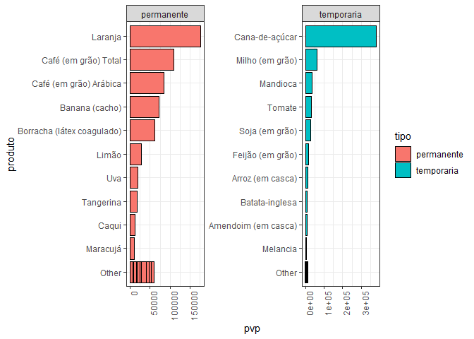

<!-- README.md is generated from README.Rmd. Please edit that file -->

------------------------------------------------------------------------

**DESAFIO 1**. Promover o acesso universal à alimentação adequada e
saudável, com prioridade para as famílias e pessoas em situação de
insegurança alimentar e nutricional

Temas: Transferência de Renda; Alimentação escolar; Distribuição de
alimentos.

1.1 Programa Bolsa Família  
1.1.1 Pessoas Beneficiárias  
1.1.2 Famílias Beneficiárias  
1.1.3 Valor Pago

------------------------------------------------------------------------

**DESAFIO 2**. Combater a insegurança alimentar e nutricional e promover
a inclusão produtiva rural em grupos populacionais específicos, com
ênfase em povos e comunidades tradicionais e outros grupos sociais
vulneráveis no meio rural.

Temas: Insegurança alimentar e nutricional; Inclusão produtiva rural;
Acesso à terra e gestão territorial; Biodiversidade; Saúde indígena;
extrativistas e ribeirinhos; Acesso a políticas públicas.

*MACRO DESAFIO*: Promoção de Sistemas Alimentares Saudáveis e
Sustentáveis Desafios: o conjunto dos desafios 3, 4 e 5 contemplam este
macro desafio.

------------------------------------------------------------------------

**DESAFIO 3**. Promover a produção de alimentos saudáveis e
sustentáveis, a estruturação da agricultura familiar e o fortalecimento
de sistemas de produção de base agroecológica

Temas: Fortalecimento da agricultura familiar; Reforma agrária;
Transição agroecológica; Mulheres; Juventude; Sementes; Mudanças
climáticas.

3.1 Produção de alimentos  
3.2 Área Plantada  
3.2.1 Área Plantada Agricultura Familiar  
3.2.2 Área Plantada Agricultura não familiar  
3.3. rendimento médio  
3.4 Proporção Área Colhida  
3.5 Proporção Valor da Produção

------------------------------------------------------------------------

**DESAFIO 4**. Promover o abastecimento e o acesso regular e permanente
da população brasileira à alimentação

Temas: Compras públicas; Abastecimento; Legislação sanitária; Economia
solidaria; Perdas e desperdícios de alimentos; Equipamentos públicos de
SAN; Agricultura urbana.

**4.1 Programa da Alimentação Escolar**  
4.1.1 Número de Alunos Beneficiários  
4.1.2 Valor gasto com Compras da Agricultura Familiar 30%  
4.1.3 Valor Formalizado  
4.1.4 Valor Executado  
**4.2 Banco de Leite **  
4.2.1 Próprio  
4.2.2 Terceirizado  
**4.3 Serviço Lactário**  
4.3.1 Próprio  
4.3.2 Terceirizado  
**4.4 Serviço Nutrição**  
4.4.1 Próprio  
4.4.2 Terceirizado

------------------------------------------------------------------------

**DESAFIO 5**. Promover e proteger a alimentação adequada e saudável da
população brasileira, com estratégias de educação alimentar e
nutricional e medidas regulatórias

Temas: Promoção da alimentação saudável; Promoção da alimentação
saudável no ambiente escolar; Ações regulatórias; Controle dos riscos
relacionados ao consumo de alimentos e a exposição ao uso de
agrotóxicos.

------------------------------------------------------------------------

**DESAFIO 6**. Controlar e prevenir os agravos decorrentes da má
alimentação Diretriz correspondente: 5

Temas: Desnutrição; excesso de peso e obesidade; doenças e agravos
relacionados à má nutrição.

6.1 P/I abaixo do percentil 0,1: criança com peso muito baixo para a
idade.  
6.2 P/I maior ou igual ao percentil 0,1 e menor que o percentil 3:
criança com peso baixo para a idade.  
6.3 P/I maior ou igual ao percentil 3 e menor que o percentil 10:
criança em risco nutricional.  
6.4 P/I maior ou igual ao percentil 10 e menor que o percentil 97:
criança com peso adequado para a idade (eutrófica).  
6.5 P/I maior ou igual ao percentil 97: criança com risco de
sobrepeso.  
6.6 P/A abaixo do percentil 3: criança com baixo peso para sua altura.  
6.7 P/A maior ou igual ao percentil 3 e menor que o percentil 10:
criança com risco de baixo peso para sua altura.  
6.8 P/A maior ou igual ao percentil 10 e menor que o percentil 97:
criança com peso adequado para sua altura.  
6.9 P/A maior ou igual ao percentil 97: criança com risco de sobrepeso
para sua estatura.  
6.10 A/I abaixo do percentil 3: criança com altura baixa para a idade.  
6.11 A/I maior ou igual ao percentil 3 e menor que o percentil 10:
criança com risco para altura baixa para a idade.  
6.12 A/I maior ou igual ao percentil 10 e menor que o percentil 97:
criança com altura adequada para sua idade.  
6.13 A/I maior ou igual ao percentil 97: criança com altura elevada para
sua idade  
6.14 Percentil de IMC por idade abaixo de 5: adolescente com baixo
peso.  
6.15 Percentil de IMC por idade maior ou igual a 5 e menor que 85:
adolescente com peso adequado (eutrófico).  
6.16 Percentil de IMC por idade maior ou igual a 85: adolescente com
sobrepeso.  
6.17 Valores de IMC abaixo de 18,5: adulto com baixo peso.  
6.18 Valores de IMC maior ou igual a 18,5 e menor que 25,0: adulto com
peso adequado (eutrófico).  
6.19 Valores de IMC maior ou igual a 25,0 e menor que 30,0: adulto com
sobrepeso.  
6.20 Valores de IMC maior ou igual a 30,0: adulto com obesidade.  
6.21 índice de Massa Corporal (IMC) para avaliação do estado nutricional
de idosos.  
6.22 Valores de IMC menor ou igual a 22,0: idoso com baixo peso.  
6.23 Valores de IMC maior que 22,0 e menor que 27,0: idoso com peso
adequado (eutrófico).  
6.24 Valores de IMC maior ou igual a 27,0: idoso com sobrepeso.  
6.25 Valores de IMC por idade gestacional abaixo da curva inferior:
gestante com baixo peso.  
6.26 Valores de IMC por idade gestacional entre a curva inferior e a
segunda curva: gestante com peso adequado (eutrófica).  
6.27 Valores de IMC por idade gestacional entre a segunda curva e a
curva superior: gestante com sobrepeso.  
6.28 Valores de IMC por idade gestacional acima da curva superior:
gestante com obesidade  
7. Consumo  
7.1 Consumo de ultra processados  
7.1.2 Consumo embutidos  
7.1.3 Consumo processados

------------------------------------------------------------------------

**DESAFIO 7**. Ampliar a disponibilidade hídrica e o acesso à água para
a população, em especial a população pobre no meio rural

Temas: Água para consumo humano; Água para a produção de alimentos;
Recursos hídricos; Saneamento básico rural

------------------------------------------------------------------------

**DESAFIO 8**. Consolidar a implementação do sistema nacional de
segurança alimentar e nutricional (SISAN), aperfeiçoando a gestão
federativa, a intersetorialidade e a participação social Diretrizes
correspondentes: 3 e 8 (envolve ainda as diretrizes da LOSAN)

Temas: Intersetorialidade nas ações federativas; Participação social;
Gestão e financiamento do Sistema; Formação, pesquisa e extensão em SAN
e DHAA; Exigibilidade e monitoramento do DHAA

------------------------------------------------------------------------

**DESAFIO 9**. Apoio às iniciativas de promoção da soberania, segurança
alimentar e nutricional, do direito humano à alimentação adequada e de
sistemas alimentares democráticos, saudáveis e sustentáveis em âmbito
internacional, por meio do diálogo e da cooperação internacional

Temas: Governança global; Cooperação internacional; Participação da
sociedade civil

------------------------------------------------------------------------

**DESAFIO 10**. Socioeconômica

10.1Índice de Vulnerabilidade Social Dimensão Capital Humano  
10.2 Índice de Vulnerabilidade Social Dimensão Renda e Trabalho  
10.3 Índice de Desenvolvimento Humano Municipal  
10.4 ndice de Desenvolvimento Humano Municipal Dimensão Longevidade  
10.5 Índice de Desenvolvimento Humano Municipal Dimensão Educação  
10.6 Índice de Desenvolvimento Humano Municipal Dimensão Renda  
10.7 Índice de Desenvolvimento Humano Municipal Dimensão Sub
Escolaridade  
10.8 Índice de Desenvolvimento Humano Municipal Dimensão Frequência
Escolar  
10.9 Índice Gini  
10.10 Renda Per capita  
10.11 Proporção de empregados com carteira assinada com 18 anos ou
mais  
10.12 Proporção de empregados sem carteira assinada com 18 anos ou
mais  
10.13 Proporção de trabalhadores do setor público com 18 anos ou mais  
10.14 Proporção de trabalhadores por conta própria com 18 anos ou mais  
10.15 Proporção de empregadores com 18 anos ou mais  
10.6 Proporção do grau formalização dos ocupados com 18 anos ou mais  
10.7 Proporção de atividade das pessoas de 10 a 14 anos de idade  
10.8 População Economicamente Ativa (PEA) com 10 anos ou mais  
10.9 População Economicamente Ativa (PEA) com 10 a 14 anos  
10.10 População Economicamente Ativa (PEA) com 15 a 17 anos  
10.11 População Economicamente Ativa (PEA) com 18 anos ou mais

# diagnosticos-pp 2023

<!-- badges: start -->
<!-- badges: end -->

## Carregando o banco de dados

``` r
library(tidyverse)
saude <- readr::read_rds("data/saude.rds") %>% 
  dplyr::mutate(tipo = stringr::str_to_lower(tipo))
dplyr::glimpse(saude)
#> Rows: 315
#> Columns: 7
#> $ cidade  <chr> "Bauru", "Bauru", "Bauru", "Bauru", "Bauru", "Bauru", "Bauru",~
#> $ ano     <dbl> 2015, 2015, 2015, 2015, 2015, 2016, 2016, 2016, 2016, 2016, 20~
#> $ id      <chr> "2_4", "5_9", "adolecentes", "adultos", "idosos", "2_4", "5_9"~
#> $ tipo    <chr> "ultra", "ultra", "ultra", "ultra", "ultra", "ultra", "ultra",~
#> $ total   <dbl> 56, 46, 145, 687, 311, 181, 123, 369, 2390, 1444, 220, 270, 56~
#> $ amostra <dbl> 52, 42, 131, 512, 193, 163, 113, 340, 1889, 965, 201, 251, 517~
#> $ perc    <dbl> 0.9285714, 0.9130435, 0.9034483, 0.7452693, 0.6205788, 0.90055~
```

## Visualizando a série temporal

``` r
saude %>% 
  ggplot2::ggplot(ggplot2::aes(x=ano,y=perc,color=id))+
  #ggplot2::geom_col(position = "dodge")+
  ggplot2::geom_line() +
  ggplot2::facet_wrap(~tipo,ncol=3)+
  ggplot2::scale_color_viridis_d()+
  ggplot2::theme_classic()
```

<!-- -->

## Consumo de ultraprocessados

``` r
dplyr::glimpse(saude)  
#> Rows: 315
#> Columns: 7
#> $ cidade  <chr> "Bauru", "Bauru", "Bauru", "Bauru", "Bauru", "Bauru", "Bauru",~
#> $ ano     <dbl> 2015, 2015, 2015, 2015, 2015, 2016, 2016, 2016, 2016, 2016, 20~
#> $ id      <chr> "2_4", "5_9", "adolecentes", "adultos", "idosos", "2_4", "5_9"~
#> $ tipo    <chr> "ultra", "ultra", "ultra", "ultra", "ultra", "ultra", "ultra",~
#> $ total   <dbl> 56, 46, 145, 687, 311, 181, 123, 369, 2390, 1444, 220, 270, 56~
#> $ amostra <dbl> 52, 42, 131, 512, 193, 163, 113, 340, 1889, 965, 201, 251, 517~
#> $ perc    <dbl> 0.9285714, 0.9130435, 0.9034483, 0.7452693, 0.6205788, 0.90055~
saude %>% 
  dplyr::filter(tipo == "ultra") %>% 
  ggplot2::ggplot(ggplot2::aes(x=ano,y=perc,fill=id))+
  #ggplot2::geom_col(position = "dodge")+
  ggplot2::geom_col(position="dodge",color="black") +
  # ggplot2::facet_wrap(~tipo,ncol=3)+
  ggplot2::scale_fill_viridis_d()+
  ggplot2::theme_classic() + 
  ggplot2::coord_cartesian(ylim=c(.5,1))
```

<!-- -->

``` r
dplyr::glimpse(saude)  
#> Rows: 315
#> Columns: 7
#> $ cidade  <chr> "Bauru", "Bauru", "Bauru", "Bauru", "Bauru", "Bauru", "Bauru",~
#> $ ano     <dbl> 2015, 2015, 2015, 2015, 2015, 2016, 2016, 2016, 2016, 2016, 20~
#> $ id      <chr> "2_4", "5_9", "adolecentes", "adultos", "idosos", "2_4", "5_9"~
#> $ tipo    <chr> "ultra", "ultra", "ultra", "ultra", "ultra", "ultra", "ultra",~
#> $ total   <dbl> 56, 46, 145, 687, 311, 181, 123, 369, 2390, 1444, 220, 270, 56~
#> $ amostra <dbl> 52, 42, 131, 512, 193, 163, 113, 340, 1889, 965, 201, 251, 517~
#> $ perc    <dbl> 0.9285714, 0.9130435, 0.9034483, 0.7452693, 0.6205788, 0.90055~
saude %>% dplyr::filter(ano <= 2019) %>% 
  dplyr::filter(tipo == "ultra") %>% 
  ggplot2::ggplot(ggplot2::aes(x=ano,y=perc,color=id))+
  ggplot2::geom_point(shape=16,size=4) +
  # ggplot2::facet_wrap(~tipo,ncol=3)+
  ggplot2::scale_color_viridis_d()+
  ggplot2::theme_classic() + 
  ggplot2::coord_cartesian(ylim=c(.5,1))+
  ggplot2::geom_smooth(method = "lm",se=FALSE) +
  ggpubr::stat_regline_equation(label.y = seq(.5,.6,.025) )
```

<!-- -->

``` r
dplyr::glimpse(saude)  
#> Rows: 315
#> Columns: 7
#> $ cidade  <chr> "Bauru", "Bauru", "Bauru", "Bauru", "Bauru", "Bauru", "Bauru",~
#> $ ano     <dbl> 2015, 2015, 2015, 2015, 2015, 2016, 2016, 2016, 2016, 2016, 20~
#> $ id      <chr> "2_4", "5_9", "adolecentes", "adultos", "idosos", "2_4", "5_9"~
#> $ tipo    <chr> "ultra", "ultra", "ultra", "ultra", "ultra", "ultra", "ultra",~
#> $ total   <dbl> 56, 46, 145, 687, 311, 181, 123, 369, 2390, 1444, 220, 270, 56~
#> $ amostra <dbl> 52, 42, 131, 512, 193, 163, 113, 340, 1889, 965, 201, 251, 517~
#> $ perc    <dbl> 0.9285714, 0.9130435, 0.9034483, 0.7452693, 0.6205788, 0.90055~
saude %>% dplyr::filter(ano > 2019) %>% 
  dplyr::filter(tipo == "ultra") %>% 
  ggplot2::ggplot(ggplot2::aes(x=as.factor(ano),y=perc,fill=id))+
  #ggplot2::geom_col(position = "dodge")+
  ggplot2::geom_col(position="dodge",color="black") +
  # ggplot2::facet_wrap(~tipo,ncol=3)+
  ggplot2::scale_fill_viridis_d()+
  ggplot2::theme_classic() + 
  ggplot2::coord_cartesian(ylim=c(.5,1)) +
  ggplot2::labs(x="Ano")
```

<!-- -->

``` r
dplyr::glimpse(saude)  
#> Rows: 315
#> Columns: 7
#> $ cidade  <chr> "Bauru", "Bauru", "Bauru", "Bauru", "Bauru", "Bauru", "Bauru",~
#> $ ano     <dbl> 2015, 2015, 2015, 2015, 2015, 2016, 2016, 2016, 2016, 2016, 20~
#> $ id      <chr> "2_4", "5_9", "adolecentes", "adultos", "idosos", "2_4", "5_9"~
#> $ tipo    <chr> "ultra", "ultra", "ultra", "ultra", "ultra", "ultra", "ultra",~
#> $ total   <dbl> 56, 46, 145, 687, 311, 181, 123, 369, 2390, 1444, 220, 270, 56~
#> $ amostra <dbl> 52, 42, 131, 512, 193, 163, 113, 340, 1889, 965, 201, 251, 517~
#> $ perc    <dbl> 0.9285714, 0.9130435, 0.9034483, 0.7452693, 0.6205788, 0.90055~
saude %>% dplyr::filter(ano > 2019) %>% 
  dplyr::filter(tipo == "ultra") %>% 
  tidyr::pivot_wider(names_from = ano, values_from = perc,id_cols = id) %>% 
  dplyr::mutate(dif = (`2021` - `2020`)*100)
#> # A tibble: 5 x 4
#>   id          `2020` `2021`    dif
#>   <chr>        <dbl>  <dbl>  <dbl>
#> 1 2_4          0.843  0.931  8.74 
#> 2 5_9          0.933  0.947  1.42 
#> 3 adolecentes  0.935  0.944  0.912
#> 4 adultos      0.792  0.908 11.6  
#> 5 idosos       0.637  0.866 22.9
```

## Três refeições ao dia

``` r
dplyr::glimpse(saude)  
#> Rows: 315
#> Columns: 7
#> $ cidade  <chr> "Bauru", "Bauru", "Bauru", "Bauru", "Bauru", "Bauru", "Bauru",~
#> $ ano     <dbl> 2015, 2015, 2015, 2015, 2015, 2016, 2016, 2016, 2016, 2016, 20~
#> $ id      <chr> "2_4", "5_9", "adolecentes", "adultos", "idosos", "2_4", "5_9"~
#> $ tipo    <chr> "ultra", "ultra", "ultra", "ultra", "ultra", "ultra", "ultra",~
#> $ total   <dbl> 56, 46, 145, 687, 311, 181, 123, 369, 2390, 1444, 220, 270, 56~
#> $ amostra <dbl> 52, 42, 131, 512, 193, 163, 113, 340, 1889, 965, 201, 251, 517~
#> $ perc    <dbl> 0.9285714, 0.9130435, 0.9034483, 0.7452693, 0.6205788, 0.90055~
saude %>% 
  dplyr::filter(tipo == "3r") %>% 
  ggplot2::ggplot(ggplot2::aes(x=ano,y=perc,fill=id))+
  #ggplot2::geom_col(position = "dodge")+
  ggplot2::geom_col(position="dodge",color="black") +
  # ggplot2::facet_wrap(~tipo,ncol=3)+
  ggplot2::scale_fill_viridis_d()+
  ggplot2::theme_classic() # 
```

<!-- -->

``` r
  #ggplot2::coord_cartesian(ylim=c(.5,1))
```

``` r
dplyr::glimpse(saude)  
#> Rows: 315
#> Columns: 7
#> $ cidade  <chr> "Bauru", "Bauru", "Bauru", "Bauru", "Bauru", "Bauru", "Bauru",~
#> $ ano     <dbl> 2015, 2015, 2015, 2015, 2015, 2016, 2016, 2016, 2016, 2016, 20~
#> $ id      <chr> "2_4", "5_9", "adolecentes", "adultos", "idosos", "2_4", "5_9"~
#> $ tipo    <chr> "ultra", "ultra", "ultra", "ultra", "ultra", "ultra", "ultra",~
#> $ total   <dbl> 56, 46, 145, 687, 311, 181, 123, 369, 2390, 1444, 220, 270, 56~
#> $ amostra <dbl> 52, 42, 131, 512, 193, 163, 113, 340, 1889, 965, 201, 251, 517~
#> $ perc    <dbl> 0.9285714, 0.9130435, 0.9034483, 0.7452693, 0.6205788, 0.90055~
saude %>% dplyr::filter(ano <= 2019) %>% 
  dplyr::filter(tipo == "3r") %>% 
  ggplot2::ggplot(ggplot2::aes(x=ano,y=perc,color=id))+
  ggplot2::geom_point(shape=16,size=4) +
  # ggplot2::facet_wrap(~tipo,ncol=3)+
  ggplot2::scale_color_viridis_d()+
  ggplot2::theme_classic() + 
  # ggplot2::coord_cartesian(ylim=c(.5,1))+
  ggplot2::geom_smooth(method = "lm",se=FALSE) +
  ggpubr::stat_regline_equation(label.y = seq(.6,.7,.025),
                                label.x = rep(2017,5))
```

<!-- -->

``` r
dplyr::glimpse(saude)  
#> Rows: 315
#> Columns: 7
#> $ cidade  <chr> "Bauru", "Bauru", "Bauru", "Bauru", "Bauru", "Bauru", "Bauru",~
#> $ ano     <dbl> 2015, 2015, 2015, 2015, 2015, 2016, 2016, 2016, 2016, 2016, 20~
#> $ id      <chr> "2_4", "5_9", "adolecentes", "adultos", "idosos", "2_4", "5_9"~
#> $ tipo    <chr> "ultra", "ultra", "ultra", "ultra", "ultra", "ultra", "ultra",~
#> $ total   <dbl> 56, 46, 145, 687, 311, 181, 123, 369, 2390, 1444, 220, 270, 56~
#> $ amostra <dbl> 52, 42, 131, 512, 193, 163, 113, 340, 1889, 965, 201, 251, 517~
#> $ perc    <dbl> 0.9285714, 0.9130435, 0.9034483, 0.7452693, 0.6205788, 0.90055~
saude %>% dplyr::filter(ano > 2019) %>% 
  dplyr::filter(tipo == "3r") %>% 
  ggplot2::ggplot(ggplot2::aes(x=as.factor(ano),y=perc,fill=id))+
  #ggplot2::geom_col(position = "dodge")+
  ggplot2::geom_col(position="dodge",color="black") +
  # ggplot2::facet_wrap(~tipo,ncol=3)+
  ggplot2::scale_fill_viridis_d()+
  ggplot2::theme_classic() + 
  #ggplot2::coord_cartesian(ylim=c(.5,1)) +
  ggplot2::labs(x="Ano")
```

<!-- -->

``` r
dplyr::glimpse(saude)  
#> Rows: 315
#> Columns: 7
#> $ cidade  <chr> "Bauru", "Bauru", "Bauru", "Bauru", "Bauru", "Bauru", "Bauru",~
#> $ ano     <dbl> 2015, 2015, 2015, 2015, 2015, 2016, 2016, 2016, 2016, 2016, 20~
#> $ id      <chr> "2_4", "5_9", "adolecentes", "adultos", "idosos", "2_4", "5_9"~
#> $ tipo    <chr> "ultra", "ultra", "ultra", "ultra", "ultra", "ultra", "ultra",~
#> $ total   <dbl> 56, 46, 145, 687, 311, 181, 123, 369, 2390, 1444, 220, 270, 56~
#> $ amostra <dbl> 52, 42, 131, 512, 193, 163, 113, 340, 1889, 965, 201, 251, 517~
#> $ perc    <dbl> 0.9285714, 0.9130435, 0.9034483, 0.7452693, 0.6205788, 0.90055~
saude %>% dplyr::filter(ano < 2017) %>% 
  dplyr::filter(tipo == "3r") %>% 
  ggplot2::ggplot(ggplot2::aes(x=as.factor(ano),y=perc,fill=id))+
  #ggplot2::geom_col(position = "dodge")+
  ggplot2::geom_col(position="dodge",color="black") +
  # ggplot2::facet_wrap(~tipo,ncol=3)+
  ggplot2::scale_fill_viridis_d()+
  ggplot2::theme_classic() + 
  #ggplot2::coord_cartesian(ylim=c(.5,1)) +
  ggplot2::labs(x="Ano")
```

<!-- -->

``` r
dplyr::glimpse(saude)  
#> Rows: 315
#> Columns: 7
#> $ cidade  <chr> "Bauru", "Bauru", "Bauru", "Bauru", "Bauru", "Bauru", "Bauru",~
#> $ ano     <dbl> 2015, 2015, 2015, 2015, 2015, 2016, 2016, 2016, 2016, 2016, 20~
#> $ id      <chr> "2_4", "5_9", "adolecentes", "adultos", "idosos", "2_4", "5_9"~
#> $ tipo    <chr> "ultra", "ultra", "ultra", "ultra", "ultra", "ultra", "ultra",~
#> $ total   <dbl> 56, 46, 145, 687, 311, 181, 123, 369, 2390, 1444, 220, 270, 56~
#> $ amostra <dbl> 52, 42, 131, 512, 193, 163, 113, 340, 1889, 965, 201, 251, 517~
#> $ perc    <dbl> 0.9285714, 0.9130435, 0.9034483, 0.7452693, 0.6205788, 0.90055~
saude %>% dplyr::filter(ano > 2019) %>% 
  dplyr::filter(tipo == "3r") %>% 
  tidyr::pivot_wider(names_from = ano, values_from = perc,id_cols = id) %>% 
  dplyr::mutate(dif = (`2021` - `2020`)*100)
#> # A tibble: 5 x 4
#>   id          `2020` `2021`   dif
#>   <chr>        <dbl>  <dbl> <dbl>
#> 1 2_4          0.414  0.643  22.8
#> 2 5_9          0.787  0.295 -49.1
#> 3 adolecentes  0.747  0.286 -46.1
#> 4 adultos      0.824  0.301 -52.3
#> 5 idosos       0.838  0.284 -55.4
```

``` r
dplyr::glimpse(saude)  
#> Rows: 315
#> Columns: 7
#> $ cidade  <chr> "Bauru", "Bauru", "Bauru", "Bauru", "Bauru", "Bauru", "Bauru",~
#> $ ano     <dbl> 2015, 2015, 2015, 2015, 2015, 2016, 2016, 2016, 2016, 2016, 20~
#> $ id      <chr> "2_4", "5_9", "adolecentes", "adultos", "idosos", "2_4", "5_9"~
#> $ tipo    <chr> "ultra", "ultra", "ultra", "ultra", "ultra", "ultra", "ultra",~
#> $ total   <dbl> 56, 46, 145, 687, 311, 181, 123, 369, 2390, 1444, 220, 270, 56~
#> $ amostra <dbl> 52, 42, 131, 512, 193, 163, 113, 340, 1889, 965, 201, 251, 517~
#> $ perc    <dbl> 0.9285714, 0.9130435, 0.9034483, 0.7452693, 0.6205788, 0.90055~
saude %>% dplyr::filter(ano < 2017) %>% 
  dplyr::filter(tipo == "3r") %>% 
  tidyr::pivot_wider(names_from = ano, values_from = perc,id_cols = id) %>% 
  dplyr::mutate(dif = (`2016` - `2015`)*100)
#> # A tibble: 5 x 4
#>   id          `2015` `2016`   dif
#>   <chr>        <dbl>  <dbl> <dbl>
#> 1 2_4          0.269  0.861  59.2
#> 2 5_9          0.739  0.366 -37.3
#> 3 adolecentes  0.634  0.325 -30.9
#> 4 adultos      0.559  0.313 -24.6
#> 5 idosos       0.540  0.337 -20.4
```

## Consumo de embutidos

``` r
dplyr::glimpse(saude)  
#> Rows: 315
#> Columns: 7
#> $ cidade  <chr> "Bauru", "Bauru", "Bauru", "Bauru", "Bauru", "Bauru", "Bauru",~
#> $ ano     <dbl> 2015, 2015, 2015, 2015, 2015, 2016, 2016, 2016, 2016, 2016, 20~
#> $ id      <chr> "2_4", "5_9", "adolecentes", "adultos", "idosos", "2_4", "5_9"~
#> $ tipo    <chr> "ultra", "ultra", "ultra", "ultra", "ultra", "ultra", "ultra",~
#> $ total   <dbl> 56, 46, 145, 687, 311, 181, 123, 369, 2390, 1444, 220, 270, 56~
#> $ amostra <dbl> 52, 42, 131, 512, 193, 163, 113, 340, 1889, 965, 201, 251, 517~
#> $ perc    <dbl> 0.9285714, 0.9130435, 0.9034483, 0.7452693, 0.6205788, 0.90055~
saude %>% 
  dplyr::filter(tipo == "eb") %>% 
  ggplot2::ggplot(ggplot2::aes(x=ano,y=perc,fill=id))+
  #ggplot2::geom_col(position = "dodge")+
  ggplot2::geom_col(position="dodge",color="black") +
  # ggplot2::facet_wrap(~tipo,ncol=3)+
  ggplot2::scale_fill_viridis_d()+
  ggplot2::theme_classic() #+ 
```

<!-- -->

``` r
 # ggplot2::coord_cartesian(ylim=c(.5,1))
```

``` r
dplyr::glimpse(saude)  
#> Rows: 315
#> Columns: 7
#> $ cidade  <chr> "Bauru", "Bauru", "Bauru", "Bauru", "Bauru", "Bauru", "Bauru",~
#> $ ano     <dbl> 2015, 2015, 2015, 2015, 2015, 2016, 2016, 2016, 2016, 2016, 20~
#> $ id      <chr> "2_4", "5_9", "adolecentes", "adultos", "idosos", "2_4", "5_9"~
#> $ tipo    <chr> "ultra", "ultra", "ultra", "ultra", "ultra", "ultra", "ultra",~
#> $ total   <dbl> 56, 46, 145, 687, 311, 181, 123, 369, 2390, 1444, 220, 270, 56~
#> $ amostra <dbl> 52, 42, 131, 512, 193, 163, 113, 340, 1889, 965, 201, 251, 517~
#> $ perc    <dbl> 0.9285714, 0.9130435, 0.9034483, 0.7452693, 0.6205788, 0.90055~
saude %>% dplyr::filter(ano <= 2019) %>% 
  dplyr::filter(tipo == "eb") %>% 
  ggplot2::ggplot(ggplot2::aes(x=ano,y=perc,color=id))+
  ggplot2::geom_point(shape=16,size=4) +
  # ggplot2::facet_wrap(~tipo,ncol=3)+
  ggplot2::scale_color_viridis_d()+
  ggplot2::theme_classic() + 
  # ggplot2::coord_cartesian(ylim=c(.5,1))+
  ggplot2::geom_smooth(method = "lm",se=FALSE) +
  ggpubr::stat_regline_equation(label.y = seq(.5,.6,.025),
                                label.x= rep(2016,5))
```

<!-- -->

``` r
dplyr::glimpse(saude)  
#> Rows: 315
#> Columns: 7
#> $ cidade  <chr> "Bauru", "Bauru", "Bauru", "Bauru", "Bauru", "Bauru", "Bauru",~
#> $ ano     <dbl> 2015, 2015, 2015, 2015, 2015, 2016, 2016, 2016, 2016, 2016, 20~
#> $ id      <chr> "2_4", "5_9", "adolecentes", "adultos", "idosos", "2_4", "5_9"~
#> $ tipo    <chr> "ultra", "ultra", "ultra", "ultra", "ultra", "ultra", "ultra",~
#> $ total   <dbl> 56, 46, 145, 687, 311, 181, 123, 369, 2390, 1444, 220, 270, 56~
#> $ amostra <dbl> 52, 42, 131, 512, 193, 163, 113, 340, 1889, 965, 201, 251, 517~
#> $ perc    <dbl> 0.9285714, 0.9130435, 0.9034483, 0.7452693, 0.6205788, 0.90055~
saude %>% dplyr::filter(ano > 2019) %>% 
  dplyr::filter(tipo == "eb") %>% 
  ggplot2::ggplot(ggplot2::aes(x=as.factor(ano),y=perc,fill=id))+
  #ggplot2::geom_col(position = "dodge")+
  ggplot2::geom_col(position="dodge",color="black") +
  # ggplot2::facet_wrap(~tipo,ncol=3)+
  ggplot2::scale_fill_viridis_d()+
  ggplot2::theme_classic() + 
  # ggplot2::coord_cartesian(ylim=c(.5,1)) +
  ggplot2::labs(x="Ano")
```

<!-- -->

``` r
dplyr::glimpse(saude)  
#> Rows: 315
#> Columns: 7
#> $ cidade  <chr> "Bauru", "Bauru", "Bauru", "Bauru", "Bauru", "Bauru", "Bauru",~
#> $ ano     <dbl> 2015, 2015, 2015, 2015, 2015, 2016, 2016, 2016, 2016, 2016, 20~
#> $ id      <chr> "2_4", "5_9", "adolecentes", "adultos", "idosos", "2_4", "5_9"~
#> $ tipo    <chr> "ultra", "ultra", "ultra", "ultra", "ultra", "ultra", "ultra",~
#> $ total   <dbl> 56, 46, 145, 687, 311, 181, 123, 369, 2390, 1444, 220, 270, 56~
#> $ amostra <dbl> 52, 42, 131, 512, 193, 163, 113, 340, 1889, 965, 201, 251, 517~
#> $ perc    <dbl> 0.9285714, 0.9130435, 0.9034483, 0.7452693, 0.6205788, 0.90055~
saude %>% dplyr::filter(ano > 2019) %>% 
  dplyr::filter(tipo == "eb") %>% 
  tidyr::pivot_wider(names_from = ano, values_from = perc,id_cols = id) %>% 
  dplyr::mutate(dif = (`2021` - `2020`)*100)
#> # A tibble: 5 x 4
#>   id          `2020` `2021`   dif
#>   <chr>        <dbl>  <dbl> <dbl>
#> 1 2_4          0.330  0.686 35.6 
#> 2 5_9          0.489  0.566  7.74
#> 3 adolecentes  0.545  0.587  4.15
#> 4 adultos      0.368  0.591 22.3 
#> 5 idosos       0.637  0.602 -3.44
```

## Feijão

``` r
dplyr::glimpse(saude)  
#> Rows: 315
#> Columns: 7
#> $ cidade  <chr> "Bauru", "Bauru", "Bauru", "Bauru", "Bauru", "Bauru", "Bauru",~
#> $ ano     <dbl> 2015, 2015, 2015, 2015, 2015, 2016, 2016, 2016, 2016, 2016, 20~
#> $ id      <chr> "2_4", "5_9", "adolecentes", "adultos", "idosos", "2_4", "5_9"~
#> $ tipo    <chr> "ultra", "ultra", "ultra", "ultra", "ultra", "ultra", "ultra",~
#> $ total   <dbl> 56, 46, 145, 687, 311, 181, 123, 369, 2390, 1444, 220, 270, 56~
#> $ amostra <dbl> 52, 42, 131, 512, 193, 163, 113, 340, 1889, 965, 201, 251, 517~
#> $ perc    <dbl> 0.9285714, 0.9130435, 0.9034483, 0.7452693, 0.6205788, 0.90055~
saude %>% 
  dplyr::filter(tipo == "feijao") %>% 
  ggplot2::ggplot(ggplot2::aes(x=ano,y=perc,fill=id))+
  #ggplot2::geom_col(position = "dodge")+
  ggplot2::geom_col(position="dodge",color="black") +
  # ggplot2::facet_wrap(~tipo,ncol=3)+
  ggplot2::scale_fill_viridis_d()+
  ggplot2::theme_classic() #+ 
```

<!-- -->

``` r
  #ggplot2::coord_cartesian(ylim=c(.5,1))
```

``` r
dplyr::glimpse(saude)  
#> Rows: 315
#> Columns: 7
#> $ cidade  <chr> "Bauru", "Bauru", "Bauru", "Bauru", "Bauru", "Bauru", "Bauru",~
#> $ ano     <dbl> 2015, 2015, 2015, 2015, 2015, 2016, 2016, 2016, 2016, 2016, 20~
#> $ id      <chr> "2_4", "5_9", "adolecentes", "adultos", "idosos", "2_4", "5_9"~
#> $ tipo    <chr> "ultra", "ultra", "ultra", "ultra", "ultra", "ultra", "ultra",~
#> $ total   <dbl> 56, 46, 145, 687, 311, 181, 123, 369, 2390, 1444, 220, 270, 56~
#> $ amostra <dbl> 52, 42, 131, 512, 193, 163, 113, 340, 1889, 965, 201, 251, 517~
#> $ perc    <dbl> 0.9285714, 0.9130435, 0.9034483, 0.7452693, 0.6205788, 0.90055~
saude %>% dplyr::filter(ano <= 2019) %>% 
  dplyr::filter(tipo == "feijao") %>% 
  ggplot2::ggplot(ggplot2::aes(x=ano,y=perc,color=id))+
  ggplot2::geom_point(shape=16,size=4) +
  # ggplot2::facet_wrap(~tipo,ncol=3)+
  ggplot2::scale_color_viridis_d()+
  ggplot2::theme_classic() + 
  ggplot2::coord_cartesian(ylim=c(.6,1))+
  ggplot2::geom_smooth(method = "lm",se=FALSE) +
  ggpubr::stat_regline_equation(label.y = seq(.6,.7,.025),
                                label.x = rep(2017,5))
```

<!-- -->

``` r
dplyr::glimpse(saude)  
#> Rows: 315
#> Columns: 7
#> $ cidade  <chr> "Bauru", "Bauru", "Bauru", "Bauru", "Bauru", "Bauru", "Bauru",~
#> $ ano     <dbl> 2015, 2015, 2015, 2015, 2015, 2016, 2016, 2016, 2016, 2016, 20~
#> $ id      <chr> "2_4", "5_9", "adolecentes", "adultos", "idosos", "2_4", "5_9"~
#> $ tipo    <chr> "ultra", "ultra", "ultra", "ultra", "ultra", "ultra", "ultra",~
#> $ total   <dbl> 56, 46, 145, 687, 311, 181, 123, 369, 2390, 1444, 220, 270, 56~
#> $ amostra <dbl> 52, 42, 131, 512, 193, 163, 113, 340, 1889, 965, 201, 251, 517~
#> $ perc    <dbl> 0.9285714, 0.9130435, 0.9034483, 0.7452693, 0.6205788, 0.90055~
saude %>% dplyr::filter(ano > 2019) %>% 
  dplyr::filter(tipo == "feijao") %>% 
  ggplot2::ggplot(ggplot2::aes(x=as.factor(ano),y=perc,fill=id))+
  #ggplot2::geom_col(position = "dodge")+
  ggplot2::geom_col(position="dodge",color="black") +
  # ggplot2::facet_wrap(~tipo,ncol=3)+
  ggplot2::scale_fill_viridis_d()+
  ggplot2::theme_classic() + 
  # ggplot2::coord_cartesian(ylim=c(.5,1)) +
  ggplot2::labs(x="Ano")
```

<!-- -->

``` r
dplyr::glimpse(saude)  
#> Rows: 315
#> Columns: 7
#> $ cidade  <chr> "Bauru", "Bauru", "Bauru", "Bauru", "Bauru", "Bauru", "Bauru",~
#> $ ano     <dbl> 2015, 2015, 2015, 2015, 2015, 2016, 2016, 2016, 2016, 2016, 20~
#> $ id      <chr> "2_4", "5_9", "adolecentes", "adultos", "idosos", "2_4", "5_9"~
#> $ tipo    <chr> "ultra", "ultra", "ultra", "ultra", "ultra", "ultra", "ultra",~
#> $ total   <dbl> 56, 46, 145, 687, 311, 181, 123, 369, 2390, 1444, 220, 270, 56~
#> $ amostra <dbl> 52, 42, 131, 512, 193, 163, 113, 340, 1889, 965, 201, 251, 517~
#> $ perc    <dbl> 0.9285714, 0.9130435, 0.9034483, 0.7452693, 0.6205788, 0.90055~
saude %>% dplyr::filter(ano > 2019) %>% 
  dplyr::filter(tipo == "feijao") %>% 
  tidyr::pivot_wider(names_from = ano, values_from = perc,id_cols = id) %>% 
  dplyr::mutate(dif = (`2021` - `2020`)*100)
#> # A tibble: 5 x 4
#>   id          `2020` `2021`   dif
#>   <chr>        <dbl>  <dbl> <dbl>
#> 1 2_4          0.8    0.274 -52.6
#> 2 5_9          0.770  0.323 -44.7
#> 3 adolecentes  0.801  0.318 -48.3
#> 4 adultos      0.837  0.290 -54.8
#> 5 idosos       0.860  0.271 -59.0
```

## Frutas

``` r
dplyr::glimpse(saude)  
#> Rows: 315
#> Columns: 7
#> $ cidade  <chr> "Bauru", "Bauru", "Bauru", "Bauru", "Bauru", "Bauru", "Bauru",~
#> $ ano     <dbl> 2015, 2015, 2015, 2015, 2015, 2016, 2016, 2016, 2016, 2016, 20~
#> $ id      <chr> "2_4", "5_9", "adolecentes", "adultos", "idosos", "2_4", "5_9"~
#> $ tipo    <chr> "ultra", "ultra", "ultra", "ultra", "ultra", "ultra", "ultra",~
#> $ total   <dbl> 56, 46, 145, 687, 311, 181, 123, 369, 2390, 1444, 220, 270, 56~
#> $ amostra <dbl> 52, 42, 131, 512, 193, 163, 113, 340, 1889, 965, 201, 251, 517~
#> $ perc    <dbl> 0.9285714, 0.9130435, 0.9034483, 0.7452693, 0.6205788, 0.90055~
saude %>% 
  dplyr::filter(tipo == "frutas") %>% 
  ggplot2::ggplot(ggplot2::aes(x=ano,y=perc,fill=id))+
  #ggplot2::geom_col(position = "dodge")+
  ggplot2::geom_col(position="dodge",color="black") +
  # ggplot2::facet_wrap(~tipo,ncol=3)+
  ggplot2::scale_fill_viridis_d()+
  ggplot2::theme_classic() #+ 
```

<!-- -->

``` r
  #ggplot2::coord_cartesian(ylim=c(.5,1))
```

``` r
dplyr::glimpse(saude)  
#> Rows: 315
#> Columns: 7
#> $ cidade  <chr> "Bauru", "Bauru", "Bauru", "Bauru", "Bauru", "Bauru", "Bauru",~
#> $ ano     <dbl> 2015, 2015, 2015, 2015, 2015, 2016, 2016, 2016, 2016, 2016, 20~
#> $ id      <chr> "2_4", "5_9", "adolecentes", "adultos", "idosos", "2_4", "5_9"~
#> $ tipo    <chr> "ultra", "ultra", "ultra", "ultra", "ultra", "ultra", "ultra",~
#> $ total   <dbl> 56, 46, 145, 687, 311, 181, 123, 369, 2390, 1444, 220, 270, 56~
#> $ amostra <dbl> 52, 42, 131, 512, 193, 163, 113, 340, 1889, 965, 201, 251, 517~
#> $ perc    <dbl> 0.9285714, 0.9130435, 0.9034483, 0.7452693, 0.6205788, 0.90055~
saude %>% dplyr::filter(ano <= 2019) %>% 
  dplyr::filter(tipo == "frutas") %>% 
  ggplot2::ggplot(ggplot2::aes(x=ano,y=perc,color=id))+
  ggplot2::geom_point(shape=16,size=4) +
  # ggplot2::facet_wrap(~tipo,ncol=3)+
  ggplot2::scale_color_viridis_d()+
  ggplot2::theme_classic() + 
  ggplot2::coord_cartesian(ylim=c(.4,1))+
  ggplot2::geom_smooth(method = "lm",se=FALSE) +
  ggpubr::stat_regline_equation(label.y = seq(.8,.9,.025),
                                label.x = rep(2017,5))
```

<!-- -->

``` r
dplyr::glimpse(saude)  
#> Rows: 315
#> Columns: 7
#> $ cidade  <chr> "Bauru", "Bauru", "Bauru", "Bauru", "Bauru", "Bauru", "Bauru",~
#> $ ano     <dbl> 2015, 2015, 2015, 2015, 2015, 2016, 2016, 2016, 2016, 2016, 20~
#> $ id      <chr> "2_4", "5_9", "adolecentes", "adultos", "idosos", "2_4", "5_9"~
#> $ tipo    <chr> "ultra", "ultra", "ultra", "ultra", "ultra", "ultra", "ultra",~
#> $ total   <dbl> 56, 46, 145, 687, 311, 181, 123, 369, 2390, 1444, 220, 270, 56~
#> $ amostra <dbl> 52, 42, 131, 512, 193, 163, 113, 340, 1889, 965, 201, 251, 517~
#> $ perc    <dbl> 0.9285714, 0.9130435, 0.9034483, 0.7452693, 0.6205788, 0.90055~
saude %>% dplyr::filter(ano > 2019) %>% 
  dplyr::filter(tipo == "frutas") %>% 
  ggplot2::ggplot(ggplot2::aes(x=as.factor(ano),y=perc,fill=id))+
  #ggplot2::geom_col(position = "dodge")+
  ggplot2::geom_col(position="dodge",color="black") +
  # ggplot2::facet_wrap(~tipo,ncol=3)+
  ggplot2::scale_fill_viridis_d()+
  ggplot2::theme_classic() + 
  # ggplot2::coord_cartesian(ylim=c(.5,1)) +
  ggplot2::labs(x="Ano")
```

<!-- -->

``` r
dplyr::glimpse(saude)  
#> Rows: 315
#> Columns: 7
#> $ cidade  <chr> "Bauru", "Bauru", "Bauru", "Bauru", "Bauru", "Bauru", "Bauru",~
#> $ ano     <dbl> 2015, 2015, 2015, 2015, 2015, 2016, 2016, 2016, 2016, 2016, 20~
#> $ id      <chr> "2_4", "5_9", "adolecentes", "adultos", "idosos", "2_4", "5_9"~
#> $ tipo    <chr> "ultra", "ultra", "ultra", "ultra", "ultra", "ultra", "ultra",~
#> $ total   <dbl> 56, 46, 145, 687, 311, 181, 123, 369, 2390, 1444, 220, 270, 56~
#> $ amostra <dbl> 52, 42, 131, 512, 193, 163, 113, 340, 1889, 965, 201, 251, 517~
#> $ perc    <dbl> 0.9285714, 0.9130435, 0.9034483, 0.7452693, 0.6205788, 0.90055~
saude %>% dplyr::filter(ano > 2019) %>% 
  dplyr::filter(tipo == "frutas") %>% 
  tidyr::pivot_wider(names_from = ano, values_from = perc,id_cols = id) %>% 
  dplyr::mutate(dif = (`2021` - `2020`)*100)
#> # A tibble: 5 x 4
#>   id          `2020` `2021`   dif
#>   <chr>        <dbl>  <dbl> <dbl>
#> 1 2_4          0.739  0.239 -50.0
#> 2 5_9          0.708  0.242 -46.6
#> 3 adolecentes  0.567  0.219 -34.8
#> 4 adultos      0.683  0.224 -45.8
#> 5 idosos       0.752  0.224 -52.8
```

## Guloseimas

``` r
dplyr::glimpse(saude)  
#> Rows: 315
#> Columns: 7
#> $ cidade  <chr> "Bauru", "Bauru", "Bauru", "Bauru", "Bauru", "Bauru", "Bauru",~
#> $ ano     <dbl> 2015, 2015, 2015, 2015, 2015, 2016, 2016, 2016, 2016, 2016, 20~
#> $ id      <chr> "2_4", "5_9", "adolecentes", "adultos", "idosos", "2_4", "5_9"~
#> $ tipo    <chr> "ultra", "ultra", "ultra", "ultra", "ultra", "ultra", "ultra",~
#> $ total   <dbl> 56, 46, 145, 687, 311, 181, 123, 369, 2390, 1444, 220, 270, 56~
#> $ amostra <dbl> 52, 42, 131, 512, 193, 163, 113, 340, 1889, 965, 201, 251, 517~
#> $ perc    <dbl> 0.9285714, 0.9130435, 0.9034483, 0.7452693, 0.6205788, 0.90055~
saude %>% 
  dplyr::filter(tipo == "gl") %>% 
  ggplot2::ggplot(ggplot2::aes(x=ano,y=perc,fill=id))+
  #ggplot2::geom_col(position = "dodge")+
  ggplot2::geom_col(position="dodge",color="black") +
  # ggplot2::facet_wrap(~tipo,ncol=3)+
  ggplot2::scale_fill_viridis_d()+
  ggplot2::theme_classic() #+ 
```

<!-- -->

``` r
  #ggplot2::coord_cartesian(ylim=c(.5,1))
```

``` r
dplyr::glimpse(saude)  
#> Rows: 315
#> Columns: 7
#> $ cidade  <chr> "Bauru", "Bauru", "Bauru", "Bauru", "Bauru", "Bauru", "Bauru",~
#> $ ano     <dbl> 2015, 2015, 2015, 2015, 2015, 2016, 2016, 2016, 2016, 2016, 20~
#> $ id      <chr> "2_4", "5_9", "adolecentes", "adultos", "idosos", "2_4", "5_9"~
#> $ tipo    <chr> "ultra", "ultra", "ultra", "ultra", "ultra", "ultra", "ultra",~
#> $ total   <dbl> 56, 46, 145, 687, 311, 181, 123, 369, 2390, 1444, 220, 270, 56~
#> $ amostra <dbl> 52, 42, 131, 512, 193, 163, 113, 340, 1889, 965, 201, 251, 517~
#> $ perc    <dbl> 0.9285714, 0.9130435, 0.9034483, 0.7452693, 0.6205788, 0.90055~
saude %>% dplyr::filter(ano <= 2019) %>% 
  dplyr::filter(tipo == "gl") %>% 
  ggplot2::ggplot(ggplot2::aes(x=ano,y=perc,color=id))+
  ggplot2::geom_point(shape=16,size=4) +
  # ggplot2::facet_wrap(~tipo,ncol=3)+
  ggplot2::scale_color_viridis_d()+
  ggplot2::theme_classic() + 
  #ggplot2::coord_cartesian(ylim=c(.6,1))+
  ggplot2::geom_smooth(method = "lm",se=FALSE) +
  ggpubr::stat_regline_equation(label.y = seq(.42,.52,.025),
                                label.x = rep(2017,5))
```

<!-- -->

``` r
dplyr::glimpse(saude)  
#> Rows: 315
#> Columns: 7
#> $ cidade  <chr> "Bauru", "Bauru", "Bauru", "Bauru", "Bauru", "Bauru", "Bauru",~
#> $ ano     <dbl> 2015, 2015, 2015, 2015, 2015, 2016, 2016, 2016, 2016, 2016, 20~
#> $ id      <chr> "2_4", "5_9", "adolecentes", "adultos", "idosos", "2_4", "5_9"~
#> $ tipo    <chr> "ultra", "ultra", "ultra", "ultra", "ultra", "ultra", "ultra",~
#> $ total   <dbl> 56, 46, 145, 687, 311, 181, 123, 369, 2390, 1444, 220, 270, 56~
#> $ amostra <dbl> 52, 42, 131, 512, 193, 163, 113, 340, 1889, 965, 201, 251, 517~
#> $ perc    <dbl> 0.9285714, 0.9130435, 0.9034483, 0.7452693, 0.6205788, 0.90055~
saude %>% dplyr::filter(ano > 2019) %>% 
  dplyr::filter(tipo == "gl") %>% 
  ggplot2::ggplot(ggplot2::aes(x=as.factor(ano),y=perc,fill=id))+
  #ggplot2::geom_col(position = "dodge")+
  ggplot2::geom_col(position="dodge",color="black") +
  # ggplot2::facet_wrap(~tipo,ncol=3)+
  ggplot2::scale_fill_viridis_d()+
  ggplot2::theme_classic() + 
  # ggplot2::coord_cartesian(ylim=c(.5,1)) +
  ggplot2::labs(x="Ano")
```

<!-- -->

``` r
dplyr::glimpse(saude)  
#> Rows: 315
#> Columns: 7
#> $ cidade  <chr> "Bauru", "Bauru", "Bauru", "Bauru", "Bauru", "Bauru", "Bauru",~
#> $ ano     <dbl> 2015, 2015, 2015, 2015, 2015, 2016, 2016, 2016, 2016, 2016, 20~
#> $ id      <chr> "2_4", "5_9", "adolecentes", "adultos", "idosos", "2_4", "5_9"~
#> $ tipo    <chr> "ultra", "ultra", "ultra", "ultra", "ultra", "ultra", "ultra",~
#> $ total   <dbl> 56, 46, 145, 687, 311, 181, 123, 369, 2390, 1444, 220, 270, 56~
#> $ amostra <dbl> 52, 42, 131, 512, 193, 163, 113, 340, 1889, 965, 201, 251, 517~
#> $ perc    <dbl> 0.9285714, 0.9130435, 0.9034483, 0.7452693, 0.6205788, 0.90055~
saude %>% dplyr::filter(ano > 2019) %>% 
  dplyr::filter(tipo == "gl") %>% 
  tidyr::pivot_wider(names_from = ano, values_from = perc,id_cols = id) %>% 
  dplyr::mutate(dif = (`2021` - `2020`)*100)
#> # A tibble: 5 x 4
#>   id          `2020` `2021`   dif
#>   <chr>        <dbl>  <dbl> <dbl>
#> 1 2_4          0.574  0.636  6.17
#> 2 5_9          0.764  0.711 -5.28
#> 3 adolecentes  0.643  0.709  6.69
#> 4 adultos      0.346  0.507 16.1 
#> 5 idosos       0.192  0.339 14.7
```
